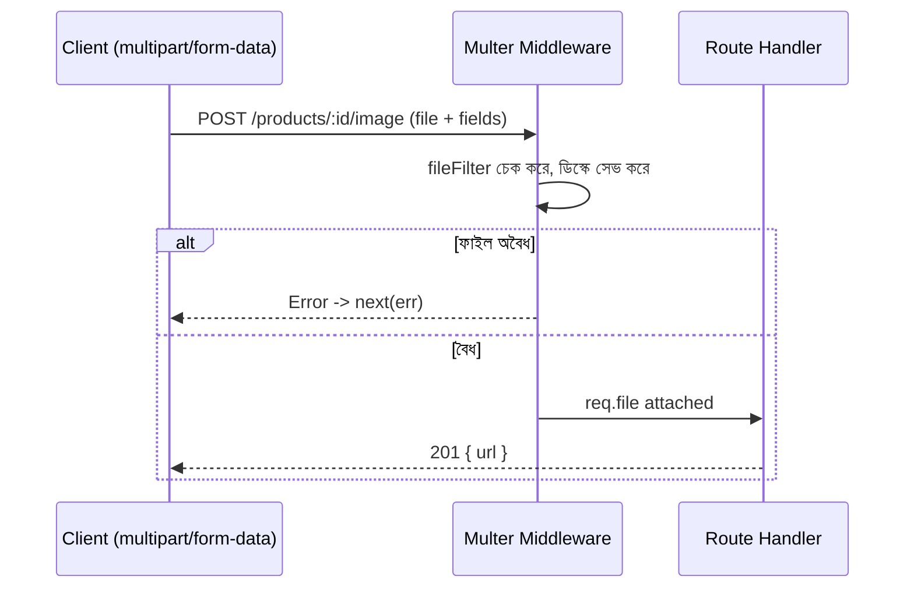

# ২৬.০১. Form Submission and File Upload Handling

Module 6-এ POST রিকোয়েস্টের অ্যানাটমি শেখার সময় আমরা ধরে নিয়েছিলাম ক্লায়েন্ট শুধু সাধারণ JSON ডেটা পাঠাচ্ছে — নাম, ইমেইল, দাম, এই ধরনের টেক্সট আর সংখ্যা। কিন্তু বাস্তব অ্যাপ্লিকেশনে ইউজার প্রায়ই একটা ছবি বা ফাইলও পাঠায় — প্রোফাইল পিকচার, প্রোডাক্টের ছবি, রিজিউম। এই লেসনে আমরা ফিরে আসছি Express.js-এ, কারণ এই মডিউলটা মূলত সেই ফাউন্ডেশনাল লেয়ারের বিস্তারিত অংশ কভার করে যেটা প্রতিটা ব্যাকএন্ড ফ্রেমওয়ার্কের (NestJS-সহ) নিচে কাজ করে।

সমস্যাটা প্রথমে বুঝি — সাধারণ JSON রিকোয়েস্ট বডি `Content-Type: application/json` হিসেবে পাঠানো হয়, যেটা `express.json()` মিডলওয়্যার পার্স করতে পারে (Module 6)। কিন্তু ফাইল পাঠাতে হলে ব্রাউজার `multipart/form-data` নামের একটা ভিন্ন ফরম্যাট ব্যবহার করে, যেখানে টেক্সট ফিল্ড আর বাইনারি ফাইল ডেটা একসাথে, আলাদা আলাদা "অংশে" (part) ভাগ করে পাঠানো হয়। এই ফরম্যাটটা `express.json()` দিয়ে পার্স করা যায় না — এর জন্য দরকার আলাদা একটা লাইব্রেরি, যার নাম **Multer**।

```typescript
// upload/upload.middleware.ts
import multer from 'multer';
import path from 'path';

const storage = multer.diskStorage({
  destination: (req, file, cb) => cb(null, 'uploads/products'),
  filename: (req, file, cb) => {
    const uniqueName = `${Date.now()}-${Math.round(Math.random() * 1e9)}`;
    cb(null, uniqueName + path.extname(file.originalname));
  },
});

export const productImageUpload = multer({
  storage,
  limits: { fileSize: 5 * 1024 * 1024 }, // ৫ মেগাবাইট সীমা
  fileFilter: (req, file, cb) => {
    const allowed = ['image/jpeg', 'image/png', 'image/webp'];
    if (!allowed.includes(file.mimetype)) {
      return cb(new Error('শুধু JPEG, PNG, WEBP ফাইল অনুমোদিত'));
    }
    cb(null, true);
  },
});
```

এখানে তিনটা গুরুত্বপূর্ণ সিদ্ধান্ত নেয়া হয়েছে, যেগুলো নিরাপত্তার দিক থেকে জরুরি। প্রথমত, `filename` জেনারেট করার সময় ইউজারের দেয়া আসল ফাইলের নাম সরাসরি ব্যবহার না করে একটা র‍্যান্ডম নাম বসানো হয়েছে — কারণ ইউজার এমন ফাইলের নামও দিতে পারে যেটা সার্ভারে আগে থেকেই থাকা কোনো গুরুত্বপূর্ণ ফাইলের নাম ওভাররাইট করে দিতে পারে। দ্বিতীয়ত, `limits.fileSize` দিয়ে সাইজ সীমাবদ্ধ করা হয়েছে, যাতে কেউ বিশাল ফাইল পাঠিয়ে সার্ভারের ডিস্ক বা মেমোরি শেষ করে দিতে না পারে। তৃতীয়ত, `fileFilter` দিয়ে শুধু নির্দিষ্ট ধরনের ফাইল গ্রহণ করা হচ্ছে — এক্সিকিউটেবল বা স্ক্রিপ্ট ফাইল আপলোড ঠেকানোর প্রথম স্তর এটাই।

এখন রুটে ব্যবহার:

```typescript
// product/product.routes.ts
router.post(
  '/products/:id/image',
  productImageUpload.single('image'), // ফর্ম ফিল্ডের নাম "image"
  (req, res) => {
    if (!req.file) return res.status(400).json({ success: false, message: 'ফাইল পাওয়া যায়নি' });
    res.status(201).json({
      success: true,
      data: { url: `/uploads/products/${req.file.filename}` },
    });
  },
);
```

একাধিক ফাইল (যেমন প্রোডাক্টের গ্যালারি) নিতে হলে `.array('images', 5)` ব্যবহার করা হয় — সর্বোচ্চ ৫টা ফাইল একসাথে।



ফাইল আপলোড হ্যান্ডলিং শেষ, কিন্তু এখানে অনেক জায়গায় ভুল হতে পারে — ভুল ফাইল টাইপ, সাইজ সীমা ছাড়ানো, ডিস্ক ফুল হয়ে যাওয়া। এই এররগুলো ইউজারকে কীভাবে পরিষ্কারভাবে জানাবো, সেটাই পরের লেসনের বিষয় — POST API-তে Error Handling।
