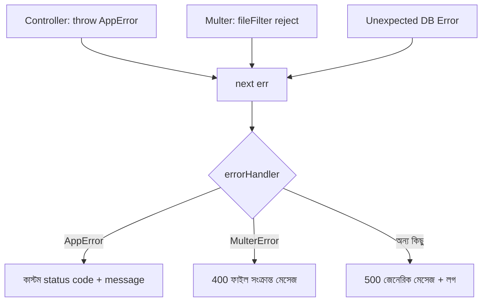

# ২৬.০২. Error Handling in POST APIs

আগের লেসনে আমরা ফাইল আপলোড বসিয়েছিলাম, কিন্তু একটা জিনিস উহ্য রেখে দিয়েছিলাম — যদি Multer কোনো এরর ছুঁড়ে (ভুল ফাইল টাইপ, সাইজ বেশি), তাহলে সেটা ঠিক কীভাবে ইউজারের কাছে পৌঁছায়? এই লেসনে আমরা POST API-এর এরর হ্যান্ডলিংটা পুরোপুরি সাজাবো, Module 7-এ শেখা কাস্টম middleware-এর ধারণাটাকে আরেকটু বিস্তৃত করে — সেখানে আমরা authCheck, rate limiting আর audit logger-এর মতো middleware বানিয়েছিলাম, এখন সেই একই প্যাটার্নে একটা কেন্দ্রীয় error-handling middleware বানাবো।

POST রিকোয়েস্টে এরর হওয়ার সুযোগ GET-এর চেয়ে অনেক বেশি, কারণ POST মানেই নতুন ডেটা তৈরি করা — আর ডেটা তৈরি করতে গেলে ভ্যালিডেশন, ডুপ্লিকেট চেক, বিজনেস রুল, ডেটাবেজ কনস্ট্রেইন্ট — এই সবকিছু ভুল হওয়ার সুযোগ তৈরি করে। তাই একটা সুসংগঠিত সিস্টেমে এরর তিন স্তরে ভাগ করে দেখা ভালো — ভ্যালিডেশন এরর (ইউজারের ভুল ইনপুট), বিজনেস লজিক এরর (যেমন ডুপ্লিকেট ইমেইল), আর আনএক্সপেক্টেড এরর (ডেটাবেজ ডাউন, কোড বাগ)।

প্রথমে একটা কাস্টম এরর ক্লাস বানানো ভালো অভ্যাস, যাতে আমরা এররের সাথে একটা স্ট্যাটাস কোড বহন করতে পারি।

```typescript
// common/errors/app-error.ts
export class AppError extends Error {
  constructor(
    public statusCode: number,
    message: string,
    public details?: unknown,
  ) {
    super(message);
    this.name = 'AppError';
  }
}
```

এখন কন্ট্রোলারে এই এরর ছোঁড়া যায়, `try/catch` এর ঝামেলা ছাড়াই — কারণ আমরা `express-async-errors` লাইব্রেরি বা নিজে একটা wrapper ব্যবহার করবো, যাতে async ফাংশনের ভেতরের এরর স্বয়ংক্রিয়ভাবে `next()`-এ চলে যায়।

```typescript
// common/utils/catch-async.ts
export const catchAsync = (fn: RequestHandler): RequestHandler => (req, res, next) => {
  Promise.resolve(fn(req, res, next)).catch(next);
};
```

```typescript
// product/product.controller.ts
export const createProduct = catchAsync(async (req, res) => {
  const { name, price } = req.body;
  if (!name || price == null) {
    throw new AppError(400, 'name এবং price আবশ্যক');
  }

  const exists = await Product.findOne({ name });
  if (exists) {
    throw new AppError(409, 'এই নামে প্রোডাক্ট আগে থেকেই আছে');
  }

  const product = await Product.create({ name, price });
  res.status(201).json({ success: true, data: product });
});
```

এখানে `catchAsync` না থাকলে প্রতিটা কন্ট্রোলারে আলাদা `try/catch` লিখতে হতো — একই কোড বারবার লেখা, যেটা DRY (Don't Repeat Yourself) নীতির বিরুদ্ধে। এখন কেন্দ্রীয় এরর-হ্যান্ডলিং মিডলওয়্যার সব ধরনের এরর একই জায়গায় ধরবে।

```typescript
// middleware/error-handler.ts
export function errorHandler(err: unknown, req: Request, res: Response, next: NextFunction) {
  if (err instanceof AppError) {
    return res.status(err.statusCode).json({
      success: false,
      message: err.message,
      details: err.details,
    });
  }

  if (err instanceof multer.MulterError) {
    return res.status(400).json({ success: false, message: `ফাইল আপলোড এরর: ${err.message}` });
  }

  console.error(err); // অপ্রত্যাশিত এরর — লগ করে রাখো, ইউজারকে বিস্তারিত দেখিও না
  res.status(500).json({ success: false, message: 'সার্ভারে একটা সমস্যা হয়েছে' });
}
```



লক্ষ্য করার মতো একটা নীতি — আনএক্সপেক্টেড এরর (যেমন কোড বাগ বা ডেটাবেজ ক্র্যাশ) কখনো তার আসল, টেকনিক্যাল মেসেজ সরাসরি ইউজারকে দেখানো উচিত না, কারণ এতে সিস্টেমের অভ্যন্তরীণ গঠন ফাঁস হতে পারে, যা আক্রমণকারীর কাজে লাগতে পারে। ইউজারকে জেনেরিক মেসেজ দেয়া হয়, কিন্তু সার্ভারের লগে পুরো বিস্তারিত রাখা হয় — এটাই এরর হ্যান্ডলিং-এর একটা গুরুত্বপূর্ণ নিরাপত্তা নীতি, যেটা পরের লেসনে আমরা আরও বিস্তৃতভাবে দেখবো — POST API Security Best Practices।
