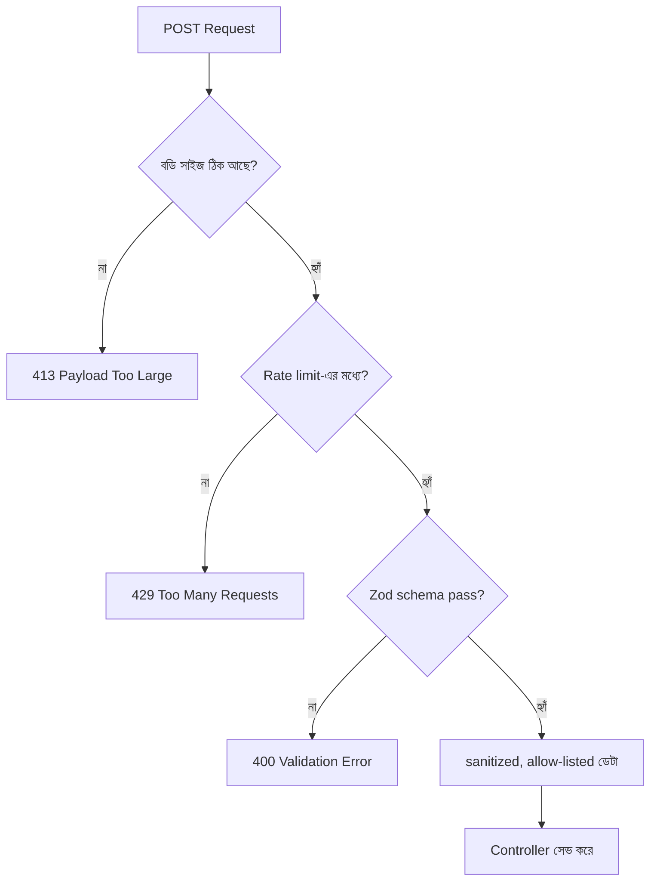

# ২৬.০৩. POST API Security Best Practices

আমাদের POST API এখন ফাইল আপলোড আর গোছানো এরর হ্যান্ডলিং পেয়ে গেছে। এই লেসনে আমরা প্রশ্নটা উল্টো দিক থেকে করবো — যদি কেউ ইচ্ছাকৃতভাবে ক্ষতি করার চেষ্টা করে, তাহলে কোথায় কোথায় ফাঁক থেকে যেতে পারে? POST এন্ডপয়েন্ট যেহেতু নতুন ডেটা তৈরি করে, তাই এটা আক্রমণকারীদের প্রিয় জায়গা — এখানেই সবচেয়ে বেশি "লিখে ফেলার" সুযোগ থাকে।

প্রথম এবং সবচেয়ে গুরুত্বপূর্ণ নীতি — **ইনপুট কখনো বিশ্বাস করা যাবে না**, সে যত "নিরাপদ" ক্লায়েন্ট থেকেই আসুক না কেন। ফ্রন্টএন্ডে ভ্যালিডেশন থাকলেও, একজন আক্রমণকারী সরাসরি Postman বা কার্ল দিয়ে API কল করতে পারে, ফ্রন্টএন্ড এড়িয়ে। তাই সার্ভার-সাইড ভ্যালিডেশন সবসময় বাধ্যতামূলক। `express-validator` বা `zod` এর মতো লাইব্রেরি দিয়ে এটা করা যায়।

```typescript
// product/product.validation.ts
import { z } from 'zod';

export const createProductSchema = z.object({
  name: z.string().min(2).max(100).trim(),
  price: z.number().positive(),
  description: z.string().max(2000).optional(),
});

export function validateBody(schema: z.ZodSchema) {
  return (req: Request, res: Response, next: NextFunction) => {
    const result = schema.safeParse(req.body);
    if (!result.success) {
      return res.status(400).json({ success: false, errors: result.error.flatten() });
    }
    req.body = result.data; // sanitize করা, টাইপ-সেফ ডেটা
    next();
  };
}
```

দ্বিতীয়, **Mass Assignment** নামের একটা সূক্ষ্ম কিন্তু বিপজ্জনক সমস্যা। ধরো তোমার `User` মডেলে একটা `role` ফিল্ড আছে। যদি তুমি `req.body`-কে সরাসরি `User.create(req.body)`-এ পাঠিয়ে দাও, আর ভ্যালিডেশন স্কিমা `role` ফিল্ড বাদ না দেয়, তাহলে একজন আক্রমণকারী রেজিস্ট্রেশনের সময় এক্সট্রা ফিল্ড হিসেবে `"role": "admin"` পাঠিয়ে নিজেকে অ্যাডমিন বানিয়ে ফেলতে পারে! উপরের `z.object()` স্কিমাটা ঠিক এই কারণেই শুধু নির্দিষ্ট ফিল্ড allow করে, বাকি সব বাদ দিয়ে দেয় (`.strict()` মোডে)।

তৃতীয়, **Rate Limiting** — Module 7-তে শেখা ধারণাটা POST এন্ডপয়েন্টে আরও জরুরি, কারণ POST দিয়ে বারবার রিসোর্স তৈরি করলে ডেটাবেজ ভরে যেতে পারে, বা রেজিস্ট্রেশন/লগইন এন্ডপয়েন্টে ব্রুট-ফোর্স অ্যাটাক চলতে পারে।

```typescript
import rateLimit from 'express-rate-limit';

const createLimiter = rateLimit({
  windowMs: 15 * 60 * 1000,
  max: 20, // ১৫ মিনিটে সর্বোচ্চ ২০ বার POST
  message: { success: false, message: 'অনেকবার চেষ্টা করেছো, একটু পর আবার চেষ্টা করো' },
});

router.post('/products', createLimiter, validateBody(createProductSchema), createProduct);
```

চতুর্থ, **Content-Type এবং সাইজ সীমা**। খুব বড় JSON বডি পাঠিয়ে সার্ভারকে ব্যস্ত রাখা (denial of service-এর একটা সহজ রূপ) ঠেকাতে বডি সাইজ সীমাবদ্ধ রাখা দরকার।

```typescript
app.use(express.json({ limit: '100kb' }));
```



এই চারটা স্তর — সাইজ সীমা, রেট লিমিট, কড়া ভ্যালিডেশন (allow-list ভিত্তিক, block-list না), আর সঠিক এরর হ্যান্ডলিং (আগের লেসন) — একসাথে POST এন্ডপয়েন্টকে অনেকটাই নিরাপদ করে তোলে। এই একই নীতিগুলো পরে Module 30-এ আমরা আরও বিস্তৃতভাবে দেখবো, যখন পুরো API-এর নিরাপত্তা নিয়ে গভীরে যাবো।

এই মডিউলে আমরা শুধু "তৈরি করা" (Create/POST) নিয়ে কাজ করলাম। কিন্তু একটা রিসোর্স তৈরির পর সেটা বদলানো বা মুছে ফেলাও দরকার হয় — আর সেখানে PUT, PATCH, DELETE-এর নিজস্ব নিয়ম আর সূক্ষ্মতা আছে। পরের মডিউলে আমরা ঠিক সেই বিষয়ে ঢুকবো — Beyond CRUD Operations।
