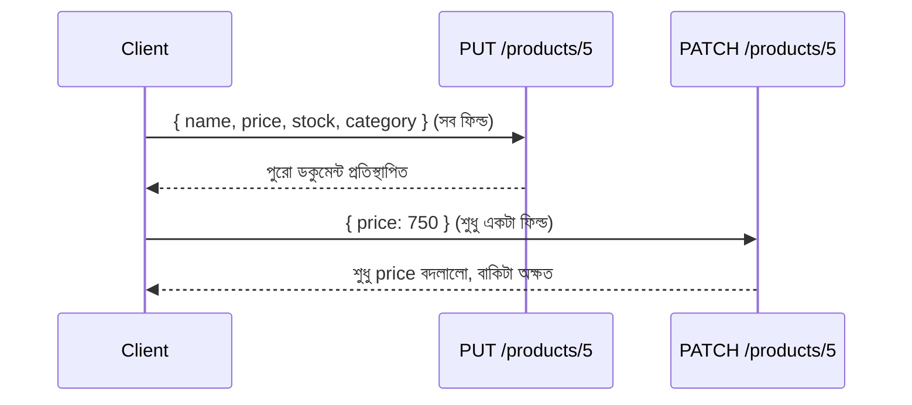

# ২৭.০২. Implementing PUT/PATCH Endpoints in Express.js

আগের লেসনে আমরা তাত্ত্বিকভাবে দেখেছি PUT আর PATCH দুটোই "আপডেট" করে, কিন্তু ভিন্নভাবে। এই লেসনে আমরা সেটা কোড দিয়ে বাস্তবায়ন করবো, আর ঠিক এখানেই তাদের পার্থক্যটা স্পষ্ট হবে।

ধরো আমাদের একটা প্রোডাক্ট আছে এমন:

```json
{ "id": "5", "name": "ওয়্যারলেস মাউস", "price": 800, "stock": 50, "category": "Electronics" }
```

**PUT** দিয়ে আপডেট করার নিয়ম হলো — ক্লায়েন্ট পুরো অবজেক্টটাই পাঠাবে, আর সার্ভার সেটাকেই নতুন সত্য হিসেবে ধরে নেবে। যদি ক্লায়েন্ট `category` ফিল্ডটা বাদ দিয়ে পাঠায়, তাহলে যুক্তিসম্মতভাবে `category`-কে ফাঁকা/null করে দেয়া উচিত, কারণ PUT-এর প্রতিশ্রুতি হলো "সম্পূর্ণ প্রতিস্থাপন"।

```typescript
// product/product.controller.ts
export const replaceProduct = catchAsync(async (req, res) => {
  const { name, price, stock, category } = req.body;

  // PUT-এ সব ফিল্ড বাধ্যতামূলক, কারণ এটা সম্পূর্ণ প্রতিস্থাপন
  if (!name || price == null || stock == null || !category) {
    throw new AppError(400, 'PUT-এর জন্য name, price, stock, category — সবগুলো ফিল্ড আবশ্যক');
  }

  const product = await Product.findByIdAndUpdate(
    req.params.id,
    { name, price, stock, category }, // পুরনো ডকুমেন্ট এই অবজেক্ট দিয়ে সম্পূর্ণ প্রতিস্থাপিত হবে
    { new: true, overwrite: true, runValidators: true },
  );

  if (!product) throw new AppError(404, 'প্রোডাক্ট পাওয়া যায়নি');
  res.status(200).json({ success: true, data: product });
});
```

`overwrite: true` অপশনটা লক্ষ্য করার মতো (MongoDB/Mongoose-এ) — এটা নিশ্চিত করে যে পুরনো ডকুমেন্টের যেসব ফিল্ড নতুন বডিতে নেই, সেগুলো মুছে যাবে। এটাই PUT-এর "সম্পূর্ণ প্রতিস্থাপন" আচরণকে সঠিকভাবে প্রতিফলিত করে। SQL-ভিত্তিক ডেটাবেজে (Module 16-17-এ শেখা) এটার সমতুল্য হবে একটা `UPDATE` কোয়েরি যেখানে সবগুলো কলাম এক্সপ্লিসিটলি সেট করা হয়।

**PATCH** এর নিয়ম সম্পূর্ণ ভিন্ন — ক্লায়েন্ট শুধু যে ফিল্ডগুলো বদলাতে চায় সেগুলোই পাঠাবে, বাকিগুলো অপরিবর্তিত থাকবে।

```typescript
export const updateProduct = catchAsync(async (req, res) => {
  const allowedFields = ['name', 'price', 'stock', 'category'];
  const updates: Record<string, unknown> = {};

  for (const key of Object.keys(req.body)) {
    if (allowedFields.includes(key)) updates[key] = req.body[key];
  }

  if (Object.keys(updates).length === 0) {
    throw new AppError(400, 'আপডেট করার মতো কোনো বৈধ ফিল্ড দেয়া হয়নি');
  }

  const product = await Product.findByIdAndUpdate(
    req.params.id,
    { $set: updates }, // শুধু উল্লেখিত ফিল্ডগুলো বদলায়, বাকিটা অক্ষত থাকে
    { new: true, runValidators: true },
  );

  if (!product) throw new AppError(404, 'প্রোডাক্ট পাওয়া যায়নি');
  res.status(200).json({ success: true, data: product });
});
```

এখানে `allowedFields`-এর লিস্ট বানিয়ে filter করাটা Module 26-এ শেখা Mass Assignment সমস্যার প্রতিরোধের একই কৌশল — শুধু নির্দিষ্ট ফিল্ড আপডেট হতে দেয়া, ইউজারের পাঠানো এক্সট্রা ফিল্ড (যেমন `isVerified: true`) উপেক্ষা করা।



বাস্তবে বেশিরভাগ ফ্রন্টএন্ড টিম PATCH-কেই পছন্দ করে, কারণ এটা নেটওয়ার্ক ব্যান্ডউইথ বাঁচায় (শুধু বদলানো ফিল্ড পাঠাতে হয়) আর accidental data loss-এর ঝুঁকি কমায় (ভুলে কোনো ফিল্ড বাদ পড়ে গেলে সেটা মুছে যায় না)। কিন্তু PUT দরকারি হয় যখন তুমি নিশ্চিত করতে চাও রিসোর্সটা ঠিক একটা নির্দিষ্ট অবস্থায় আছে, আংশিক অবস্থায় না।

এখন প্রশ্ন হলো — "সম্পূর্ণ" আর "আংশিক" আপডেটের এই পার্থক্যটা ঠিক কোন কোন বাস্তব পরিস্থিতিতে গুরুত্বপূর্ণ হয়ে ওঠে? পরের লেসনে আমরা এই তুলনাটা আরও গভীরে নিয়ে যাবো।
