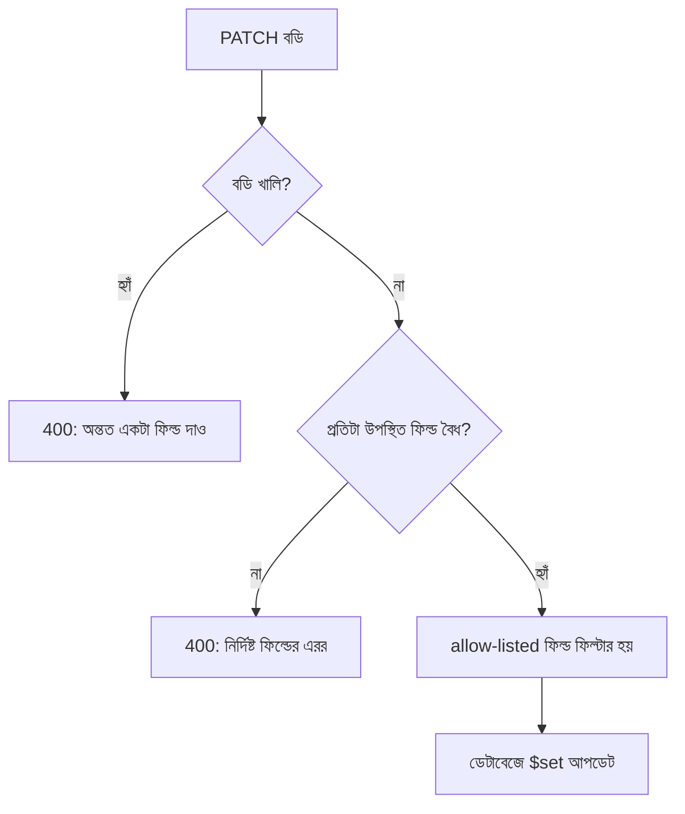

# ২৭.০৪. Handling PUT/PATCH Request Validation

Module 26-এ আমরা POST রিকোয়েস্টের জন্য Zod দিয়ে স্কিমা-ভিত্তিক ভ্যালিডেশন শিখেছিলাম, যেখানে সব ফিল্ড বাধ্যতামূলক ছিলো। কিন্তু আগের লেসনে দেখা PATCH-এর প্রকৃতি অনুযায়ী একটা সমস্যা তৈরি হয় — PATCH-এ কোন ফিল্ড আসবে সেটা আগে থেকে নিশ্চিত না, তাহলে ভ্যালিডেশন স্কিমা কীভাবে লিখবো?

PUT-এর ভ্যালিডেশন তুলনামূলক সহজ, কারণ সব ফিল্ড বাধ্যতামূলক — এটা অনেকটা POST-এর স্কিমার মতোই।

```typescript
// product/product.validation.ts
import { z } from 'zod';

export const putProductSchema = z.object({
  name: z.string().min(2).max(100),
  price: z.number().positive(),
  stock: z.number().int().nonnegative(),
  category: z.enum(['Electronics', 'Fashion', 'Grocery', 'Books']),
});
```

PATCH-এর জন্য Zod-এর একটা বিশেষ সুবিধা কাজে লাগে — `.partial()`। এটা একই স্কিমা নিয়ে সবগুলো ফিল্ডকে "ঐচ্ছিক" বানিয়ে দেয়, কিন্তু যদি কোনো ফিল্ড আসে, সেটাকে ঠিক আগের নিয়ম মেনেই ভ্যালিডেট করে।

```typescript
export const patchProductSchema = putProductSchema.partial().refine(
  (data) => Object.keys(data).length > 0,
  { message: 'কমপক্ষে একটা ফিল্ড দিতে হবে আপডেটের জন্য' },
);
```

এখানে `.refine()` দিয়ে একটা কাস্টম নিয়ম যোগ করা হয়েছে — খালি বডি (`{}`) পাঠানো হলে সেটাকেও প্রত্যাখ্যান করা, কারণ একটা PATCH রিকোয়েস্টে অন্তত একটা পরিবর্তন থাকতেই হবে, নয়তো রিকোয়েস্টটাই অর্থহীন।

```typescript
// product/product.routes.ts
router.put('/products/:id', validateBody(putProductSchema), replaceProduct);
router.patch('/products/:id', validateBody(patchProductSchema), updateProduct);
```

একটা সূক্ষ্ম কিন্তু গুরুত্বপূর্ণ সমস্যা এখানে দেখা দেয় — যদি PATCH-এ `price: -50` এর মতো একটা ভুল মান আসে, `.partial()` স্কিমা এটা ধরে ফেলবে কারণ `price` ফিল্ডটা এলে সেটা এখনও `z.number().positive()` নিয়ম মেনে চলতে হবে। কিন্তু যদি ফিল্ডটাই না আসে, `.partial()` সেটা এড়িয়ে যাবে, কোনো এরর দেবে না। এটাই ঠিক আচরণ — "না দেয়া" আর "ভুল দেয়া" দুটো ভিন্ন জিনিস, আর ভ্যালিডেশনকে এই পার্থক্যটা বুঝতে হবে।



আরেকটা গুরুত্বপূর্ণ বিষয় — টাইপ কনভার্সন। HTML ফর্ম বা কুয়েরি স্ট্রিং থেকে আসা মান প্রায়ই স্ট্রিং হিসেবে আসে (যেমন `"price": "800"`), সংখ্যা হিসেবে না। Zod-এর `z.coerce.number()` ব্যবহার করে এই ধরনের ইনপুট স্বয়ংক্রিয়ভাবে সঠিক টাইপে রূপান্তর করা যায়, যাতে ভ্যালিডেশন অযথা ব্যর্থ না হয় শুধু টাইপ মিসম্যাচের কারণে।

এই ভ্যালিডেশন স্তরগুলো নিশ্চিত করে যে আপডেট রিকোয়েস্ট নিরাপদ আর সঠিক ডেটা নিয়ে আসছে। কিন্তু ডিলিট অপারেশনে একটা সম্পূর্ণ ভিন্ন প্রশ্ন উঠে আসে — যখন একটা প্রোডাক্ট "ডিলিট" করা হয়, সেটা কি সত্যিই ডেটাবেজ থেকে মুছে ফেলা উচিত, নাকি শুধু "লুকিয়ে" রাখা উচিত? পরের লেসনে আমরা Soft Delete বনাম Hard Delete নিয়ে কথা বলবো।
