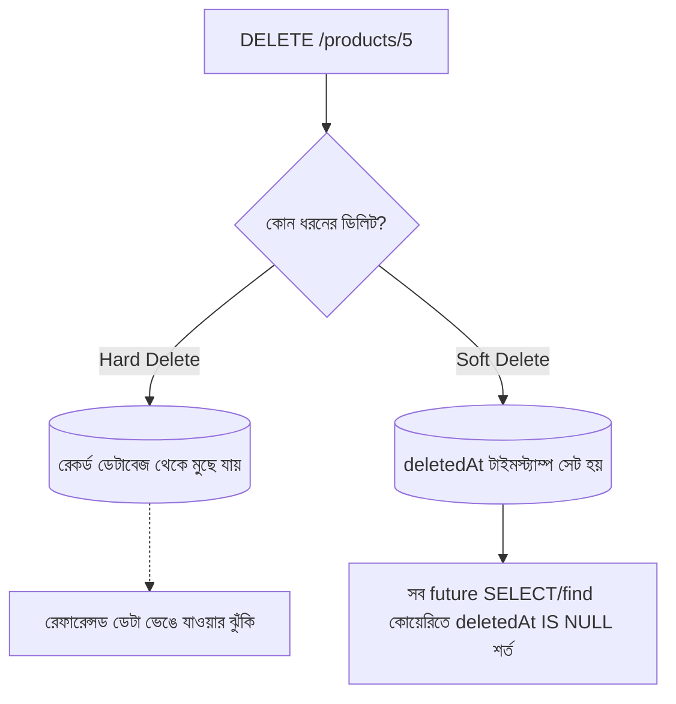

# ২৭.০৫. Soft Delete vs Hard Delete Implementation

আগের লেসনগুলোতে আমরা তৈরি ও আপডেট নিয়ে সতর্ক থেকেছি — ভুল ডেটা যেন না ঢোকে, পুরনো ডেটা যেন হারিয়ে না যায়। ডিলিটের বেলাতেও একই সতর্কতা দরকার, কারণ ডিলিট হলো সবচেয়ে অপরিবর্তনীয় (irreversible) অপারেশন — একবার ডেটা মুছে গেলে সাধারণত সেটা আর ফেরত পাওয়া যায় না, যদি না আলাদা ব্যাকআপ থাকে (Module 21-এ ব্যাকআপ স্ট্র্যাটেজি নিয়ে কথা হয়েছিলো)।

**Hard Delete** মানে সহজ — রেকর্ডটা ডেটাবেজ থেকে সত্যিই মুছে ফেলা। SQL-এ এটা `DELETE FROM products WHERE id = ?`, MongoDB-তে `findByIdAndDelete()`। একবার এই কমান্ড চললে, ডেটা চিরতরে চলে যায়।

```typescript
// hard delete — সরাসরি, ফেরতযোগ্য নয়
export const hardDeleteProduct = catchAsync(async (req, res) => {
  const deleted = await Product.findByIdAndDelete(req.params.id);
  if (!deleted) throw new AppError(404, 'প্রোডাক্ট পাওয়া যায়নি');
  res.status(204).send();
});
```

কিন্তু বাস্তব ব্যবসায়িক অ্যাপ্লিকেশনে hard delete অনেক সময় বিপজ্জনক এবং অবাস্তব। আমাদের ই-কমার্স প্রজেক্টে ভাবো — একটা প্রোডাক্ট যদি হার্ড ডিলিট হয়ে যায়, কিন্তু সেই প্রোডাক্টটা আগে কেউ অর্ডার করে থাকে, তাহলে সেই পুরনো অর্ডার হিস্ট্রিতে প্রোডাক্টের রেফারেন্স ভেঙে যাবে (Module 18-19-এ শেখা ফরেন কী রিলেশনশিপ নষ্ট হবে)। এছাড়া, ব্যবসায়িক প্রয়োজনে অনেক সময় "ডিলিট করা" ডেটা রিপোর্টিং বা অডিটের জন্য রাখা দরকার হয়, বা ভুলবশত ডিলিট হলে ফিরিয়ে আনার সুযোগ রাখা দরকার হয়।

এখানেই আসে **Soft Delete** — রেকর্ডটা আসলে না মুছে, শুধু একটা ফ্ল্যাগ বা টাইমস্ট্যাম্প বসিয়ে "ডিলিটেড" হিসেবে চিহ্নিত করা।

```typescript
// Schema — Product মডেলে একটা নতুন ফিল্ড
const productSchema = new Schema({
  name: String,
  price: Number,
  deletedAt: { type: Date, default: null }, // null মানে অ্যাক্টিভ, তারিখ মানে ডিলিটেড
});
```

```typescript
// soft delete
export const softDeleteProduct = catchAsync(async (req, res) => {
  const product = await Product.findByIdAndUpdate(
    req.params.id,
    { deletedAt: new Date() },
    { new: true },
  );
  if (!product) throw new AppError(404, 'প্রোডাক্ট পাওয়া যায়নি');
  res.status(204).send();
});
```

এখন সবচেয়ে গুরুত্বপূর্ণ অংশ — soft delete করলে বাকি সব কোয়েরিতেও `deletedAt: null` শর্তটা যোগ করতে ভুলে গেলে ডিলিট করা প্রোডাক্ট আবার তালিকায় দেখা যাবে, যা একটা সাধারণ কিন্তু মারাত্মক বাগ।

```typescript
// সব "সক্রিয়" প্রোডাক্ট খোঁজার সময় সবসময় এই শর্ত লাগবে
export const getAllProducts = catchAsync(async (req, res) => {
  const products = await Product.find({ deletedAt: null });
  res.json({ success: true, data: products });
});
```

এই ভুল এড়ানোর একটা পরিষ্কার উপায় হলো Mongoose middleware বা TypeORM-এর মতো ORM-এ একটা গ্লোবাল "default scope" বসিয়ে দেয়া, যাতে ডেভেলপারকে প্রতিটা কোয়েরিতে আলাদা করে মনে রাখতে না হয়।



সংক্ষেপে বলা যায়, hard delete ব্যবহার করা উচিত শুধু তখনই যখন ডেটা সত্যিই স্থায়ীভাবে মুছে ফেলার প্রয়োজন আছে (যেমন GDPR-এর মতো আইনি বাধ্যবাধকতায় ইউজারের ব্যক্তিগত তথ্য মোছা), অন্যথায় soft delete-ই বেশিরভাগ ব্যবসায়িক অ্যাপ্লিকেশনের জন্য নিরাপদ ডিফল্ট পছন্দ।

এখন আমরা জানি কীভাবে সঠিকভাবে আপডেট আর ডিলিট বাস্তবায়ন করতে হয়। এই মডিউলের শেষ লেসনে আমরা এই সবকিছুকে একসাথে নিয়ে একটা সংক্ষিপ্ত, প্রয়োগযোগ্য বেস্ট-প্র্যাকটিস চেকলিস্ট তৈরি করবো।
