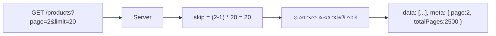

# ২৮.০১. API Response Formatting and Pagination

আমাদের ই-কমার্স প্রজেক্টের প্রোডাক্ট ক্যাটালগে ধরো ৫০,০০০টা প্রোডাক্ট আছে। যদি `GET /products` কল করলে সবগুলো একসাথে ফেরত দেয়া হয়, তাহলে কী হবে? সার্ভারকে বিশাল পরিমাণ ডেটা মেমোরিতে লোড করতে হবে, নেটওয়ার্কে বিশাল JSON পাঠাতে হবে, আর ক্লায়েন্ট ডিভাইস (বিশেষ করে মোবাইল) সেই বিশাল লিস্ট প্রসেস করতে গিয়ে ধীর হয়ে যাবে বা ক্র্যাশ করবে। এই সমস্যার সমাধান হলো **Pagination** — ডেটাকে ছোট ছোট "পাতায়" ভাগ করে একবারে অল্প পরিমাণ পাঠানো।

কিন্তু pagination-এ যাওয়ার আগে, একটা মৌলিক বিষয় ঠিক করা দরকার — API-এর রেসপন্স ফরম্যাট কেমন হবে, সেটা সামঞ্জস্যপূর্ণ (consistent) কিনা। এতদিনের লেসনগুলোতে আমরা মাঝে মাঝে `{ success, data }` ফরম্যাট ব্যবহার করেছি, কিন্তু এখন এটাকে একটা প্রাতিষ্ঠানিক নিয়মে পরিণত করা দরকার — একটা **response envelope**।

```typescript
// common/response-envelope.ts
interface ApiResponse<T> {
  success: boolean;
  data?: T;
  meta?: {
    page?: number;
    limit?: number;
    totalItems?: number;
    totalPages?: number;
  };
  message?: string;
  errors?: unknown;
}

export function successResponse<T>(data: T, meta?: ApiResponse<T>['meta']): ApiResponse<T> {
  return { success: true, data, ...(meta && { meta }) };
}
```

এই envelope-টা প্রতিটা এন্ডপয়েন্টে একই আকৃতি বজায় রাখে, যাতে ফ্রন্টএন্ড ডেভেলপার একটা সাধারণ, পূর্বানুমানযোগ্য নিয়ম মেনে রেসপন্স পার্স করতে পারে — আলাদা আলাদা এন্ডপয়েন্টের জন্য আলাদা লজিক লেখার দরকার হয় না। এটা Module 8-এ শেখা JSON ডেটা মডেলিং-এর ধারণারই একটা প্রয়োগ, যেখানে আমরা শিখেছিলাম গোছানো, পূর্বানুমানযোগ্য ডেটা স্ট্রাকচার কতটা গুরুত্বপূর্ণ।

এখন pagination-এর মূল ধারণাটা — ক্লায়েন্ট বলবে "আমাকে কত নম্বর পাতা দাও, প্রতি পাতায় কতগুলো আইটেম" আর সার্ভার সেই অনুযায়ী একটা নির্দিষ্ট অংশ কেটে পাঠাবে, সাথে "মোট কতগুলো আইটেম আছে, মোট কত পাতা আছে" — এই মেটাডেটাও।

```typescript
// product/product.controller.ts
export const getAllProducts = catchAsync(async (req, res) => {
  const page = Math.max(1, parseInt(req.query.page as string) || 1);
  const limit = Math.min(100, parseInt(req.query.limit as string) || 20); // সর্বোচ্চ সীমা
  const skip = (page - 1) * limit;

  const [products, totalItems] = await Promise.all([
    Product.find({ deletedAt: null }).skip(skip).limit(limit),
    Product.countDocuments({ deletedAt: null }),
  ]);

  res.json(successResponse(products, {
    page,
    limit,
    totalItems,
    totalPages: Math.ceil(totalItems / limit),
  }));
});
```

লক্ষ্য করো `limit`-এর একটা সর্বোচ্চ সীমা (`Math.min(100, ...)`) বসানো হয়েছে — এটা একটা গুরুত্বপূর্ণ নিরাপত্তা অভ্যাস, কারণ ইউজার চাইলে `?limit=999999` পাঠিয়ে সার্ভারকে ওভারলোড করার চেষ্টা করতে পারে।



এই প্যাটার্নটাকে বলে **offset-based pagination** (skip/limit ব্যবহার করে), যেটা এই মডিউলে আমরা পরের লেসনে আরও বিস্তারিতভাবে দেখবো — এর সুবিধা, অসুবিধা, আর এটা ঠিক কোন পরিস্থিতিতে ব্যবহার করা উচিত।
