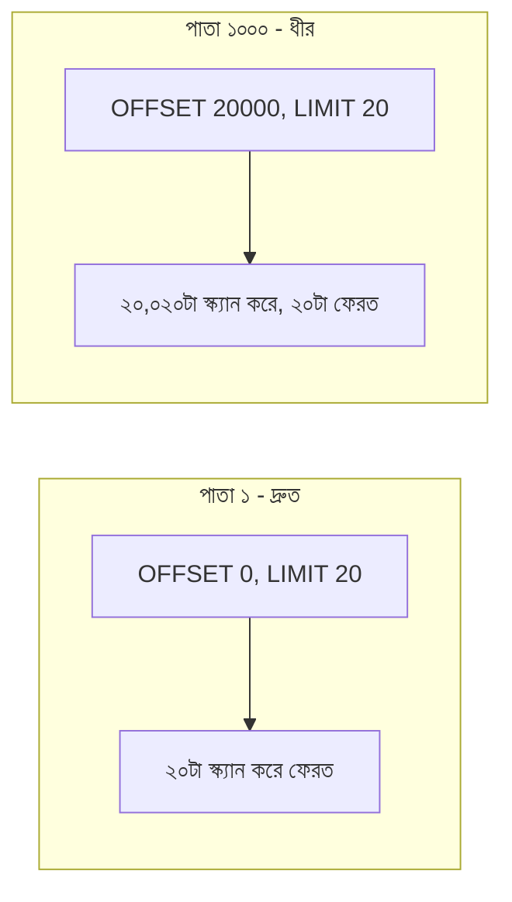

# ২৮.০২. Pagination Implementation with Limit and Offset

আগের লেসনে আমরা `skip`/`limit` (যেটাকে SQL-এর ভাষায় `OFFSET`/`LIMIT` বলে) দিয়ে একটা সাধারণ pagination বাস্তবায়ন করেছি। এই লেসনে আমরা এই পদ্ধতিটা SQL ডেটাবেজে (Module 16-17-এ শেখা) কীভাবে কাজ করে সেটা দেখবো, আর এর ভেতরের কারিগরি সীমাবদ্ধতাগুলো বুঝবো।

SQL-এ offset/limit pagination দেখতে এমন:

```sql
SELECT * FROM products
WHERE deleted_at IS NULL
ORDER BY created_at DESC
LIMIT 20 OFFSET 40; -- তৃতীয় পাতা, প্রতি পাতায় ২০টা
```

`OFFSET 40` মানে ডেটাবেজ ইঞ্জিনকে প্রথম ৪০টা রেকর্ড "গুনে" বাদ দিতে হবে, তারপর পরের ২০টা রিটার্ন করতে হবে। এখানেই সমস্যাটা লুকিয়ে — ডেটাবেজকে ঐ ৪০টা রেকর্ড সত্যিই স্ক্যান করতে হয়, শুধু বাদ দেয়ার জন্যই। যখন `OFFSET` ছোট (পাতা ২, পাতা ৩), সমস্যা নেই। কিন্তু যদি ইউজার পাতা ৫০,০০০-এ যেতে চায় (`OFFSET 1000000`), ডেটাবেজকে দশ লক্ষ রেকর্ড স্ক্যান করে তারপর বাদ দিতে হবে — এটা ক্রমশ ধীর হতে থাকে যত পেছনের পাতায় যাওয়া হয়। Module 21-এ ইনডেক্সিং শেখার সময় আমরা দেখেছিলাম ইনডেক্স কীভাবে "কোন রেকর্ড দরকার" সেটা দ্রুত বের করতে সাহায্য করে, কিন্তু `OFFSET`-এর এই "গুনে বাদ দেয়া" সমস্যাটা ইনডেক্স দিয়েও পুরোপুরি সমাধান হয় না।



Node.js/Express-এ সম্পূর্ণ implementation, সঠিক এজ-কেস হ্যান্ডলিং সহ:

```typescript
// common/pagination.ts
export function parsePagination(query: Record<string, unknown>) {
  const page = Math.max(1, parseInt(query.page as string) || 1);
  const limit = Math.min(100, Math.max(1, parseInt(query.limit as string) || 20));
  return { page, limit, offset: (page - 1) * limit };
}
```

```typescript
// product/product.controller.ts (raw SQL, e.g. via pg বা knex)
export const getAllProducts = catchAsync(async (req, res) => {
  const { page, limit, offset } = parsePagination(req.query);

  const { rows: products } = await db.query(
    `SELECT * FROM products WHERE deleted_at IS NULL
     ORDER BY created_at DESC LIMIT $1 OFFSET $2`,
    [limit, offset],
  );
  const { rows: [{ count }] } = await db.query(
    `SELECT COUNT(*) FROM products WHERE deleted_at IS NULL`,
  );

  res.json(successResponse(products, {
    page, limit,
    totalItems: parseInt(count),
    totalPages: Math.ceil(count / limit),
  }));
});
```

লক্ষ্য করো `$1`, `$2` — এগুলো **parameterized query**, যেটা Module 21-এ SQL Injection প্রতিরোধের পদ্ধতি হিসেবে শেখা হয়েছিলো, আর Module 30-এও আবার গভীরে আসবে। ব্যবহারকারীর ইনপুট (`page`, `limit`) কখনোই সরাসরি স্ট্রিং কনক্যাটেনেশন দিয়ে SQL-এ বসানো উচিত না।

Offset pagination-এর প্রধান সুবিধা হলো সরলতা — ইউজার সহজেই "পাতা ৫-এ যাও" বলতে পারে, পেজ নাম্বার দেখানো UI-তে (যেমন ১, ২, ৩ ... ৫০) এটা স্বাভাবিকভাবে মানানসই। এই কারণে অ্যাডমিন ড্যাশবোর্ড বা ছোট-মাঝারি ডেটাসেটের জন্য এটাই যথেষ্ট এবং সবচেয়ে সহজবোধ্য সমাধান।

কিন্তু যখন ডেটাসেট বিশাল (লক্ষ লক্ষ রেকর্ড), আর ইউজার একটানা স্ক্রল করে যাচ্ছে (যেমন সোশ্যাল মিডিয়া ফিড বা প্রোডাক্ট ফিড) — সেখানে offset pagination-এর পারফরম্যান্স সমস্যা বাস্তব হয়ে ওঠে। পরের লেসনে আমরা এই সমস্যার সমাধান হিসেবে Cursor-based Pagination শিখবো।
