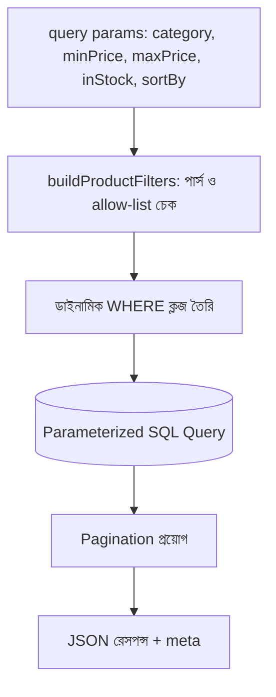

# ২৮.০৪. Advanced Filtering with Multiple Parameters

আমাদের ই-কমার্স প্রজেক্টে একজন কাস্টমার শুধু "সব প্রোডাক্ট পৃষ্ঠায় পৃষ্ঠায় দেখতে চায়" এমনটা না — সে চায় "Electronics ক্যাটাগরির, ৫০০ থেকে ২০০০ টাকার মধ্যে, স্টকে আছে এমন প্রোডাক্ট, দাম অনুযায়ী সাজানো"। এটাই **advanced filtering** — একাধিক শর্ত একসাথে প্রয়োগ করে ডেটা খোঁজা, যেটা Module 17-এ শেখা `WHERE`, `ORDER BY` ক্লজের বাস্তব, প্রোডাকশন-লেভেল প্রয়োগ।

প্রথম চ্যালেঞ্জ হলো — কুয়েরি স্ট্রিং থেকে এই শর্তগুলো নিরাপদভাবে পার্স করা।

```
GET /products?category=Electronics&minPrice=500&maxPrice=2000&inStock=true&sortBy=price&order=asc&page=1&limit=20
```

```typescript
// product/product.query-builder.ts
interface ProductFilters {
  category?: string;
  minPrice?: number;
  maxPrice?: number;
  inStock?: boolean;
  sortBy?: 'price' | 'name' | 'createdAt';
  order?: 'asc' | 'desc';
}

function buildProductFilters(query: Record<string, unknown>): ProductFilters {
  const filters: ProductFilters = {};
  if (query.category) filters.category = String(query.category);
  if (query.minPrice) filters.minPrice = Number(query.minPrice);
  if (query.maxPrice) filters.maxPrice = Number(query.maxPrice);
  if (query.inStock !== undefined) filters.inStock = query.inStock === 'true';
  if (['price', 'name', 'createdAt'].includes(query.sortBy as string)) {
    filters.sortBy = query.sortBy as ProductFilters['sortBy'];
  }
  filters.order = query.order === 'desc' ? 'desc' : 'asc';
  return filters;
}
```

এখানে `sortBy`-এর জন্য একটা allow-list (`['price', 'name', 'createdAt']`) ব্যবহার করা হয়েছে, ইউজারের দেয়া যেকোনো স্ট্রিং সরাসরি না মেনে। এটা গুরুত্বপূর্ণ, কারণ যদি ইউজারের ইনপুট সরাসরি SQL-এর `ORDER BY` কলামের নামে বসানো হয়, সেটা একটা SQL Injection-এর সুযোগ তৈরি করতে পারে (parameterized query দিয়ে ভ্যালুর ইনজেকশন ঠেকানো যায়, কিন্তু কলামের নাম বা দিক নির্দেশনা প্যারামিটারাইজ করা যায় না — তাই allow-list-ই এখানে একমাত্র নিরাপদ পথ)।

এখন এই ফিল্টার দিয়ে ডাইনামিক কোয়েরি বানানো:

```typescript
// product/product.service.ts
export async function findProducts(filters: ProductFilters, page: number, limit: number) {
  const conditions: string[] = ['deleted_at IS NULL'];
  const params: unknown[] = [];

  if (filters.category) {
    params.push(filters.category);
    conditions.push(`category = $${params.length}`);
  }
  if (filters.minPrice != null) {
    params.push(filters.minPrice);
    conditions.push(`price >= $${params.length}`);
  }
  if (filters.maxPrice != null) {
    params.push(filters.maxPrice);
    conditions.push(`price <= $${params.length}`);
  }
  if (filters.inStock) {
    conditions.push(`stock > 0`);
  }

  const sortColumn = filters.sortBy ?? 'created_at'; // ইতিমধ্যে allow-list দিয়ে যাচাই করা
  const sortOrder = filters.order === 'desc' ? 'DESC' : 'ASC';

  params.push(limit, (page - 1) * limit);
  const sql = `
    SELECT * FROM products
    WHERE ${conditions.join(' AND ')}
    ORDER BY ${sortColumn} ${sortOrder}
    LIMIT $${params.length - 1} OFFSET $${params.length}`;

  return db.query(sql, params);
}
```

এই ফাংশনটা একটা **dynamic WHERE clause builder** — যে শর্তগুলো আসলেই দেয়া হয়েছে, শুধু সেগুলোই কোয়েরিতে যোগ হচ্ছে, বাকি সব ঐচ্ছিক। এই প্যাটার্নটা বড় প্রজেক্টে এতটাই সাধারণ যে অনেক ORM (যেমন NestJS-এর সাথে ব্যবহৃত TypeORM, Prisma) এর জন্য বিল্ট-ইন কোয়েরি বিল্ডার সরবরাহ করে, ঠিক এই লজিকটাই আরও সহজ সিনট্যাক্সে করার জন্য।



এই মডিউলে আমরা রেসপন্স ফরম্যাটিং, offset আর cursor pagination, আর মাল্টি-প্যারামিটার ফিল্টারিং — এই তিনটা মিলিয়ে একটা সম্পূর্ণ, প্রোডাকশন-রেডি "লিস্টিং API" বানানোর কৌশল শিখে ফেললাম, যেটা Module 24-এর ই-কমার্স প্রজেক্টের প্রোডাক্ট, স্টোর, অর্ডার — সব ধরনের লিস্টিং এন্ডপয়েন্টে সরাসরি প্রয়োগযোগ্য।

আমাদের API এখন ডেটা ভালোভাবে ফেরত দিতে পারে, বদলাতে পারে, মুছতে পারে। কিন্তু এই পুরো সময় ধরে আমরা ধরে নিয়েছি "ইউজার লগইন করা আছে, তার রোল জানা আছে" — পরের মডিউলে আমরা এই অথেন্টিকেশন আর অথরাইজেশনের ভিত্তিটা আরও গভীরভাবে, প্রথম থেকে শেষ পর্যন্ত একসাথে ঝালিয়ে নেবো।
