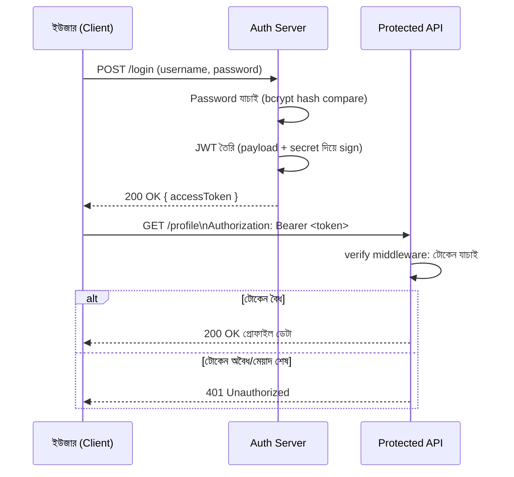

# ২৯.০১. Token-based Authentication Flow and Security

এতদিন আমরা authentication-এর গল্পটা টুকরো টুকরো করে শিখেছি। Module 11-এ আমরা দেখেছি Cookie আর Session কীভাবে একজন ইউজারকে "মনে রাখে", আর সেখানেই একটা সমস্যাও চোখে পড়েছিল — Session-ভিত্তিক পদ্ধতিতে সার্ভারকে প্রতিটা লগইন করা ইউজারের তথ্য নিজের মেমরিতে বা ডেটাবেজে জমা রাখতে হয়, যেটা একাধিক সার্ভার (স্কেলিং) এর জগতে বেশ ঝামেলার। ঠিক সেই সমস্যার সমাধান হিসেবে Module 12-তে আমরা পরিচিত হয়েছিলাম JWT — JSON Web Token-এর সাথে। এই মডিউলে আমরা সেই দুটো জ্ঞানকে এক জায়গায় নিয়ে আসবো, আরেকটু গভীরে গিয়ে বুঝবো একটা প্রোডাকশন-মানের token-based authentication system ঠিক কীভাবে কাজ করে — শুধু Express-এ না, NestJS-এও (যেটা আমরা Module 25-এ Passport দিয়ে দেখেছিলাম), যাতে দুটো ফ্রেমওয়ার্কেই তুমি একই মানসিক মডেল দিয়ে auth সিস্টেম সাজাতে পারো।

তার আগে একটা প্রশ্নের উত্তর পরিষ্কার করে নেই — "token-based authentication" জিনিসটা আসলে কী সমস্যার সমাধান করে? Session-ভিত্তিক পদ্ধতিতে সার্ভার নিজে একটা "state" রাখে — কে লগইন করে আছে, তার তালিকা। কিন্তু JWT-ভিত্তিক পদ্ধতিতে সার্ভার কোনো state রাখে না; বরং ইউজারের পরিচয় আর অধিকারের তথ্য (payload) নিজেই টোকেনের ভেতরে সিল করে ইউজারকে দিয়ে দেয়, একটা ডিজিটাল স্বাক্ষর (signature) সহ। পরে ইউজার যখন কোনো অনুরোধ পাঠায়, সে টোকেনটা সাথে নিয়ে আসে, আর সার্ভার শুধু স্বাক্ষরটা যাচাই করেই বুঝে ফেলে টোকেনটা আসল কিনা এবং তার ভেতরের তথ্য বিশ্বাসযোগ্য কিনা। এই বৈশিষ্ট্যকে বলে **stateless authentication** — এটাই আধুনিক API আর মাইক্রোসার্ভিস জগতের মূল ভিত্তি, কারণ এখানে যেকোনো সার্ভার ইনস্ট্যান্স, এমনকি সম্পূর্ণ ভিন্ন একটা সার্ভিসও, শুধু একটা shared secret বা public key দিয়ে টোকেন যাচাই করতে পারে, কোনো shared session store ছাড়াই।

পুরো ফ্লো-টা একটা গল্পের মতো করে দেখা যাক।



লক্ষ্য করো, এখানে দুটো ধাপ সম্পূর্ণ আলাদা দায়িত্বে বিভক্ত — একটা হলো **issuing** (টোকেন বানানো, লগইনের সময়), আরেকটা হলো **verifying** (টোকেন যাচাই করা, প্রতিটা protected রিকোয়েস্টে)। Express + TypeScript-এ এই দুটো অংশ আমরা আলাদা ফাইলে সাজাবো, কারণ বাস্তব প্রজেক্টে এই বিভাজনটাই কোডকে পরিষ্কার রাখে।

প্রথমে issuing অংশ — লগইন রুট, যেখানে পাসওয়ার্ড যাচাই করে টোকেন ইস্যু করা হচ্ছে:

```ts
// auth/issueToken.ts
import jwt from "jsonwebtoken";
import bcrypt from "bcrypt";

const ACCESS_SECRET = process.env.JWT_ACCESS_SECRET as string;

export interface JwtPayload {
  sub: string; // user id
  role: "admin" | "editor" | "viewer";
}

export function signAccessToken(payload: JwtPayload): string {
  return jwt.sign(payload, ACCESS_SECRET, {
    expiresIn: "15m", // ছোট আয়ু, security-র জন্য গুরুত্বপূর্ণ
    issuer: "our-api",
  });
}

export async function verifyPassword(
  plain: string,
  hashed: string
): Promise<boolean> {
  return bcrypt.compare(plain, hashed);
}
```

```ts
// routes/authRoutes.ts
import { Router } from "express";
import { findUserByUsername } from "../db/userRepository";
import { signAccessToken, verifyPassword } from "../auth/issueToken";

const router = Router();

router.post("/login", async (req, res) => {
  const { username, password } = req.body;
  const user = await findUserByUsername(username);

  if (!user || !(await verifyPassword(password, user.passwordHash))) {
    return res.status(401).json({ message: "ভুল username অথবা password" });
  }

  const accessToken = signAccessToken({ sub: user.id, role: user.role });
  res.json({ accessToken });
});

export default router;
```

খেয়াল করলে দেখবে, পাসওয়ার্ড কখনও plain text-এ ডেটাবেজে থাকছে না — Module 12-তে শেখা hashing (bcrypt) এখানেও ব্যবহার হচ্ছে। পাসওয়ার্ড hash করার যুক্তিটা একই থেকে যায়, শুধু এখন সেটা একটা পূর্ণাঙ্গ auth সিস্টেমের প্রথম ধাপ হিসেবে বসছে।

এবার verifying অংশ — এটাই middleware, যেটা প্রতিটা protected route-এর সামনে দাঁড়িয়ে থাকবে গেটকিপার হিসেবে:

```ts
// middleware/authenticate.ts
import { Request, Response, NextFunction } from "express";
import jwt from "jsonwebtoken";
import { JwtPayload } from "../auth/issueToken";

const ACCESS_SECRET = process.env.JWT_ACCESS_SECRET as string;

export interface AuthenticatedRequest extends Request {
  user?: JwtPayload;
}

export function authenticate(
  req: AuthenticatedRequest,
  res: Response,
  next: NextFunction
) {
  const header = req.headers.authorization; // "Bearer <token>"

  if (!header || !header.startsWith("Bearer ")) {
    return res.status(401).json({ message: "টোকেন পাওয়া যায়নি" });
  }

  const token = header.split(" ")[1];

  try {
    const decoded = jwt.verify(token, ACCESS_SECRET) as JwtPayload;
    req.user = decoded; // পরের handler-এর জন্য রেখে দিলাম
    next();
  } catch (err) {
    return res.status(401).json({ message: "টোকেন অবৈধ অথবা মেয়াদ শেষ" });
  }
}
```

এই মিডলওয়্যার প্যাটার্নটা Module 7-এ শেখা middleware চেইনের ধারণারই সরাসরি প্রয়োগ — request প্রথমে `authenticate`-এর ভেতর দিয়ে যায়, এবং শুধুমাত্র বৈধ হলেই `next()` কল হয়ে আসল route handler-এ পৌঁছায়। NestJS-এ Module 25-এ আমরা একই কাজ করেছিলাম `AuthGuard('jwt')` দিয়ে Passport স্ট্র্যাটেজি ব্যবহার করে — সেখানে Guard ক্লাসের `canActivate()` মেথডের ভেতরেই এই একই verify লজিক থাকে, শুধু ফ্রেমওয়ার্কের নিজস্ব wrapper-এ মোড়ানো। অর্থাৎ ধারণাটা সর্বজনীন — "প্রতিটা protected route-এর আগে একটা যাচাইকারী স্তর বসানো" — শুধু বাস্তবায়নের সিনট্যাক্স আলাদা।

একটা জিনিস এখানে বিশেষভাবে গুরুত্বপূর্ণ, নিরাপত্তার দৃষ্টিকোণ থেকে। Access token-এর মেয়াদ ইচ্ছাকৃতভাবে ছোট রাখা হয় (উপরে ১৫ মিনিট), কারণ যদি কোনোভাবে টোকেন চুরি হয়ে যায় (যেমন XSS আক্রমণে, যেটা আমরা Module 30-এ বিস্তারিত দেখবো), তাহলে ক্ষতির সময়সীমা সীমিত থাকে। কিন্তু ইউজারকে প্রতি ১৫ মিনিটে লগইন করতে বলাটা বাজে অভিজ্ঞতা — তাই বাস্তব সিস্টেমে একটা দীর্ঘ-মেয়াদী **refresh token** থাকে, যেটা httpOnly cookie-তে (Module 11-এর শেখা কৌশল কাজে লাগিয়ে) সংরক্ষিত থাকে এবং শুধু নতুন access token চাওয়ার জন্য ব্যবহার হয়, কখনও সরাসরি API অ্যাক্সেসের জন্য না। এভাবে দুই স্তরের টোকেন সিস্টেম — সংক্ষিপ্ত-মেয়াদী access token আর দীর্ঘ-মেয়াদী refresh token — একসাথে security আর ব্যবহারযোগ্যতার ভারসাম্য তৈরি করে।

এই লেসনে আমরা টোকেন ইস্যু আর যাচাইয়ের মূল ফ্লো শিখলাম। কিন্তু টোকেনের ভেতরের `role` তথ্যটা দিয়ে আমরা কী করবো — মানে কে কী করতে পারবে, সেটা কীভাবে নিয়ন্ত্রণ করা যায় — সেই প্রশ্নের উত্তর খুঁজবো পরের লেসনে, যেখানে আমরা Role-based Access Control (RBAC)-এর স্থাপত্য নিয়ে বিস্তারিত আলোচনা করবো।
