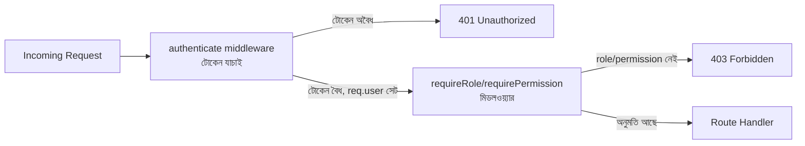

# ২৯.০৩. Implementing Authorization Middleware

আগের লেসনে আমরা RBAC-এর মডেলটা কাগজে-কলমে (মানে টাইপস্ক্রিপ্ট টাইপ আর একটা ম্যাপে) সাজিয়েছি। এখন সময় এসেছে সেই মডেলটাকে জীবন্ত করার — একটা middleware বানানো, যেটা প্রতিটা protected route-এর সামনে দাঁড়িয়ে বলবে "তুমি ভেতরে যেতে পারবে" অথবা "তুমি পারবে না"। Module 7-এ আমরা middleware চেইনের ধারণাটা শিখেছিলাম — একটা request একের পর এক ফাংশনের ভেতর দিয়ে যায়, প্রতিটা ফাংশন হয় `next()` কল করে এগিয়ে দেয়, নয়তো response পাঠিয়ে থামিয়ে দেয়। authorization middleware ঠিক এই একই প্যাটার্নের একটা বিশেষ প্রয়োগ, যেখানে থামানোর সিদ্ধান্তটা নির্ভর করে ইউজারের role আর সে যে কাজ করতে চাইছে তার উপর।

লক্ষ্য করার বিষয় হলো, authorization middleware সবসময় authentication middleware-এর *পরে* বসে — কারণ এটা কাজ করার জন্য আগেই জানা দরকার ইউজার কে (`req.user`), যেটা লেসন ১-এর `authenticate` middleware সেট করে দেয়। এই ক্রমটা ভাঙলে পুরো নিরাপত্তা মডেল ভেঙে পড়ে।



এখানে একটা সূক্ষ্ম কিন্তু গুরুত্বপূর্ণ পার্থক্য খেয়াল করার মতো — টোকেন না থাকলে বা অবৈধ হলে আমরা ফেরত দিই **401 Unauthorized** ("তুমি কে সেটাই আমরা জানি না"), কিন্তু টোকেন বৈধ হওয়া সত্ত্বেও প্রয়োজনীয় role না থাকলে ফেরত দিই **403 Forbidden** ("তোমাকে চিনি, কিন্তু তোমার এই কাজের অনুমতি নেই")। Module 6-এ শেখা status code-এর অর্থপূর্ণ ব্যবহারের এটাই বাস্তব প্রয়োগ — সঠিক status code ক্লায়েন্ট অ্যাপকে সঠিক প্রতিক্রিয়া (যেমন লগইন পেজে পাঠানো বনাম "অনুমতি নেই" বার্তা দেখানো) দিতে সাহায্য করে।

চলো এবার কোড লিখি। প্রথমে সহজ সংস্করণ — শুধু role-ভিত্তিক নিয়ন্ত্রণ:

```ts
// middleware/requireRole.ts
import { Response, NextFunction } from "express";
import { AuthenticatedRequest } from "./authenticate";
import { Role } from "../auth/rbac";

export function requireRole(...allowedRoles: Role[]) {
  return (req: AuthenticatedRequest, res: Response, next: NextFunction) => {
    const userRole = req.user?.role;

    if (!userRole) {
      return res.status(401).json({ message: "লগইন করা প্রয়োজন" });
    }

    if (!allowedRoles.includes(userRole)) {
      return res.status(403).json({
        message: `এই কাজের জন্য প্রয়োজনীয় role নেই। প্রয়োজন: ${allowedRoles.join(", ")}`,
      });
    }

    next();
  };
}
```

লক্ষ্য করো, `requireRole` নিজে একটা middleware ফেরত দিচ্ছে না — বরং একটা **middleware factory**, মানে একটা ফাংশন যেটা কল করলে middleware তৈরি হয়। এই প্যাটার্নটা দরকারি, কারণ আমরা চাই ভিন্ন ভিন্ন route-এ ভিন্ন ভিন্ন role বসাতে:

```ts
// routes/postRoutes.ts
import { Router } from "express";
import { authenticate } from "../middleware/authenticate";
import { requireRole } from "../middleware/requireRole";

const router = Router();

router.post(
  "/posts",
  authenticate,
  requireRole("admin", "editor"),
  createPostHandler
);

router.delete(
  "/posts/:id",
  authenticate,
  requireRole("admin"),
  deletePostHandler
);

router.get("/posts", authenticate, requireRole("admin", "editor", "viewer"), listPostsHandler);
```

এই তিনটা লাইন পড়লেই বোঝা যায় প্রতিটা endpoint-এর অনুমতির নিয়ম কী — এটাই ভালো authorization middleware-এর একটা বড় সুবিধা: নিয়মগুলো ছড়িয়ে-ছিটিয়ে না থেকে route definition-এর ঠিক পাশে, পড়ার মতো ভাষায় লেখা থাকে।

তবে role-ভিত্তিক চেক অনেক সময় যথেষ্ট সূক্ষ্ম না। ধরো তুমি চাও শুধু "যে ইউজার নিজের পোস্ট এডিট করছে, অথবা যে admin" তাকেই অনুমতি দিতে — এখানে শুধু role যথেষ্ট না, ডেটার সাথে ইউজারের সম্পর্কও (ownership) বিবেচনা করতে হয়। আগের লেসনে বানানো `roleHasPermission` ফাংশন কাজে লাগিয়ে আমরা আরেকটু নমনীয় একটা permission-based middleware বানাতে পারি:

```ts
// middleware/requirePermission.ts
import { Response, NextFunction } from "express";
import { AuthenticatedRequest } from "./authenticate";
import { Permission, roleHasPermission } from "../auth/rbac";

export function requirePermission(permission: Permission) {
  return (req: AuthenticatedRequest, res: Response, next: NextFunction) => {
    const role = req.user?.role;

    if (!role) {
      return res.status(401).json({ message: "লগইন করা প্রয়োজন" });
    }

    if (!roleHasPermission(role, permission)) {
      return res.status(403).json({ message: `অনুমতি নেই: ${permission}` });
    }

    next();
  };
}
```

```ts
router.delete(
  "/posts/:id",
  authenticate,
  requirePermission("post:delete"),
  deletePostHandler
);
```

আর ownership-এর মতো ডেটা-নির্ভর নিয়মের জন্য, একটা কাস্টম middleware লেখাই সবচেয়ে পরিষ্কার সমাধান, যেখানে আমরা ডেটাবেজ থেকে রিসোর্সটা খুঁজে বের করে owner আর current user তুলনা করি:

```ts
// middleware/requireOwnerOrAdmin.ts
export async function requireOwnerOrAdmin(
  req: AuthenticatedRequest,
  res: Response,
  next: NextFunction
) {
  const post = await findPostById(req.params.id);

  if (!post) return res.status(404).json({ message: "পোস্ট পাওয়া যায়নি" });

  const isOwner = post.authorId === req.user?.sub;
  const isAdmin = req.user?.role === "admin";

  if (!isOwner && !isAdmin) {
    return res.status(403).json({ message: "এই পোস্ট এডিট করার অনুমতি নেই" });
  }

  next();
}
```

NestJS-এ Module 25-তে আমরা যে `RolesGuard` দেখেছিলাম, সেটাও ঠিক এই একই কাজ করে, শুধু middleware ফাংশনের বদলে একটা Guard ক্লাসের `canActivate()` মেথডে বসে, আর route-এর role তথ্য আসে `@Roles()` ডেকোরেটরের metadata থেকে। মূল স্থাপত্য অভিন্ন — request থামানো, role/permission চেক করা, তারপর এগিয়ে দেওয়া বা প্রত্যাখ্যান করা।

এই লেসনে আমরা authorization-এর কার্যকরী স্তরটা বানালাম। কিন্তু এখনো একটা গুরুত্বপূর্ণ প্রশ্ন বাকি — এই role আর permission-এর ডেটা আসলে কোথা থেকে আসে, আর ইউজার ম্যানেজমেন্ট সিস্টেমে সেগুলো কীভাবে নিয়ন্ত্রণ করা হয়? সেটাই আমরা দেখবো পরের লেসনে, যেখানে আমরা user roles আর permissions ম্যানেজমেন্টের পূর্ণাঙ্গ চিত্র আঁকবো।
