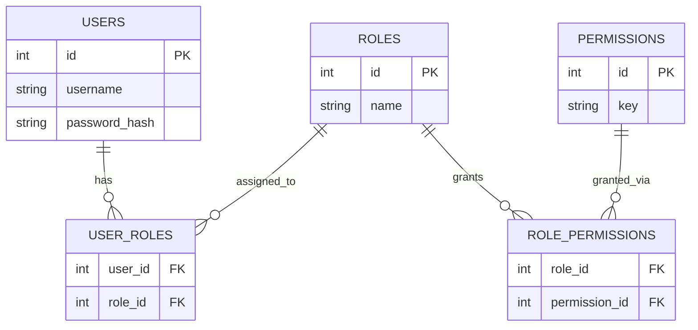

# ২৯.০৪. User Roles and Permissions Management

আগের দুটো লেসনে আমরা role আর permission-কে একটা in-memory ম্যাপে (`rolePermissions`) রেখে কাজ চালিয়েছি — শেখার জন্য এটা যথেষ্ট ছিল, কারণ এতে মনোযোগ ছিল middleware-এর যুক্তির উপর। কিন্তু বাস্তব একটা প্রোডাকশন সিস্টেমে role আর permission স্থির (hardcoded) থাকে না — একজন super-admin হয়তো চাইবে নতুন role বানাতে ("moderator"), অথবা কোনো নির্দিষ্ট role-এর কাছ থেকে একটা permission কেড়ে নিতে, অ্যাপ পুনরায় ডিপ্লয় না করেই। এই ধরনের নমনীয়তার জন্য role আর permission-কে ডেটাবেজে মডেল করতে হয়। এই লেসনে আমরা ঠিক সেই কাজটাই করবো, আর Module 21-এ RBAC নিয়ে যা শিখেছিলাম তার একটা বাস্তব, অ্যাপ্লিকেশন-লেভেল রূপ দাঁড় করাবো।

Module 18-তে আমরা শিখেছিলাম many-to-many সম্পর্ক কীভাবে কাজ করে — একজন স্টুডেন্ট অনেকগুলো কোর্সে ভর্তি হতে পারে, আবার একটা কোর্সে অনেক স্টুডেন্ট থাকতে পারে, আর এই সম্পর্কটা প্রকাশ করতে দরকার হয় একটা মাঝের (junction/pivot) টেবিল। User-Role-Permission-এর সম্পর্কটাও ঠিক একই প্যাটার্নের — একজন ইউজারের একাধিক role থাকতে পারে (কেউ হয়তো একইসাথে "editor" আর "support-agent"), আর একটা role-এর একাধিক permission থাকতে পারে, আবার একটা permission একাধিক role-এ ব্যবহার হতে পারে। তাই আমাদের দরকার দুটো many-to-many সম্পর্ক, যার মানে দুটো junction টেবিল।



এই ডিজাইনটা Module 16 আর Module 20-তে শেখা SQL দিয়েই সরাসরি বাস্তবায়ন করা যায়। ধরো আমরা raw SQL বা একটা ORM (যেমন Prisma বা TypeORM) ব্যবহার করছি — কনসেপ্টটা একই থাকে, শুধু সিনট্যাক্স আলাদা। raw SQL-এ স্কিমাটা দেখতে এমন হবে:

```sql
CREATE TABLE roles (
  id SERIAL PRIMARY KEY,
  name VARCHAR(50) UNIQUE NOT NULL
);

CREATE TABLE permissions (
  id SERIAL PRIMARY KEY,
  key VARCHAR(100) UNIQUE NOT NULL -- যেমন 'post:delete'
);

CREATE TABLE user_roles (
  user_id INT REFERENCES users(id) ON DELETE CASCADE,
  role_id INT REFERENCES roles(id) ON DELETE CASCADE,
  PRIMARY KEY (user_id, role_id)
);

CREATE TABLE role_permissions (
  role_id INT REFERENCES roles(id) ON DELETE CASCADE,
  permission_id INT REFERENCES permissions(id) ON DELETE CASCADE,
  PRIMARY KEY (role_id, permission_id)
);
```

এখন Express + TypeScript-এ, একজন ইউজারের সব permission বের করতে হলে আমাদের দুটো JOIN দরকার — user থেকে role, আর role থেকে permission (Module 20-তে শেখা JOIN অপারেশনের বাস্তব ব্যবহার):

```ts
// db/permissionRepository.ts
import { pool } from "./pool";

export async function getUserPermissions(userId: number): Promise<string[]> {
  const result = await pool.query(
    `
    SELECT DISTINCT p.key
    FROM permissions p
    JOIN role_permissions rp ON rp.permission_id = p.id
    JOIN user_roles ur ON ur.role_id = rp.role_id
    WHERE ur.user_id = $1
    `,
    [userId]
  );

  return result.rows.map((row) => row.key);
}
```

খেয়াল করো, এখানে `$1` প্লেসহোল্ডার ব্যবহার হয়েছে সরাসরি স্ট্রিং জোড়া লাগানোর বদলে — এটা parameterized query, যেটা SQL Injection ঠেকায়। এই বিষয়টা নিয়ে আমরা Module 30-তে অনেক গভীরে যাবো, কিন্তু এখানেই মনে রাখা ভালো — যেকোনো জায়গায় ইউজারের ইনপুট SQL query-তে যাচ্ছে, সেটা সবসময় parameterized হতে হবে।

এখন প্রশ্ন হলো — প্রতিটা রিকোয়েস্টে কি এই ডেটাবেজ কোয়েরি চালানো উচিত? সরাসরি হ্যাঁ বললে performance-এর একটা মূল্য দিতে হয়, কারণ প্রতিটা protected route hit করলেই একটা extra JOIN কোয়েরি চলবে। বাস্তব সিস্টেমে সাধারণত দুটো কৌশলের মিশ্রণ ব্যবহার হয়। প্রথমত, লগইনের সময় ইউজারের role আর মূল permission-গুলো JWT payload-এ বসিয়ে দেওয়া (যেটা আমরা লেসন ১-এ করেছি), যাতে বেশিরভাগ রিকোয়েস্টে ডেটাবেজ কল ছাড়াই কাজ চলে। দ্বিতীয়ত, যেসব খুব sensitive অপারেশন (যেমন কাউকে delete করা, বা কারো role পাল্টানো), সেখানে সবসময় সরাসরি ডেটাবেজ থেকে সবচেয়ে সাম্প্রতিক permission ফেরত পড়ে নেওয়া, যাতে সদ্য revoke করা কোনো অনুমতি এখনো কাজ না করে।

Role আর permission ম্যানেজ করার জন্য আমাদের একটা অ্যাডমিন-only API-ও দরকার হবে, যেটা নিজেই RBAC দিয়ে সুরক্ষিত — এখানে একটা সুন্দর "self-referencing" ব্যাপার আছে, RBAC সিস্টেম নিজেকে সুরক্ষা দিচ্ছে RBAC দিয়েই:

```ts
// routes/adminRoleRoutes.ts
router.post(
  "/admin/users/:id/roles",
  authenticate,
  requirePermission("user:manage"),
  async (req, res) => {
    const { roleName } = req.body;
    await assignRoleToUser(req.params.id, roleName);
    res.json({ message: "Role সফলভাবে অ্যাসাইন করা হয়েছে" });
  }
);
```

NestJS জগতে (Module 25) একই মডেল সাধারণত TypeORM-এর entity রিলেশন (`@ManyToMany`) দিয়ে প্রকাশ পায়, আর role/permission লজিক একটা আলাদা `RolesService`-এ থাকে, যেটা Guard-এর ভেতর থেকে ইনজেক্ট করে ব্যবহার হয় — কিন্তু আন্ডারলাইং ডেটা মডেল, উপরের ERD-টার মতোই।

এখন পর্যন্ত আমরা authentication (কে তুমি) আর authorization (তুমি কী পারো) দুটোই বানিয়ে ফেলেছি, একটা টেকসই, ডেটাবেজ-ব্যাকড role/permission মডেল সহ। শেষ ধাপ বাকি — এই সব টুকরো একসাথে জোড়া দিয়ে একটা সম্পূর্ণ API-কে কীভাবে end-to-end সুরক্ষিত করা হয়, সেটাই আমরা দেখবো পরের, এই মডিউলের শেষ লেসনে।
