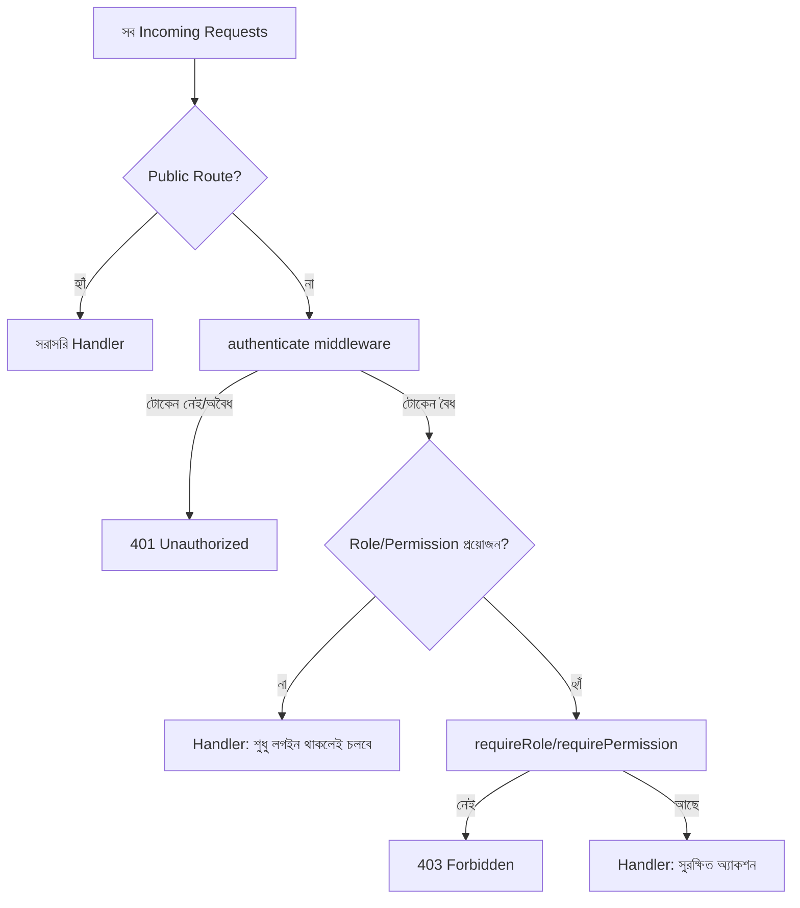

# ২৯.০৫. Securing API Routes with Authentication

এই মডিউলের চারটা লেসনে আমরা টুকরো টুকরো করে একটা সম্পূর্ণ auth সিস্টেমের প্রতিটা অংশ বানিয়েছি — টোকেন ইস্যু আর যাচাই (লেসন ১), role আর permission-এর মডেল (লেসন ২), সেই মডেল কার্যকর করার middleware (লেসন ৩), আর role/permission-এর ডেটাবেজ-ব্যাকড ম্যানেজমেন্ট (লেসন ৪)। এই শেষ লেসনে আমরা এই সবগুলো টুকরো একসাথে জোড়া দিয়ে দেখবো, একটা বাস্তব Express অ্যাপ্লিকেশনে পুরো route protection strategy কেমন দেখতে হয় — আর কোন কোন সাধারণ ভুল এড়িয়ে চলা উচিত।

প্রথমে ভাবা যাক, একটা API-এর সব endpoint আসলে একই রকম সুরক্ষা চায় না। কিছু endpoint সম্পূর্ণ পাবলিক (যেমন `/login`, `/register`, অথবা একটা পাবলিক ব্লগের `/posts` লিস্ট)। কিছু endpoint শুধু "লগইন করা থাকলেই চলবে" (যেমন `/profile`)। আবার কিছু endpoint নির্দিষ্ট role বা permission দাবি করে (যেমন `/admin/users`)। এই তিন স্তরের differentiation স্পষ্টভাবে বোঝা এবং route সাজানোর সময় সচেতনভাবে প্রয়োগ করা — এটাই "securing routes"-এর মূল কাজ।



Express-এ এই তিন স্তরকে আলাদা করার একটা পরিষ্কার উপায় হলো router-লেভেলে middleware প্রয়োগ করা, প্রতিটা রুটে আলাদা করে না লিখে। Module 7-এ শেখা router-ভিত্তিক গঠন এখানে খুব কাজে লাগে:

```ts
// app.ts
import express from "express";
import publicRoutes from "./routes/publicRoutes";
import profileRoutes from "./routes/profileRoutes";
import adminRoutes from "./routes/adminRoutes";
import { authenticate } from "./middleware/authenticate";
import { requireRole } from "./middleware/requireRole";

const app = express();
app.use(express.json());

// স্তর ১: সম্পূর্ণ পাবলিক
app.use("/api/public", publicRoutes);

// স্তর ২: লগইন থাকলেই চলবে
app.use("/api/profile", authenticate, profileRoutes);

// স্তর ৩: নির্দিষ্ট role দরকার
app.use("/api/admin", authenticate, requireRole("admin"), adminRoutes);

export default app;
```

এভাবে router-লেভেলে middleware বসালে, প্রতিটা আলাদা রুটে বারবার `authenticate` আর `requireRole` লেখার দরকার পড়ে না — পুরো গ্রুপের জন্য একবারেই নিয়মটা বসানো হয়ে যায়। তবে সতর্ক থাকা দরকার, `adminRoutes`-এর ভেতরেও যদি কোনো sub-route শুধু "viewer"-ও দেখতে পারা উচিত এমন কিছু থাকে, সেখানে আলাদাভাবে সেই route-এ বাড়তি অনুমতি বসাতে হবে — router-লেভেল middleware একটা "বেসলাইন" মাত্র, চূড়ান্ত কথা না।

এখন কিছু বাস্তব প্রজেক্টে দেখা সাধারণ ভুল নিয়ে কথা বলা যাক, কারণ এগুলো জানাটা middleware লেখা জানার চেয়ে কম গুরুত্বপূর্ণ না।

প্রথম ভুল হলো **client-side নির্ভরতা** — ফ্রন্টএন্ডে যদি "Delete" বাটনটা admin না হলে লুকিয়ে রাখা হয়, কিন্তু backend-এ কোনো `requireRole` middleware না থাকে, তাহলে যে কেউ সরাসরি API কল করে (Postman দিয়ে, যেটা আমরা Module 4-এ ব্যবহার শিখেছিলাম) ডিলিট করে ফেলতে পারবে। **Authorization সবসময় backend-এ enforce হতে হবে, frontend-এ শুধু ভালো UX দেখানোর জন্য UI লুকানো যায়, কিন্তু সেটা কখনও নিরাপত্তার একমাত্র স্তর হতে পারবে না।**

দ্বিতীয় ভুল হলো **মিডলওয়্যার অর্ডার ভুল করা**। `requireRole` কে `authenticate`-এর আগে বসালে `req.user` তখনও সেট হয়নি, ফলে middleware ক্র্যাশ করবে বা ভুল আচরণ করবে। মিডলওয়্যার চেইন সবসময় "প্রথমে identity নিশ্চিত করো, তারপর অনুমতি যাচাই করো" — এই ক্রম মেনে চলা উচিত।

তৃতীয় ভুল হলো **object-level authorization ভুলে যাওয়া**। ধরো `/api/orders/:id` একটা route, আর এতে `authenticate` বসানো আছে — কিন্তু যদি কোনো ইউজার শুধু তার নিজের অর্ডার আইডি না দিয়ে অন্য কারো অর্ডার আইডি বসিয়ে দেয়, আর handler-এ owner চেক না থাকে, তাহলে সে অন্যের ডেটা দেখে ফেলতে পারবে — এটাকে বলে **Broken Object Level Authorization (BOLA)**, এবং এটা আধুনিক API-গুলোর অন্যতম সবচেয়ে সাধারণ দুর্বলতা। লেসন ৩-এ দেখানো `requireOwnerOrAdmin` প্যাটার্নটা ঠিক এই সমস্যা সমাধানের জন্যই বানানো হয়েছিল:

```ts
router.get(
  "/orders/:id",
  authenticate,
  async (req: AuthenticatedRequest, res) => {
    const order = await findOrderById(req.params.id);
    if (!order) return res.status(404).json({ message: "পাওয়া যায়নি" });

    // শুধু authenticate যথেষ্ট না — ownership যাচাই বাধ্যতামূলক
    if (order.userId !== req.user!.sub && req.user!.role !== "admin") {
      return res.status(403).json({ message: "অনুমতি নেই" });
    }

    res.json(order);
  }
);
```

চতুর্থ, এবং শেষ ভুল — **টোকেন revocation-এর কথা না ভাবা**। JWT stateless বলে সার্ভার নিজে থেকে জানে না কোনো টোকেন এখনো "বৈধ" আছে কিনা তার মেয়াদ শেষ হওয়ার আগেই — যেমন ইউজার লগ-আউট করলে, বা তার অ্যাকাউন্ট ব্যান করা হলে। এই সমস্যার সাধারণ সমাধান একটা ছোট **blocklist** (সাধারণত Redis-এ, দ্রুত lookup-এর জন্য) রাখা, যেখানে revoke করা টোকেনের id (jti) জমা থাকে, আর `authenticate` middleware প্রতিবার সেই blocklist-ও চেক করে।

এই পাঁচটা লেসন মিলিয়ে আমরা এখন Express (আর সমান্তরালে NestJS-এ Module 25-এর মতো) একটা সম্পূর্ণ, স্তরবিন্যস্ত authentication ও authorization ব্যবস্থা কীভাবে দাঁড় করাতে হয় তা শিখে ফেললাম — টোকেন ইস্যু থেকে শুরু করে fine-grained permission আর object-level সুরক্ষা পর্যন্ত। কিন্তু "কে ভেতরে ঢুকতে পারবে" প্রশ্নের উত্তর দেওয়াটা নিরাপত্তার শুধু একটা অংশ। এখনো বাকি আছে আরও বড় প্রশ্ন — যে ইউজার বৈধভাবে ভেতরে ঢুকেছে, সেও কি তোমার API-কে ক্ষতিগ্রস্ত করতে পারে ভুল ইনপুট দিয়ে, ক্রস-সাইট আক্রমণ দিয়ে, বা তোমার সার্ভারকে অতিরিক্ত রিকোয়েস্টে ডুবিয়ে দিয়ে? সেই বিস্তৃত প্রশ্নের উত্তর নিয়েই শুরু হচ্ছে পরবর্তী মডিউল — Module 30: API Security।
