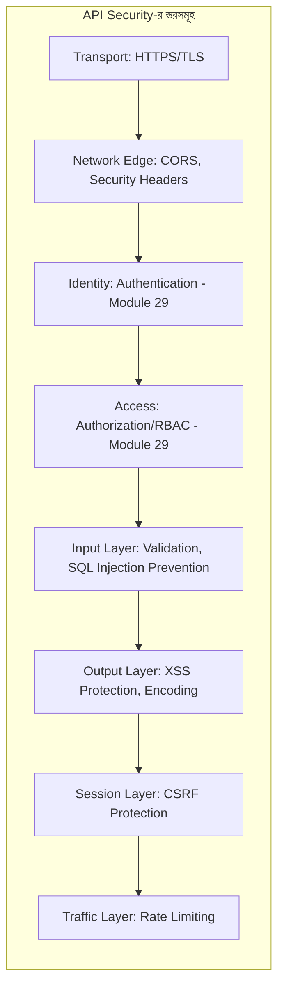

# ৩০.০১. API Security and Best Practices

Module 29 জুড়ে আমরা একটা নির্দিষ্ট প্রশ্নের উত্তর খুঁজেছি — "কে ভেতরে ঢুকতে পারবে, আর সে কী করতে পারবে?" কিন্তু একজন বৈধ, লগইন করা ইউজারও ইচ্ছাকৃত বা অনিচ্ছাকৃতভাবে তোমার সিস্টেমের ক্ষতি করতে পারে — ভুল ফরম্যাটের ডেটা পাঠিয়ে, দূষিত স্ক্রিপ্ট ঢুকিয়ে, অথবা হাজার হাজার রিকোয়েস্ট পাঠিয়ে সার্ভার আটকে দিয়ে। আবার এমন আক্রমণকারীও থাকতে পারে যে কখনো লগইনই করেনি, কিন্তু ব্রাউজারের কোনো দুর্বলতা কাজে লাগিয়ে অন্য কারো session হাইজ্যাক করছে। এই বিস্তৃত সমস্যাগুলোর সমাধান নিয়েই এই নতুন মডিউল — Module 30: API Security। এই প্রথম লেসনে আমরা পুরো ছবিটা এক নজরে দেখবো, যাতে পরের ছয়টা লেসনের প্রতিটা টুকরো কোথায় বসে সেটা বোঝা সহজ হয়।

Authentication আর Authorization (Module 29) আসলে API security-র একটা অংশ মাত্র — "কে" আর "কী করতে পারে" প্রশ্নের উত্তর। কিন্তু একটা সম্পূর্ণ নিরাপদ API-এর জন্য আরও অনেকগুলো স্তরের সুরক্ষা দরকার, যেগুলো একসাথে কাজ করে একটা **defense in depth** — অর্থাৎ একাধিক স্তরের সুরক্ষা — কৌশল তৈরি করে। যদি একটা স্তর ব্যর্থও হয়, বাকি স্তরগুলো ক্ষতি ঠেকিয়ে রাখে।



এই মডিউলের প্রতিটা লেসন এই স্তরগুলোর একেকটা নিয়ে গভীরে যাবে। লেসন ২-তে আমরা দেখবো CORS কীভাবে ব্রাউজারকে বলে দেয় কোন origin থেকে তোমার API কল করা যাবে, আর security headers কীভাবে ব্রাউজারকে নির্দেশ দেয় কী করা নিরাপদ আর কী না। লেসন ৩-তে SQL Injection — Module 21-এ যেটার সংক্ষিপ্ত পরিচয় পেয়েছিলে, সেটার পূর্ণ বিস্তার এবং প্রতিরোধের বাস্তব কৌশল। লেসন ৪-এ Cross-Site Scripting (XSS) — যেখানে আক্রমণকারী তোমার ওয়েবপেজে নিজের স্ক্রিপ্ট ঢুকিয়ে দিতে চায়। লেসন ৫-এ CSRF — যেখানে আক্রমণকারী তোমার লগইন করা ইউজারকে না জানিয়ে তার হয়ে একটা অ্যাকশন চালিয়ে দিতে চায়। লেসন ৬-এ Helmet.js — একটা লাইব্রেরি যেটা এক লাইনে অনেকগুলো security header একসাথে বসিয়ে দেয়। আর শেষ লেসনে আমরা rate limiting, input validation, আর আরও কিছু সাধারণ best practice দিয়ে পুরো মডিউলটার সারসংক্ষেপ টানবো।

একটা গুরুত্বপূর্ণ মানসিকতার কথা এখানেই বলে রাখা দরকার — নিরাপত্তা কখনো "একবার বানিয়ে ফেললাম, শেষ" ধরনের ব্যাপার না। আক্রমণকারীরা প্রতিনিয়ত নতুন কৌশল খুঁজে বের করে, তাই security-কে একটা চলমান প্রক্রিয়া হিসেবে দেখা উচিত। এই জায়গায় OWASP (Open Web Application Security Project) নামের একটা সংস্থার কথা জানা দরকার — তারা প্রতি বছর "OWASP Top 10" নামে সবচেয়ে সাধারণ ওয়েব/API দুর্বলতার একটা তালিকা প্রকাশ করে। এই মডিউলে আমরা যে টপিকগুলো কভার করছি — Injection, Broken Authentication (Module 29-তেই দেখা), XSS, CSRF, Security Misconfiguration — এর প্রায় সবগুলোই এই তালিকায় বছরের পর বছর ধরে শীর্ষে থাকে। তার মানে আমরা কল্পনাপ্রসূত কোনো সমস্যা নিয়ে কথা বলছি না, বরং বাস্তব দুনিয়ায় সবচেয়ে বেশি ঘটা আক্রমণগুলো ঠেকানোর কৌশল শিখছি।

আরেকটা মৌলিক নীতি, যেটা পুরো মডিউল জুড়ে বারবার ফিরে আসবে, তা হলো **"কখনো ইউজারের ইনপুটকে বিশ্বাস করো না"** (Never trust user input)। যেকোনো ডেটা যা তোমার সার্ভারের বাইরে থেকে আসছে — সেটা query parameter, request body, header, এমনকি cookie — সেটাকে সম্ভাব্য বিপজ্জনক ধরে নিয়ে যাচাই আর sanitize করতে হবে, তা সে ইউজার নিজে ইচ্ছাকৃতভাবে দূষিত ডেটা পাঠাক বা তার ব্রাউজার কোনো আক্রমণে আক্রান্ত হয়ে অজান্তেই দূষিত ডেটা পাঠাক।

একটা ছোট বাস্তব উদাহরণ দিয়ে ব্যাপারটা আরও স্পষ্ট করা যাক। ধরো তোমার একটা Express অ্যাপ আছে যেখানে কোনো security middleware বসানো নেই:

```ts
import express from "express";
const app = express();
app.use(express.json());

app.get("/search", async (req, res) => {
  const q = req.query.q;
  const results = await db.query(`SELECT * FROM products WHERE name LIKE '%${q}%'`);
  res.json(results);
});
```

এই একটা endpoint-এই অন্তত দুটো বড় দুর্বলতা লুকিয়ে আছে — সরাসরি স্ট্রিং জোড়া লাগিয়ে SQL query বানানো (SQL Injection-এর সুযোগ, লেসন ৩-এ বিস্তারিত), আর কোনো rate limiting না থাকা (লেসন ৭-এ বিস্তারিত)। এই মডিউল শেষে, তুমি এই একই endpoint-কে ধাপে ধাপে সুরক্ষিত রূপে রূপান্তর করতে সক্ষম হবে।

এখন যেহেতু পুরো ছবিটা আমাদের চোখের সামনে পরিষ্কার, চলো প্রথম স্তর দিয়ে শুরু করি — নেটওয়ার্কের একদম প্রান্তে, ব্রাউজার আর সার্ভারের মধ্যে যোগাযোগের নিয়ম ঠিক করা, অর্থাৎ CORS আর security headers, যেটা আমরা দেখবো পরের লেসনে।
