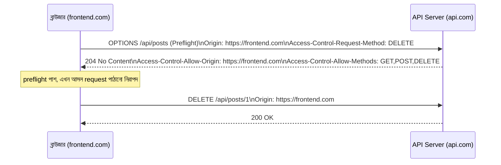

# ৩০.০২. CORS Configuration and Security Headers

আগের লেসনে আমরা security-র স্তরগুলোর মধ্যে সবচেয়ে বাইরের স্তরটার কথা বলেছিলাম — নেটওয়ার্কের প্রান্তে, যেখানে ব্রাউজার প্রথমবার তোমার সার্ভারের সাথে কথা বলার চেষ্টা করে। এই লেসনে আমরা সেই স্তরটা নিয়েই কাজ করবো, শুরু করবো একটা এমন সমস্যা দিয়ে যেটা প্রায় প্রতিটা backend ডেভেলপার তার প্রথম কয়েক মাসেই মুখোমুখি হয় — একটা কনফিউজিং এরর মেসেজ, "blocked by CORS policy"।

এই সমস্যাটা বোঝার জন্য প্রথমে বুঝতে হবে ব্রাউজার একটা বিশেষ সুরক্ষা নীতি মেনে চলে, যার নাম **Same-Origin Policy**। এই নীতি অনুযায়ী, `https://myapp.com`-এ চলা কোনো JavaScript কোড ডিফল্টভাবে `https://api.otherdomain.com`-এর মতো ভিন্ন origin-এ (ভিন্ন domain, protocol, বা port) request পাঠিয়ে তার response পড়তে পারবে না, নিরাপত্তার স্বার্থে — কারণ এই নীতি না থাকলে যেকোনো দূষিত ওয়েবসাইট তোমার ব্যাংকের সাইটে (যেখানে তুমি হয়তো ইতিমধ্যে লগইন করে আছো, Module 11-এ শেখা cookie-র মাধ্যমে) নিজের ইচ্ছামতো request পাঠিয়ে তোমার তথ্য চুরি করে ফেলতে পারতো। CORS (Cross-Origin Resource Sharing) হলো এই কড়া নীতির একটা নিয়ন্ত্রিত ব্যতিক্রম তৈরি করার প্রক্রিয়া — সার্ভার স্পষ্টভাবে বলে দেয় "এই নির্দিষ্ট origin-গুলো থেকে request নিরাপদ, তাদের অনুমতি দাও"।

কিছু request-এর ক্ষেত্রে ব্রাউজার আসল request পাঠানোর আগে একটা "প্রি-চেক" রিকোয়েস্ট পাঠায়, যাকে বলে **preflight request** — এটা HTTP-এর `OPTIONS` মেথড ব্যবহার করে জিজ্ঞেস করে "আমি যদি এই মেথড, এই header নিয়ে request পাঠাই, তুমি কি অনুমতি দেবে?"



Express-এ CORS ম্যানুয়ালি header বসিয়েও করা যায়, কিন্তু ভুল করার সুযোগ অনেক (যেমন ভুলবশত সব origin-কে `*` দিয়ে অনুমতি দেওয়া, যেটা credential-সহ request-এর সাথে বিপজ্জনক)। তাই বাস্তবে আমরা `cors` নামের নির্ভরযোগ্য npm প্যাকেজ ব্যবহার করি:

```bash
npm install cors
npm install -D @types/cors
```

```ts
// app.ts
import express from "express";
import cors from "cors";

const app = express();

const allowedOrigins = [
  "https://myapp.com",
  "https://admin.myapp.com",
];

app.use(
  cors({
    origin: (origin, callback) => {
      // origin undefined হয় server-to-server call বা Postman-এর ক্ষেত্রে
      if (!origin || allowedOrigins.includes(origin)) {
        callback(null, true);
      } else {
        callback(new Error("এই origin থেকে অনুমতি নেই"));
      }
    },
    methods: ["GET", "POST", "PUT", "PATCH", "DELETE"],
    credentials: true, // cookie/Authorization header পাঠানোর অনুমতি
  })
);
```

লক্ষ্য করো, এখানে `origin: "*"` ব্যবহার না করে একটা whitelist ফাংশন ব্যবহার করা হয়েছে। এটা ইচ্ছাকৃত — `credentials: true` (মানে cookie-ভিত্তিক authentication, Module 11-এর সেশন কুকির মতো, ব্রাউজারের মধ্যে দিয়ে যাওয়ার অনুমতি) দেওয়ার সাথে `origin: "*"` একসাথে ব্যবহার করা browser স্পেসিফিকেশন অনুযায়ীই নিষিদ্ধ, ঠিক নিরাপত্তার কারণেই — কারণ এই কম্বিনেশন যেকোনো ওয়েবসাইটকে ইউজারের কুকি ব্যবহার করে request পাঠানোর সুযোগ দিতো।

CORS ঠিক করা হলো একটা সুরক্ষা, কিন্তু এটা একমাত্র সুরক্ষা না। ব্রাউজার আরও অনেক আচরণ নিয়ন্ত্রণ করতে পারে বিভিন্ন **security header** দিয়ে, যেগুলো সার্ভার response-এর সাথে পাঠায়। এদের মধ্যে কয়েকটা সবচেয়ে গুরুত্বপূর্ণ header এখানে দেখা যাক:

```ts
app.use((req, res, next) => {
  // ব্রাউজারকে বলে content-type অনুমান (sniff) না করতে, ঘোষিত টাইপ মেনে চলতে
  res.setHeader("X-Content-Type-Options", "nosniff");

  // এই পেজটা অন্য কোনো সাইটের <iframe>-এর ভেতরে লোড হতে না দেওয়া (clickjacking প্রতিরোধ)
  res.setHeader("X-Frame-Options", "DENY");

  // ব্রাউজারকে বাধ্য করা সবসময় HTTPS দিয়ে যোগাযোগ করতে
  res.setHeader(
    "Strict-Transport-Security",
    "max-age=63072000; includeSubDomains"
  );

  // Referrer header-এ কতটা তথ্য পাঠানো হবে তা সীমিত করা
  res.setHeader("Referrer-Policy", "strict-origin-when-cross-origin");

  next();
});
```

এই header-গুলো ম্যানুয়ালি লেখা শেখার জন্য গুরুত্বপূর্ণ, কারণ এতে বোঝা যায় প্রতিটার আসল উদ্দেশ্য কী। কিন্তু বাস্তব প্রজেক্টে এই সবগুলো header (আর আরও অনেকগুলো, যেমন Content-Security-Policy) হাতে বসানো ভুলপ্রবণ এবং সময়সাপেক্ষ — এই কারণেই পরে লেসন ৬-এ আমরা **Helmet.js** নামের একটা লাইব্রেরি দেখবো, যেটা এই সব header এক লাইনে, ভালোভাবে টেস্ট করা ডিফল্ট মান দিয়ে বসিয়ে দেয়।

একটা লক্ষণীয় বিষয় — CORS আর security header দুটোই মূলত **ব্রাউজারের আচরণ নিয়ন্ত্রণ করে**, কারণ ব্রাউজারই এই header-গুলো মেনে চলার প্রতিশ্রুতি রাখে। যদি কেউ সরাসরি `curl` বা Postman দিয়ে request পাঠায় (কোনো ব্রাউজার ছাড়াই), CORS তাকে থামাতে পারবে না। তাই CORS কখনও authentication বা authorization-এর বিকল্প না — এটা Module 29-এ শেখা `authenticate`/`requireRole` middleware-এর *সাথে* কাজ করে, তার *বদলে* না।

এখন আমাদের নেটওয়ার্কের প্রান্তটা সুরক্ষিত। কিন্তু ব্রাউজার-লেভেল সুরক্ষা যথেষ্ট না, যদি সার্ভারের ভেতরেই ডেটা-হ্যান্ডলিং-এ ফাঁক থাকে। পরের লেসনে আমরা তেমনই একটা সবচেয়ে পুরনো, কিন্তু আজও সবচেয়ে সাধারণ দুর্বলতা নিয়ে কথা বলবো — SQL Injection।
