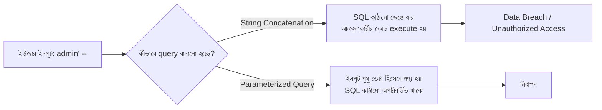

# ৩০.০৩. SQL Injection Prevention Techniques

Module 21-এ, ডেটাবেজ পারফরম্যান্স আর নিরাপত্তা নিয়ে আলোচনার সময় আমরা সংক্ষেপে SQL Injection-এর সাথে পরিচিত হয়েছিলাম। এই লেসনে আমরা সেই পরিচয়টাকে পূর্ণাঙ্গ বোঝাপড়ায় রূপান্তর করবো — কেন এই আক্রমণ কাজ করে, ঠিক কীভাবে একজন আক্রমণকারী এটা কাজে লাগায়, আর সবচেয়ে গুরুত্বপূর্ণভাবে, Express + TypeScript প্রজেক্টে এটা প্রতিরোধ করার নির্ভরযোগ্য কৌশল কী।

SQL Injection-এর মূল কারণ একটা খুব সাধারণ ভুল থেকে আসে — ইউজারের ইনপুট আর SQL কোডকে একসাথে, স্ট্রিং জোড়া লাগিয়ে (concatenation) একটা query বানানো। মনে করো আমাদের একটা লগইন query আছে:

```ts
// বিপজ্জনক কোড — কখনো এভাবে লিখো না
const username = req.body.username; // ধরি: admin' --
const query = `SELECT * FROM users WHERE username = '${username}'`;
```

স্বাভাবিক ইনপুটের ক্ষেত্রে এই query ঠিকঠাক কাজ করে। কিন্তু যদি কেউ username হিসেবে পাঠায় `admin' --`, তাহলে চূড়ান্ত query দাঁড়ায়:

```sql
SELECT * FROM users WHERE username = 'admin' --'
```

লক্ষ্য করো, `--` SQL-এ একটা কমেন্টের শুরু বোঝায় — তার মানে বাকি সব (পাসওয়ার্ড চেক-সহ, যদি থাকতো) উপেক্ষা করা হয়ে যায়, আর query কার্যকরভাবে হয়ে যায় "admin ইউজারকে খুঁজে বের করো, পাসওয়ার্ড না মিলিয়েই" — আক্রমণকারী পাসওয়ার্ড ছাড়াই লগইন করে ফেলতে পারে। আরও বিপজ্জনক উদাহরণে, কেউ এমন ইনপুটও দিতে পারে যা পুরো `users` টেবিল ডিলিট করে দেয়, অথবা এমন query চালায় যা তাকে অন্য ইউজারের গোপন তথ্য দেখতে দেয়।



এখানে মূল সমাধান হলো একটাই নীতি — **কখনো ইউজারের ইনপুটকে সরাসরি SQL স্ট্রিং-এর ভেতর জোড়া লাগাবে না। বরং সবসময় parameterized query (prepared statement) ব্যবহার করবে।** এই পদ্ধতিতে, ডেটাবেজ ড্রাইভার নিজেই ইনপুটকে "শুধুমাত্র ডেটা" হিসেবে চিহ্নিত করে পাঠায়, কখনো এক্সিকিউটেবল SQL কোড হিসেবে না, যতই সেই ডেটার ভেতরে `'`, `--`, বা `;` এর মতো চিহ্ন থাকুক না কেন।

Node.js-এ raw SQL ব্যবহার করলে (যেমন `pg` ড্রাইভার দিয়ে PostgreSQL-এর সাথে কাজ করার সময়), parameterized query দেখতে এমন:

```ts
// নিরাপদ কোড
import { pool } from "./db/pool";

export async function findUserByUsername(username: string) {
  const result = await pool.query(
    "SELECT * FROM users WHERE username = $1",
    [username]
  );
  return result.rows[0];
}
```

এখানে `$1` একটা প্লেসহোল্ডার, আর `username` ভ্যারিয়েবলটা আলাদা array-তে পাঠানো হচ্ছে। ড্রাইভার নিজে ভেতরে ভেতরে নিশ্চিত করে যে যতই দূষিত স্ট্রিং আসুক, সেটা শুধু "একটা তুলনার মান" হিসেবেই ব্যবহৃত হবে, SQL কাঠামোর অংশ হিসেবে না।

আধুনিক Express + TypeScript প্রজেক্টে, আমরা প্রায়ই raw SQL-এর বদলে একটা ORM (Object-Relational Mapper) ব্যবহার করি — যেমন Prisma বা TypeORM — যা এই parameterization ডিফল্টভাবে, স্বয়ংক্রিয়ভাবে করে দেয়:

```ts
// Prisma উদাহরণ — এখানে ORM নিজেই parameterization নিশ্চিত করছে
const user = await prisma.user.findUnique({
  where: { username: req.body.username },
});
```

```ts
// TypeORM উদাহরণ
const user = await userRepository.findOne({
  where: { username: req.body.username },
});
```

এই দুটো উদাহরণেই আমরা কখনো সরাসরি SQL স্ট্রিং লিখছি না — ORM নিজেই সঠিক parameterized query বানিয়ে ডেটাবেজে পাঠায়। এই কারণে বেশিরভাগ আধুনিক প্রজেক্টে ORM ব্যবহার SQL Injection-এর ঝুঁকি বহুলাংশে কমিয়ে দেয়। তবে একটা সতর্কতা — অনেক ORM-এই "raw query" চালানোর সুযোগ থাকে (যেমন Prisma-র `$queryRawUnsafe`, বা TypeORM-এর `query()`), আর সেখানে যদি কেউ আবার স্ট্রিং জোড়া লাগিয়ে ফেলে, একই দুর্বলতা ফিরে আসে:

```ts
// এটাও বিপজ্জনক, ORM ব্যবহার করলেও
await prisma.$queryRawUnsafe(
  `SELECT * FROM users WHERE username = '${req.body.username}'`
);

// সঠিক পদ্ধতি — ট্যাগড টেমপ্লেট বা প্যারামিটার সহ
await prisma.$queryRaw`SELECT * FROM users WHERE username = ${req.body.username}`;
```

তার মানে নিয়মটা টুল-নির্ভর না, এটা একটা নীতি — যেখানেই raw SQL লেখা হোক, ইউজার ইনপুট আর query স্ট্রাকচার সবসময় আলাদা থাকতে হবে।

Parameterized query ছাড়াও, defense-in-depth নীতি মেনে আরও দুটো বাড়তি সুরক্ষা যোগ করা ভালো অভ্যাস। প্রথমত, ডেটাবেজ ইউজারের নিজের অনুমতি সীমিত রাখা (Module 21-এ শেখা `GRANT`/`REVOKE`) — API-এর ডেটাবেজ ইউজারকে যদি শুধু নির্দিষ্ট টেবিলে READ/WRITE অনুমতি দেওয়া থাকে, DROP TABLE-এর মতো ধ্বংসাত্মক কমান্ড চালানোর ক্ষমতাই তার না থাকলে, কোনো ইনজেকশন সফল হলেও ক্ষতির পরিসর সীমিত থাকে। দ্বিতীয়ত, ইনপুট validation (যেটা লেসন ৭-এ আরও বিস্তারিত দেখবো) — যেমন যদি একটা ফিল্ড শুধু সংখ্যা হওয়ার কথা, সেটাকে সংখ্যা হিসেবেই যাচাই করে নেওয়া, এতে আক্রমণকারীর কাছে অস্ত্র হিসেবে ব্যবহারযোগ্য অক্ষরই পৌঁছায় না।

SQL Injection ছিল এমন একটা আক্রমণ যেখানে দূষিত কোড ডেটাবেজের দিকে যাচ্ছিল। পরের লেসনে আমরা দেখবো ঠিক উল্টো দিকের একটা আক্রমণ — যেখানে দূষিত কোড ফিরে আসে ব্রাউজারের দিকে, অন্য ইউজারদের ব্রাউজারে execute হওয়ার জন্য। এটাই Cross-Site Scripting, বা XSS।
