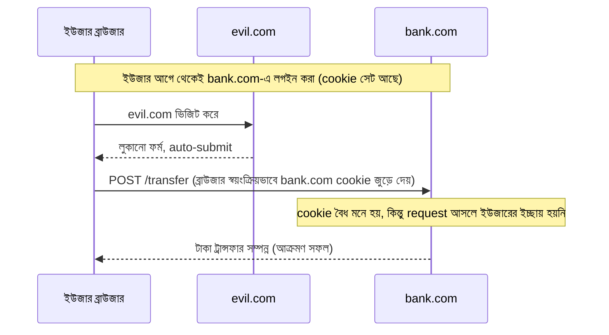

# ৩০.০৫. CSRF Token Implementation

আগের লেসনের শেষে আমরা একটা ইঙ্গিত রেখে এসেছিলাম — এমন একটা আক্রমণ যেখানে আক্রমণকারী ইউজারের cookie চুরি করে না, বরং সেই cookie-কেই ইউজারের অজান্তে "ব্যবহার" করে ফেলে। এটাই Cross-Site Request Forgery, সংক্ষেপে CSRF (উচ্চারণ করা হয় "সি-সার্ফ")। এই আক্রমণ বোঝার জন্য প্রথমে মনে করিয়ে দেওয়া দরকার Module 11-এ শেখা cookie-র একটা মৌলিক বৈশিষ্ট্য — ব্রাউজার স্বয়ংক্রিয়ভাবে একটা ডোমেইনের cookie সেই ডোমেইনে পাঠানো প্রতিটা request-এর সাথে জুড়ে দেয়, সেই request কোথা থেকে এসেছে সেটা বিবেচনা না করেই।

এই স্বয়ংক্রিয়তাটাই CSRF আক্রমণের ভিত্তি। ধরো তুমি `bank.com`-এ লগইন করে আছো, আর তোমার ব্রাউজারে তার session cookie জমা আছে। এখন তুমি অজান্তে একটা দূষিত ওয়েবসাইট `evil.com`-এ যাও, যেখানে লুকানো একটা ফর্ম আছে যেটা পেজ লোড হওয়ার সাথে সাথেই `bank.com/transfer`-এ একটা POST request পাঠিয়ে দেয়, টাকা আক্রমণকারীর অ্যাকাউন্টে পাঠানোর অনুরোধ নিয়ে। যেহেতু এই request `bank.com`-এর উদ্দেশ্যেই যাচ্ছে, ব্রাউজার স্বয়ংক্রিয়ভাবে তোমার `bank.com` session cookie সেই request-এর সাথে জুড়ে দেয় — আর `bank.com`-এর সার্ভার দেখে একটা বৈধ, লগইন করা ইউজারের অনুরোধ, request-টা আসলে কোথা থেকে trigger হয়েছে তা বিবেচনা না করেই।



লক্ষ্য করার বিষয় — CSRF কাজ করে শুধুমাত্র তখনই যখন authentication সম্পূর্ণভাবে cookie-নির্ভর হয়, কারণ cookie-ই একমাত্র credential যেটা ব্রাউজার নিজে থেকে জুড়ে দেয়। যদি authentication `Authorization: Bearer <token>` header দিয়ে হয় (Module 12, 29-এর JWT পদ্ধতি), তাহলে CSRF অনেকটাই দুর্বল হয়ে যায় — কারণ `evil.com`-এর ফর্ম নিজে থেকে সেই header জুড়ে দিতে পারে না, আর JavaScript দিয়ে জুড়তে গেলে CORS (লেসন ২) বাধা দেয়। এটাই একটা বড় কারণ কেন আধুনিক SPA/API আর্কিটেকচারে JWT-header-ভিত্তিক auth জনপ্রিয়। কিন্তু অনেক প্রজেক্টেই refresh token বা session httpOnly cookie-তে রাখা হয় (আগের লেসনগুলোতে যেমন দেখেছি), তাই CSRF সুরক্ষা এখনও প্রাসঙ্গিক।

প্রথম প্রতিরক্ষা স্তর, আগের লেসনেই উল্লেখ করা `sameSite` cookie অ্যাট্রিবিউট:

```ts
res.cookie("session", token, {
  httpOnly: true,
  secure: true,
  sameSite: "strict", // অথবা "lax"
});
```

`sameSite: "strict"` ব্রাউজারকে বলে দেয় "এই cookie শুধু তখনই পাঠাও যখন request একই সাইট থেকে শুরু হয়েছে" — মানে `evil.com`-এর ফর্ম থেকে `bank.com`-এ request গেলেও cookie জুড়বে না। এটা অনেক ক্ষেত্রেই যথেষ্ট, কিন্তু `lax` মোডে কিছু ব্যতিক্রম থাকে (যেমন লিংকে ক্লিক করে নেভিগেট করা), আর পুরনো ব্রাউজারে এই অ্যাট্রিবিউট সমর্থিত নাও হতে পারে। তাই defense-in-depth নীতি মেনে, একটা দ্বিতীয়, আরও সরাসরি প্রতিরক্ষা ব্যবহার করা হয় — **CSRF Token**।

CSRF Token-এর মূল ধারণা হলো: প্রতিটা state-পরিবর্তনকারী request-এর (POST/PUT/DELETE) সাথে একটা গোপন, অনুমান-অযোগ্য টোকেন জুড়ে পাঠাতে হবে, যেটা শুধুমাত্র সেই সাইটের নিজস্ব পেজ থেকেই পাওয়া সম্ভব — cookie-র মতো এটা স্বয়ংক্রিয়ভাবে জুড়ে যায় না, বরং JavaScript দিয়ে সচেতনভাবে বসাতে হয়, যেটা `evil.com` করতে পারবে না কারণ সে টোকেনের মানটাই জানে না।

একটা জনপ্রিয়, সহজ পদ্ধতি হলো **Double-Submit Cookie** প্যাটার্ন — সার্ভার একটা random টোকেন তৈরি করে দুই জায়গায় পাঠায়: একটা সাধারণ (non-httpOnly) cookie হিসেবে, আরেকটা response body-তে যাতে frontend সেটা পড়ে পরবর্তী request-এ header হিসেবে জুড়ে দিতে পারে। সার্ভার শুধু যাচাই করে দুটো মান মিলছে কিনা।

```ts
// middleware/csrf.ts
import crypto from "crypto";
import { Request, Response, NextFunction } from "express";

export function issueCsrfToken(req: Request, res: Response, next: NextFunction) {
  const token = crypto.randomBytes(32).toString("hex");
  res.cookie("csrfToken", token, {
    httpOnly: false, // frontend থেকে পড়তে হবে বলেই httpOnly না
    secure: true,
    sameSite: "strict",
  });
  res.locals.csrfToken = token;
  next();
}

export function verifyCsrfToken(req: Request, res: Response, next: NextFunction) {
  const cookieToken = req.cookies["csrfToken"];
  const headerToken = req.headers["x-csrf-token"];

  if (!cookieToken || !headerToken || cookieToken !== headerToken) {
    return res.status(403).json({ message: "CSRF যাচাই ব্যর্থ" });
  }

  next();
}
```

```ts
// রুট সেটআপ
app.get("/api/csrf-token", issueCsrfToken, (req, res) => {
  res.json({ csrfToken: res.locals.csrfToken });
});

app.post("/api/transfer", authenticate, verifyCsrfToken, transferHandler);
```

আর frontend-এ, প্রতিটা POST/PUT/DELETE request পাঠানোর আগে ওই টোকেনটা header হিসেবে জুড়ে দিতে হবে:

```ts
// frontend fetch উদাহরণ
const res = await fetch("/api/csrf-token");
const { csrfToken } = await res.json();

await fetch("/api/transfer", {
  method: "POST",
  headers: {
    "Content-Type": "application/json",
    "X-CSRF-Token": csrfToken,
  },
  credentials: "include", // cookie পাঠানোর জন্য
  body: JSON.stringify({ amount: 100 }),
});
```

এই প্যাটার্নের নিরাপত্তা নির্ভর করে একটা সহজ যুক্তির উপর — `evil.com` কোনোভাবে `bank.com`-এর cookie পড়তে পারে না (Same-Origin Policy, লেসন ২), তাই সে সঠিক `X-CSRF-Token` header বসাতে পারবে না, যদিও cookie নিজে স্বয়ংক্রিয়ভাবে জুড়ে যাবে। ঐতিহাসিকভাবে অনেক Express প্রজেক্টে `csurf` নামের একটা মিডলওয়্যার লাইব্রেরিও ব্যবহার হতো, যেটা ঠিক এই একই double-submit বা session-ভিত্তিক প্যাটার্ন প্যাকেজ করে দিতো — যদিও সেই নির্দিষ্ট প্যাকেজটা এখন deprecated, এর পেছনের প্যাটার্নটা আজও বৈধ এবং সমান কার্যকর, উপরের কাস্টম মিডলওয়্যারের মতো নিজে বাস্তবায়ন করেও ব্যবহার করা যায়।

মনে রাখা দরকার, GET request-এ সাধারণত CSRF সুরক্ষা দরকার হয় না, কারণ GET-কে idempotent এবং side-effect-free হওয়ার কথা (Module 6-এ শেখা REST নীতি) — CSRF সুরক্ষা কেবল সেই সব request-এ বসানো উচিত যেগুলো ডেটা পরিবর্তন করে।

এখন পর্যন্ত আমরা তিনটা বড় আক্রমণ প্রতিরোধ করা শিখেছি — SQL Injection, XSS, আর CSRF, প্রতিটাই আলাদা আলাদা middleware বা কৌশল দিয়ে। কিন্তু এই সবগুলো header, cookie flag, আর নিরাপত্তা নিয়ম হাতে-কলমে বসানো ভুলপ্রবণ। পরের লেসনে আমরা দেখবো Helmet.js কীভাবে এই কাজগুলোর অনেকটাই একসাথে, নির্ভরযোগ্যভাবে সামলে দেয়।
