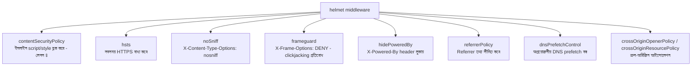

# ৩০.০৬. Using Helmet.js for Enhanced Security

গত চারটা লেসনে আমরা একের পর এক নিরাপত্তা header আর মিডলওয়্যার হাতে-কলমে লিখেছি — CORS-এর পাশাপাশি `X-Content-Type-Options`, `X-Frame-Options`, `Strict-Transport-Security`, `Content-Security-Policy`, আর cookie-র `httpOnly`/`sameSite` flag। এই প্রতিটাই আলাদা আলাদাভাবে গুরুত্বপূর্ণ, কিন্তু বাস্তব প্রজেক্টে এতগুলো header হাতে মনে রেখে, সঠিক মান দিয়ে, প্রতিটা প্রজেক্টে নতুন করে বসানো — এটা ভুল হওয়ার একটা বড় সুযোগ তৈরি করে। এই লেসনে আমরা পরিচিত হবো **Helmet.js**-এর সাথে, একটা ছোট কিন্তু অত্যন্ত কার্যকর Express মিডলওয়্যার লাইব্রেরি, যেটা এই সাধারণ security header-গুলোর প্রায় সবই এক লাইনে, ভালোভাবে যাচাই করা ডিফল্ট মান দিয়ে বসিয়ে দেয়।

Helmet আসলে একটামাত্র মিডলওয়্যার না — এটা আসলে অনেকগুলো ছোট ছোট মিডলওয়্যারের একটা সংকলন (bundle), যেখানে প্রতিটা ছোট মিডলওয়্যার একটা নির্দিষ্ট header বা নিরাপত্তা বিষয় সামলায়। এই গঠনটা বোঝা গুরুত্বপূর্ণ, কারণ এতে বোঝা যায় Helmet "জাদু" কিছু করছে না — বরং আমরা যা এতক্ষণ হাতে লিখেছি, সেটাই সুসংগঠিতভাবে, ভালো ডিফল্ট সহ প্যাকেজ করা।

```bash
npm install helmet
```

```ts
// app.ts
import express from "express";
import helmet from "helmet";

const app = express();

app.use(helmet());
```

এই একটামাত্র লাইন `app.use(helmet())` ভেতরে ভেতরে প্রায় এক ডজন আলাদা সাব-মিডলওয়্যার সক্রিয় করে দেয়। চলো একে একে দেখি এগুলো কী করে, যাতে ডিফল্ট ব্যবহার করলেও তুমি জানো ঠিক কী ঘটছে।



**`contentSecurityPolicy`** ঠিক সেই CSP header বসায় যা আমরা XSS-এর লেসনে (লেসন ৪) নিজে হাতে লিখেছিলাম — ব্রাউজারকে নির্দেশ দেয় কোন উৎস থেকে script, style, image লোড করা নিরাপদ। **`hsts`** (HTTP Strict Transport Security) ব্রাউজারকে মনে করিয়ে রাখতে বলে যে এই ডোমেইনে ভবিষ্যতে সবসময় HTTPS ব্যবহার করতে হবে, এমনকি ইউজার ভুলে `http://` টাইপ করলেও। **`noSniff`** ব্রাউজারকে বাধা দেয় response-এর content-type অনুমান করতে — এটা গুরুত্বপূর্ণ কারণ ভুল অনুমান কখনো কখনো একটা নিরীহ ফাইলকে script হিসেবে execute করিয়ে ফেলতে পারে। **`frameguard`** নিশ্চিত করে তোমার পেজ অন্য কোনো সাইটের `<iframe>`-এর ভেতরে লুকিয়ে বসিয়ে ইউজারকে প্রতারণা করা (clickjacking) যাবে না। **`hidePoweredBy`** `X-Powered-By: Express` header সরিয়ে দেয়, যাতে আক্রমণকারী সহজে বুঝতে না পারে তুমি ঠিক কোন ফ্রেমওয়ার্ক ব্যবহার করছো — আক্রমণের পরিধি কমানোর একটা ছোট কিন্তু কার্যকর কৌশল, যাকে বলে **security through obscurity**-এর একটা সহায়ক (কখনো একমাত্র নয়) স্তর।

Helmet-এর প্রতিটা সাব-মিডলওয়্যার আলাদাভাবেও কনফিগার করা যায়, যখন ডিফল্ট মান তোমার প্রজেক্টের জন্য যথেষ্ট না। ধরো তোমার একটা প্রজেক্টে third-party ফন্ট বা ইমেজ CDN থেকে আসছে — ডিফল্ট কড়া CSP সেগুলো ব্লক করে দেবে, তাই নির্দিষ্ট উৎস অনুমতি দিতে হয়:

```ts
app.use(
  helmet({
    contentSecurityPolicy: {
      directives: {
        defaultSrc: ["'self'"],
        scriptSrc: ["'self'"],
        styleSrc: ["'self'", "https://fonts.googleapis.com"],
        fontSrc: ["'self'", "https://fonts.gstatic.com"],
        imgSrc: ["'self'", "https://cdn.myapp.com", "data:"],
      },
    },
    hsts: {
      maxAge: 63072000, // ২ বছর, সেকেন্ডে
      includeSubDomains: true,
      preload: true,
    },
  })
);
```

এখানে গুরুত্বপূর্ণ একটা শিক্ষা লুকিয়ে আছে — Helmet ব্যবহার করলেও নিরাপত্তা "স্বয়ংক্রিয়" হয়ে যায় না, বরং এটা তোমাকে একটা ভালো, নিরাপদ ডিফল্ট থেকে শুরু করতে দেয়, যেটা তোমার নির্দিষ্ট প্রজেক্টের প্রয়োজন অনুযায়ী সচেতনভাবে সামঞ্জস্য করতে হয়। ডিফল্ট CSP অনেক সময় বাস্তব প্রজেক্টে কিছু জিনিস ভেঙে দেয় (যেমন কোনো inline script ব্যবহার করলে) — তখন সমাধান হওয়া উচিত directive ঠিকঠাক কনফিগার করা, CSP পুরোপুরি বন্ধ করে দেওয়া না।

Helmet-কে middleware চেইনে ঠিক কোথায় বসানো উচিত, তা নিয়েও একটা ভালো অভ্যাস আছে — এটা সবচেয়ে আগে বসানো উচিত, এমনকি `cors()`-এরও আগে বা ঠিক পরে, যাতে প্রতিটা response (এরর হলেও) নিরাপত্তা header পায়:

```ts
const app = express();

app.use(helmet());
app.use(cors({ origin: allowedOrigins, credentials: true }));
app.use(express.json());
app.use("/api/public", publicRoutes);
app.use("/api/profile", authenticate, profileRoutes);
app.use("/api/admin", authenticate, requireRole("admin"), adminRoutes);
```

NestJS-এ (Module 23, 25-এ শেখা ফ্রেমওয়ার্ক), Helmet ঠিক একইভাবে ব্যবহার হয়, শুধু `main.ts`-এ bootstrap-এর সময় গ্লোবাল মিডলওয়্যার হিসেবে বসাতে হয়:

```ts
// NestJS main.ts
import helmet from "helmet";

async function bootstrap() {
  const app = await NestFactory.create(AppModule);
  app.use(helmet());
  await app.listen(3000);
}
```

Helmet আমাদের ব্রাউজার-লেভেল আর header-লেভেল সুরক্ষা প্রায় স্বয়ংক্রিয় করে দিয়েছে। কিন্তু এখনো একটা গুরুত্বপূর্ণ প্রশ্ন বাকি — সার্ভার নিজে কীভাবে অতিরিক্ত ট্র্যাফিক, ভুল ইনপুট, আর সাধারণ অপব্যবহারের বিরুদ্ধে সুরক্ষিত থাকবে? এই মডিউলের শেষ লেসনে আমরা rate limiting, input validation, আর আরও কিছু Node.js API নিরাপত্তার সাধারণ সেরা অভ্যাস নিয়ে সবকিছু একসাথে গুছিয়ে নেবো।
