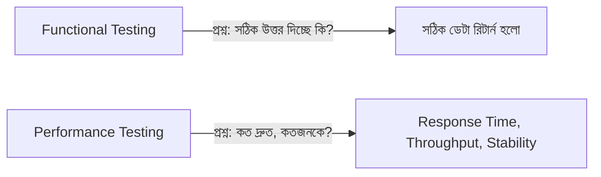

# ৩১.০১. Introduction to API Performance Testing

Module 30 পর্যন্ত আমরা API-কে নিরাপদ (secure) করা শিখেছি — CORS, XSS, CSRF, Helmet.js দিয়ে অনেক আক্রমণ ঠেকানো শিখেছি। কিন্তু একটা API "নিরাপদ" হলেই যথেষ্ট না — সেটাকে "দ্রুত" আর "নির্ভরযোগ্য"ও হতে হবে। ধরো তোমার API সব security check পাস করলো, কিন্তু ১০০ জন ইউজার একসাথে রিকোয়েস্ট পাঠালে সার্ভার ৩০ সেকেন্ড সময় নিলো, বা ক্র্যাশ করে গেলো — তাহলে সেই নিরাপত্তার কোনো মূল্য নেই, কারণ ইউজাররা অ্যাপ ব্যবহারই করতে পারছে না। এই মডিউলে আমরা শিখবো কীভাবে একটা API-এর "পারফরম্যান্স" মাপা যায়, টেস্ট করা যায়, আর প্রয়োজনে উন্নত করা যায়।

## Performance Testing আসলে কী পরীক্ষা করে

একটা রেস্তোরাঁর কথা চিন্তা করো। রেস্তোরাঁর রান্না সুস্বাদু হতে পারে (এটা functional correctness — সঠিক আউটপুট দিচ্ছে কিনা), কিন্তু যদি একসাথে ৫০ জন কাস্টমার আসলে রান্নাঘর হ্যাং হয়ে যায়, অর্ডার দিতে ২ ঘণ্টা লাগে — তাহলে রেস্তোরাঁটা ব্যবসায়িকভাবে ব্যর্থ। Performance testing ঠিক এই প্রশ্নগুলোর উত্তর খোঁজে: সার্ভার কতজন কাস্টমার (concurrent user/request) একসাথে সামলাতে পারে? প্রতিটা রিকোয়েস্ট কত দ্রুত জবাব দেয়? লোড বাড়লে কী পরিমাণ ধীর হয়ে যায়, নাকি একদম ভেঙে পড়ে?



Performance testing-এর কয়েকটা আলাদা ধরন আছে, যেগুলোর নাম আমরা এই মডিউলে বারবার শুনবো:

- **Load Testing** — স্বাভাবিক বা প্রত্যাশিত পরিমাণ ইউজার একসাথে ব্যবহার করলে সিস্টেম কেমন আচরণ করে (Lesson 3-এ আমরা JMeter দিয়ে এটা করবো)।
- **Stress Testing** — সিস্টেমকে তার সীমার বাইরে নিয়ে গিয়ে দেখা, কোথায় গিয়ে সে ভেঙে পড়ে (breaking point কোথায়)।
- **Spike Testing** — হঠাৎ করে অনেক বেশি ট্রাফিক আসলে (যেমন একটা ভাইরাল পোস্টের পর) সিস্টেম কীভাবে সামলায়।

## কেন এখনই এই টপিক

Module 21-এ আমরা ডেটাবেজ ইনডেক্সিং আর কোয়েরি অপটিমাইজেশন শিখেছিলাম — তখন আমরা মূলত ডেটাবেজ লেয়ারে পারফরম্যান্স দেখেছি। কিন্তু একটা সম্পূর্ণ রিকোয়েস্ট ডেটাবেজ ছাড়াও অনেক জায়গা দিয়ে যায় — Express middleware, authentication check, business logic, network latency। এই মডিউলে আমরা পুরো request-response সাইকেলের performance দেখবো, শুধু ডেটাবেজ না।

চলো একটা সহজ Express endpoint দেখি, যেটাকে আমরা এই মডিউল জুড়ে পরীক্ষা করবো:

```js
const express = require('express');
const app = express();

app.get('/api/products', async (req, res) => {
  const start = Date.now();
  const products = await getProductsFromDB(); // ধরি এটা ডেটাবেজ কল
  const duration = Date.now() - start;
  console.log(`getProductsFromDB নিলো ${duration}ms`);
  res.json({ data: products });
});

app.listen(3000, () => console.log('Server running on port 3000'));
```

এখানে আমরা `Date.now()` দিয়ে খুব সাধারণভাবে সময় মাপলাম — এটাই performance measurement-এর সবচেয়ে মৌলিক রূপ। কিন্তু বাস্তব প্রজেক্টে হাজার হাজার রিকোয়েস্টের জন্য ম্যানুয়ালি `console.log` লিখে রাখা সম্ভব না — তার জন্য দরকার টুলস (Postman, JMeter) আর প্রপার লগিং সিস্টেম, যা আমরা এই মডিউল আর পরের মডিউল (Logging & Observability) জুড়ে শিখবো।

পরের লেসনে আমরা দেখবো কীভাবে Postman শুধু API টেস্ট করার টুল না, বরং response time মাপা আর মনিটর করার জন্যও ব্যবহার করা যায়।
