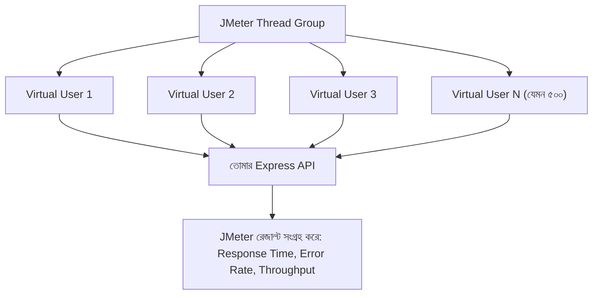

# ৩১.০৩. Load Testing with Apache JMeter

আগের লেসনে আমরা Postman দিয়ে একটা করে রিকোয়েস্ট পাঠিয়ে response time দেখেছি। কিন্তু বাস্তবে যখন তোমার অ্যাপ প্রোডাকশনে যাবে, একজন ইউজার না, হয়তো একসাথে হাজার জন ইউজার তোমার সার্ভারে রিকোয়েস্ট পাঠাবে। একজন ইউজারের জন্য যেই endpoint ২০০ms-এ জবাব দেয়, সেটাই ১০০০ জন একসাথে ব্যবহার করলে ১০ সেকেন্ড সময় নিতে পারে, অথবা সার্ভার একদমই সাড়া দেয়া বন্ধ করে দিতে পারে। এই "একসাথে অনেক ইউজার" পরিস্থিতি সিমুলেট করার জন্য দরকার **Apache JMeter** — একটা ফ্রি, ওপেন-সোর্স লোড টেস্টিং টুল।

## JMeter আসলে কী করে

কল্পনা করো তুমি একটা ব্রিজের ভার-ধারণক্ষমতা পরীক্ষা করতে চাও। একজন মানুষ ব্রিজে হাঁটলে সেটা কিছুই বলে না — তোমাকে জানতে হবে ১০০, ৫০০, বা ১০০০ জন মানুষ একসাথে হাঁটলে ব্রিজ কেমন আচরণ করে। JMeter ঠিক এই কাজটা করে সার্ভারের জন্য — এটা একসাথে অনেকগুলো "ভার্চুয়াল ইউজার" (virtual user বা thread) তৈরি করে, যারা সবাই মিলে তোমার API-তে রিকোয়েস্ট পাঠাতে থাকে, এবং JMeter প্রতিটা রিকোয়েস্টের ফলাফল (সময়, সফল/ব্যর্থ) রেকর্ড করে।



## একটা Test Plan-এর মৌলিক অংশগুলো

JMeter-এ কাজ করার সময় তুমি একটা "Test Plan" বানাও, যার তিনটা মূল অংশ থাকে। **Thread Group** ঠিক করে দেয় কতজন ভার্চুয়াল ইউজার থাকবে, তারা কত সময় ধরে ধীরে ধীরে যোগ হবে (ramp-up period), আর কতবার পুরো টেস্ট রিপিট হবে। **HTTP Request Sampler** বলে দেয় কোন endpoint-এ, কোন মেথডে (GET/POST) রিকোয়েস্ট যাবে — ঠিক Postman-এ যেমন তুমি একটা রিকোয়েস্ট বানাও, এখানেও তেমন। আর **Listener** হলো ফলাফল দেখার জায়গা — যেমন "View Results Tree" বা "Summary Report", যেখানে গ্রাফ আর সংখ্যা আকারে ফলাফল দেখা যায়।

ধরো আমরা আগের লেসনের `/api/products` endpoint-টাই টেস্ট করতে চাই। JMeter-এ আমরা এভাবে সেটআপ করবো:

- Thread Group: 500 users, ramp-up 10 seconds, loop count 5
- HTTP Request: `GET http://localhost:3000/api/products`
- Listener: Summary Report

এই সেটআপ চালালে JMeter একদম বাস্তব পরিস্থিতির মতো ১০ সেকেন্ডের মধ্যে ৫০০ জন ইউজার তৈরি করে, প্রত্যেকে ৫ বার করে রিকোয়েস্ট পাঠাবে — মোট ২৫০০টা রিকোয়েস্ট। JMeter টেস্ট শেষে একটা রিপোর্ট দেখাবে, যাতে থাকে **Average Response Time**, **Min/Max**, আর **Error %** (কতগুলো রিকোয়েস্ট ব্যর্থ হয়েছে বা টাইমআউট হয়েছে)।

## সার্ভার সাইড থেকে দেখা

JMeter যখন লোড পাঠাচ্ছে, তখন আমাদের Express সার্ভার সাইডেও একটু নজর রাখা দরকার। Module 10-এ আমরা Process আর CPU নিয়ে শিখেছিলাম — এই লোড টেস্টের সময় `top` বা `htop` কমান্ড দিয়ে দেখা যায় Node.js প্রসেসটা কতটুকু CPU/মেমরি ব্যবহার করছে:

```bash
# টার্মিনালে সার্ভার চলাকালীন আলাদা একটা টার্মিনালে
top -p $(pgrep -f "node server.js")
```

যদি দেখো লোড বাড়ার সাথে সাথে CPU ১০০%-এ চলে যাচ্ছে আর response time হু হু করে বাড়ছে, তার মানে তোমার সার্ভার তার সীমায় পৌঁছে গেছে — এটাই সেই "breaking point" যেটা খুঁজে বের করাই load testing-এর আসল লক্ষ্য।

এখন আমরা জানি লোড কীভাবে সিমুলেট করতে হয় আর ফলাফল কীভাবে দেখতে হয়। পরের লেসনে আমরা এই ফলাফলের সংখ্যাগুলো — response time-এর percentile, throughput ইত্যাদি — গভীরভাবে বিশ্লেষণ করা শিখবো।
