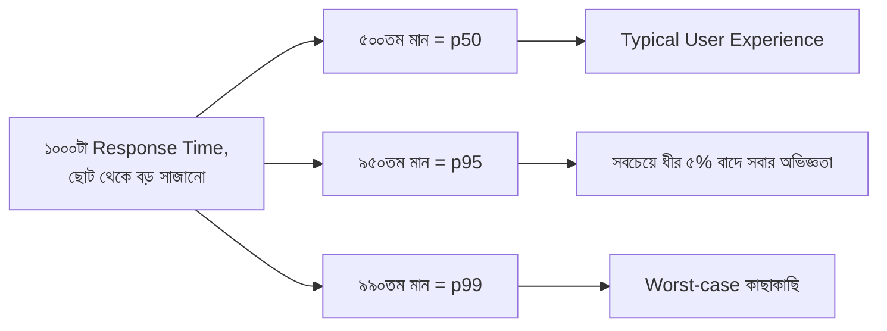

# ৩১.০৪. Measuring and Analyzing API Response Times

আগের লেসনে JMeter দিয়ে আমরা হাজারো রিকোয়েস্ট চালিয়ে একটা "Average Response Time" পেয়েছিলাম। কিন্তু শুধু গড় (average) সংখ্যা দিয়ে বিচার করা বিপজ্জনক হতে পারে — এই লেসনে বুঝবো কেন, আর তার বদলে কী দেখা উচিত।

## গড় কেন মিথ্যা বলতে পারে

ধরো ১০০ জন মানুষের একটা রুমে ৯৯ জনের মাসিক আয় ২০ হাজার টাকা, কিন্তু একজনের আয় ২ কোটি টাকা। গড় আয় হিসাব করলে দেখাবে প্রায় ৪০ হাজার টাকা — যেটা ওই রুমের প্রায় কারো বাস্তবতাকেই প্রতিনিধিত্ব করে না। ঠিক একইভাবে, যদি ১০০০ রিকোয়েস্টের মধ্যে ৯৫০টা ১০০ms-এ শেষ হয়, কিন্তু ৫০টা রিকোয়েস্ট (হয়তো ডেটাবেজ লক হওয়ার কারণে) ৫ সেকেন্ড নেয়, তাহলে average দেখাবে হয়তো ৩৫০ms — যা শুনতে ভালো লাগে, কিন্তু বাস্তবে প্রতি ২০ জনের ১ জন ইউজার একটা ভয়াবহ ধীর অভিজ্ঞতা পাচ্ছে। এই কারণেই performance বিশ্লেষণে **percentile** ব্যবহার করা হয়, average না।

## Percentile বোঝা: p50, p95, p99

Percentile মানে হলো, সমস্ত রেসপন্স টাইমকে ছোট থেকে বড় সাজিয়ে দেখা যে কত শতাংশ রিকোয়েস্ট একটা নির্দিষ্ট সময়ের ভেতরে পড়ছে।

- **p50 (median)** — ৫০% রিকোয়েস্ট এর চেয়ে কম সময়ে শেষ হয়েছে। এটা একটা "typical" অভিজ্ঞতা বোঝায়।
- **p95** — ৯৫% রিকোয়েস্ট এর চেয়ে দ্রুত, মানে সবচেয়ে ধীর ৫% বাদে বাকি সবাই এর মধ্যে পড়ে। এটা সবচেয়ে বেশি ব্যবহৃত মেট্রিক, কারণ এটা "খারাপ অভিজ্ঞতা" ধরতে পারে গড়ের চেয়ে ভালোভাবে।
- **p99** — সবচেয়ে ধীরগতির ১% রিকোয়েস্ট বাদ দিয়ে বাকি সব। এটা দেখায় সবচেয়ে খারাপ পরিস্থিতিতে কী হচ্ছে।



## নিজেই percentile হিসাব করে দেখা

JMeter নিজে থেকেই percentile হিসাব করে দেয়, কিন্তু ধারণাটা পোক্ত করতে চলো নিজেরাই একটা ছোট Node.js স্ক্রিপ্ট দিয়ে দেখি কীভাবে কাজ করে — ধরে নিচ্ছি আমরা একটা আরে (array) রেসপন্স টাইম সংগ্রহ করেছি:

```js
function calculatePercentile(times, percentile) {
  const sorted = [...times].sort((a, b) => a - b);
  const index = Math.ceil((percentile / 100) * sorted.length) - 1;
  return sorted[index];
}

// ধরি এগুলো ২০টা রিকোয়েস্টের response time (ms)
const responseTimes = [
  95, 102, 98, 110, 105, 99, 101, 97, 103, 108,
  100, 96, 104, 99, 102, 107, 950, 101, 98, 103, // একটা বড় আউটলায়ার (৯৫০ms)
];

console.log('p50:', calculatePercentile(responseTimes, 50)); // typical
console.log('p95:', calculatePercentile(responseTimes, 95)); // 950ms আউটলায়ার ধরা পড়বে
console.log('p99:', calculatePercentile(responseTimes, 99));
```

এই স্ক্রিপ্ট চালালে দেখবে p50 প্রায় ১০০ms দেখাচ্ছে (স্বাভাবিক), কিন্তু p95 বা p99-এ গিয়ে সেই ৯৫০ms আউটলায়ারটা ধরা পড়ে যাচ্ছে — যেটা শুধু average নিলে চাপা পড়ে যেতো।

## Throughput — আরেকটা গুরুত্বপূর্ণ মেট্রিক

শুধু একটা রিকোয়েস্ট কত দ্রুত শেষ হলো সেটাই যথেষ্ট না — সার্ভার প্রতি সেকেন্ডে কতগুলো রিকোয়েস্ট সামলাতে পারছে, সেটাও গুরুত্বপূর্ণ, একে বলে **throughput** (সাধারণত RPS — Requests Per Second হিসেবে মাপা হয়)। একটা সার্ভারের response time কম কিন্তু throughput কম হলে বুঝতে হবে সে একসাথে বেশি রিকোয়েস্ট নিতে পারছে না — যেমন একটা টোল বুথ যেখানে প্রতিটা গাড়ি দ্রুত পার হয়, কিন্তু বুথ মাত্র একটা থাকায় লাইন জমে যায়।

এই মেট্রিকগুলো (p50, p95, p99, throughput) বোঝার পর আমরা এখন জানি সমস্যা *আছে কিনা* এবং *কতটা গুরুতর* তা মাপতে পারি। পরের লেসনে আমরা দেখবো সমস্যা পেলে সেটা সমাধানের একটা সবচেয়ে কার্যকর উপায় — caching — কীভাবে প্রয়োগ করা যায়।
