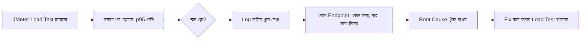

# ৩১.০৬. API Testing, Logging and Performance

এই মডিউলে আমরা তিনটা জিনিস আলাদা আলাদাভাবে শিখেছি — Postman/JMeter দিয়ে টেস্টিং, response time আর percentile মাপা, আর caching দিয়ে অপটিমাইজেশন। এই শেষ লেসনে আমরা এই সবগুলোকে একসাথে জোড়া দেবো, আর দেখবো কেন **logging** এই পুরো চক্রের একটা অপরিহার্য অংশ — যা পরের মডিউল (Logging & Observability)-এর ভিত্তি তৈরি করবে।

## কেন টেস্টিং, লগিং আর পারফরম্যান্স আলাদা করা যায় না

চিন্তা করো তুমি JMeter দিয়ে লোড টেস্ট চালালে, আর দেখলে p95 response time হঠাৎ ২ সেকেন্ডে চলে গেছে। এখন প্রশ্ন হলো — *কেন*? কোন নির্দিষ্ট endpoint স্লো? কোন নির্দিষ্ট সময়ে সমস্যা হচ্ছে? ডেটাবেজ কোয়েরি স্লো, নাকি cache miss বেশি হচ্ছে? এই প্রশ্নগুলোর উত্তর শুধু একটা সংখ্যা (p95 = 2000ms) দিয়ে পাওয়া যাবে না — দরকার একটা **লগ**, যেটা প্রতিটা রিকোয়েস্টের বিস্তারিত বিবরণ রেখে দেয়।



## একটা সাধারণ Logging Middleware দিয়ে শুরু

Module 7-এ আমরা middleware-এর ধারণা শিখেছিলাম। চলো একটা সহজ middleware বানাই, যা প্রতিটা রিকোয়েস্টের সময় মাপে আর লগ করে — এটাই পরের মডিউলে আমরা Winston/Pino দিয়ে আরও প্রফেশনালভাবে করবো, কিন্তু এখন মূল ধারণাটা দেখি:

```js
function performanceLogger(req, res, next) {
  const start = Date.now();

  res.on('finish', () => {
    const duration = Date.now() - start;
    const logEntry = {
      method: req.method,
      path: req.path,
      statusCode: res.statusCode,
      durationMs: duration,
      timestamp: new Date().toISOString(),
    };

    // এখন শুধু console.log করছি, পরের মডিউলে এটা ফাইলে/সিস্টেমে যাবে
    console.log(JSON.stringify(logEntry));

    // একটা সহজ threshold চেক — স্লো রিকোয়েস্ট আলাদা করে চিহ্নিত করা
    if (duration > 500) {
      console.warn(`⚠️  SLOW REQUEST: ${req.method} ${req.path} নিলো ${duration}ms`);
    }
  });

  next();
}

app.use(performanceLogger);
```

`res.on('finish', ...)` ব্যবহার করার কারণ হলো, আমরা চাই response পাঠানো সম্পূর্ণ হওয়ার *পরে* সময় মাপতে — তাহলেই প্রকৃত duration পাওয়া যাবে, শুধু route handler-এর ভেতরের কোড না, পুরো middleware chain সহ পুরো সময়টা।

## টেস্ট → লগ → অপটিমাইজ — একটা চক্র (cycle)

বাস্তব প্রজেক্টে performance improvement কোনো একবারের কাজ না, এটা একটা চলমান চক্র। প্রথমে load test চালিয়ে সমস্যা খুঁজে বের করা হয়, লগ দেখে root cause বের করা হয়, caching বা কোড অপটিমাইজেশন দিয়ে সমাধান করা হয়, এরপর আবার load test চালিয়ে যাচাই করা হয় সমাধানটা কাজ করলো কিনা। এই চক্রটা এমনভাবে চলতে থাকে যতক্ষণ না তোমার API business requirement অনুযায়ী যথেষ্ট দ্রুত হয়।

| ধাপ | টুল/কৌশল | এই মডিউলের কোন লেসন |
|---|---|---|
| পরিমাপ | Postman, JMeter | Lesson 2, 3 |
| বিশ্লেষণ | Percentile, Throughput | Lesson 4 |
| সমাধান | Caching (in-memory, Redis) | Lesson 5 |
| পর্যবেক্ষণ | Logging middleware | এই লেসন |

আমরা এখন জানি কীভাবে performance সমস্যা খুঁজে বের করতে হয়, মাপতে হয়, আর সমাধান করতে হয় — আর তার মধ্যে logging যে কতটা গুরুত্বপূর্ণ, তারও একটা আভাস পেলাম। পরের মডিউলে আমরা এই logging-কেই একটা পূর্ণাঙ্গ, প্রফেশনাল সিস্টেমে রূপান্তরিত করবো — Winston আর Pino-এর মতো লাইব্রেরি দিয়ে, যা আসল প্রোডাকশন অ্যাপ্লিকেশনে ব্যবহার হয়।
