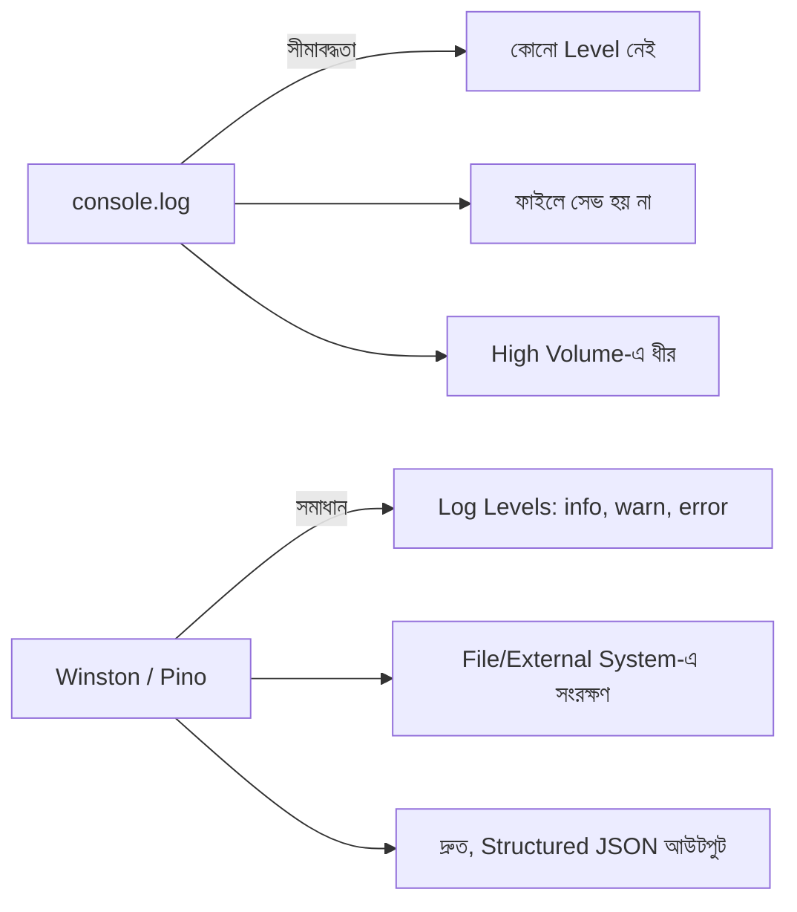

# ৩২.০১. Implementing Logging with Winston and Pino

Module 31-এর শেষ লেসনে আমরা একটা সাধারণ `console.log` দিয়ে logging middleware বানিয়েছিলাম, আর একটা প্রশ্ন রেখে গিয়েছিলাম — বাস্তব প্রোডাকশন অ্যাপ্লিকেশনে `console.log` কেন যথেষ্ট না? এই লেসনে আমরা সেই ফাঁকটা পূরণ করবো Winston আর Pino নামের দুটো জনপ্রিয় logging লাইব্রেরি দিয়ে।

## `console.log`-এর সীমাবদ্ধতা

`console.log` ছোট প্রজেক্টে ঠিক আছে, কিন্তু প্রোডাকশনে এর কয়েকটা বড় সমস্যা আছে। প্রথমত, এটা সব লগকে সমান গুরুত্ব দেয় — একটা সাধারণ তথ্য (info) আর একটা মারাত্মক এরর (error) দেখতে একই রকম, আলাদা করার উপায় নেই। দ্বিতীয়ত, এটা লগকে কোথাও সংরক্ষণ (persist) করে না — সার্ভার রিস্টার্ট হলে বা টার্মিনাল বন্ধ হলে সব লগ হারিয়ে যায়। তৃতীয়ত, লক্ষ লক্ষ রিকোয়েস্টের ক্ষেত্রে `console.log` খুব ধীর, কারণ এটা synchronous ভাবে কাজ করে। এই তিনটা সমস্যা সমাধানের জন্যই তৈরি হয়েছে dedicated logging library।



## Winston দিয়ে শুরু করা

Winston হলো Node.js ইকোসিস্টেমের সবচেয়ে জনপ্রিয় logging লাইব্রেরিগুলোর একটা — এটা নমনীয় (flexible), মানে তুমি কনফিগার করে ঠিক করতে পারো লগ কোথায় যাবে (কনসোলে, ফাইলে, নাকি দুই জায়গাতেই)।

```bash
npm install winston
```

```js
const winston = require('winston');

const logger = winston.createLogger({
  level: 'info', // এই লেভেল বা তার চেয়ে গুরুত্বপূর্ণ লগই দেখাবে
  format: winston.format.combine(
    winston.format.timestamp(),
    winston.format.json()
  ),
  transports: [
    new winston.transports.Console(), // টার্মিনালে দেখানো
    new winston.transports.File({ filename: 'error.log', level: 'error' }), // শুধু error ফাইলে
    new winston.transports.File({ filename: 'combined.log' }), // সব লগ একসাথে ফাইলে
  ],
});

logger.info('সার্ভার শুরু হয়েছে');
logger.warn('Cache miss ঘটেছে /api/products-এ');
logger.error('ডেটাবেজ কানেকশন ব্যর্থ হয়েছে');
```

এখানে `transports` হলো Winston-এর মূল ধারণা — এটা বলে দেয় লগ কোথায় কোথায় পাঠানো হবে। লক্ষ করো, error লগ দুই জায়গায় যাচ্ছে (কনসোল আর `error.log` ফাইল, কারণ `combined.log`-এও যাবে) — এভাবে গুরুত্বপূর্ণ এরর আলাদা ফাইলে সহজে খুঁজে পাওয়া যায়, বাকি সব লগের মধ্যে হারিয়ে যায় না।

## Pino: গতির জন্য ডিজাইন করা

Winston নমনীয়, কিন্তু **Pino** ডিজাইন করা হয়েছে বিশেষভাবে গতির (speed) কথা মাথায় রেখে — উচ্চ-ট্রাফিক অ্যাপ্লিকেশনে (যেখানে প্রতি সেকেন্ডে হাজার হাজার রিকোয়েস্ট আসে) Pino Winston-এর চেয়ে কয়েকগুণ দ্রুত, কারণ এটা কম কাজ synchronously করে এবং সরাসরি JSON স্ট্রিং তৈরি করে কোনো অতিরিক্ত প্রসেসিং ছাড়াই।

```bash
npm install pino
```

```js
const pino = require('pino')();

pino.info('সার্ভার শুরু হয়েছে');
pino.warn({ endpoint: '/api/products' }, 'Cache miss ঘটেছে');
pino.error({ err: new Error('DB timeout') }, 'ডেটাবেজ কানেকশন ব্যর্থ হয়েছে');
```

Pino-এর আউটপুট ডিফল্টভাবে raw JSON, যা মানুষের চোখে পড়তে একটু কঠিন — কিন্তু এটাই ইচ্ছাকৃত, কারণ Pino ধরে নেয় তুমি এই লগ কোনো মেশিন (log aggregator) দিয়ে পড়াবে, মানুষ দিয়ে না। ডেভেলপমেন্টে সুন্দর করে দেখতে চাইলে `pino-pretty` নামের একটা companion প্যাকেজ ব্যবহার করা যায়।

## কোনটা কখন বেছে নেবে

| বিবেচ্য বিষয় | Winston | Pino |
|---|---|---|
| নমনীয়তা (custom format, multiple transport) | বেশি | কম |
| Raw স্পিড | মাঝারি | অনেক বেশি |
| উপযুক্ত | ছোট-মাঝারি ট্রাফিক, কাস্টম প্রয়োজন | High-traffic প্রোডাকশন সিস্টেম |

দুটোই "log level" নামের একটা ধারণার উপর দাঁড়িয়ে আছে — info, warn, error ইত্যাদি। পরের লেসনে আমরা এই level আর logging-এর গঠন (structure) নিয়ে আরও গভীরে যাবো, আর দেখবো কেন শুধু টেক্সট মেসেজ লেখার বদলে **structured logging** এত গুরুত্বপূর্ণ।
