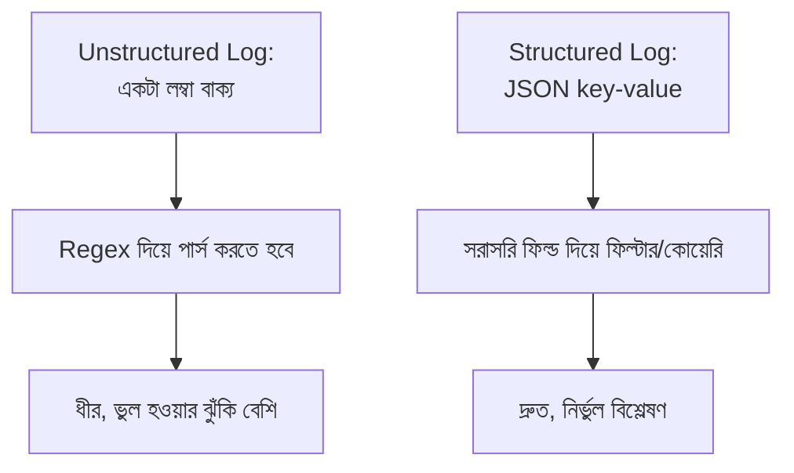

# ৩২.০২. Structured Logging Best Practices

আগের লেসনে আমরা Winston আর Pino দিয়ে JSON ফরম্যাটে লগ লিখেছিলাম, কিন্তু কেন সরাসরি একটা সাধারণ বাক্য না লিখে JSON-এ লিখলাম, সেটা বিস্তারিত বলিনি। এই লেসনে আমরা বুঝবো **structured logging** কী, আর কেন এটা প্রোডাকশন সিস্টেমে প্রায় বাধ্যতামূলক।

## Unstructured বনাম Structured Log

ধরো তোমার লগ ফাইলে এরকম একটা লাইন আছে:

```
সার্ভার এ ইউজার ১২৩ /api/orders এ POST রিকোয়েস্ট পাঠিয়েছে, সময় লেগেছে ৩৪২ms, স্ট্যাটাস ৫০০
```

এটা মানুষের পড়তে সহজ, কিন্তু কল্পনা করো তোমার কাছে এমন ১০ লক্ষ লাইন আছে, আর তুমি জানতে চাও: "গত এক ঘণ্টায় কতগুলো POST /api/orders রিকোয়েস্ট ৫০০ স্ট্যাটাস দিয়ে ব্যর্থ হয়েছে, এবং তাদের গড় সময় কত?" এই টেক্সট থেকে এই তথ্য বের করতে তোমাকে জটিল regex লিখে প্রতিটা লাইন পার্স করতে হবে — ধীর, আর ভুল হওয়ার সম্ভাবনা বেশি। এই একই তথ্য যদি structured (JSON) আকারে থাকে, তাহলে সেটা সরাসরি ফিল্টার আর কোয়েরি করা যায়, ঠিক যেমন ডেটাবেজ টেবিলে কোয়েরি করা যায়:

```json
{
  "timestamp": "2026-08-08T10:15:32.120Z",
  "level": "error",
  "userId": 123,
  "method": "POST",
  "path": "/api/orders",
  "statusCode": 500,
  "durationMs": 342,
  "message": "Order creation failed"
}
```



## ভালো Structured Log-এর গঠন

একটা ভালো লগ এন্ট্রিতে সাধারণত এই ফিল্ডগুলো থাকা উচিত — timestamp (কখন ঘটলো), level (কতটা গুরুত্বপূর্ণ), message (মানুষের পড়ার জন্য সংক্ষিপ্ত বিবরণ), আর context (userId, requestId, path-এর মতো প্রাসঙ্গিক ডেটা যা পরে ফিল্টার করতে কাজে লাগবে)। চলো Winston দিয়ে এই প্যাটার্ন অনুসরণ করে একটা reusable logger বানাই, যা এই মডিউলের বাকি লেসনগুলোতেও ব্যবহার করবো:

```js
const winston = require('winston');

const logger = winston.createLogger({
  level: process.env.LOG_LEVEL || 'info',
  format: winston.format.combine(
    winston.format.timestamp(),
    winston.format.errors({ stack: true }), // Error object-এর stack trace ধরে রাখা
    winston.format.json()
  ),
  defaultMeta: { service: 'order-api' }, // প্রতিটা লগে এই মেটাডেটা যোগ হবে
  transports: [new winston.transports.Console()],
});

// ব্যবহার — message-এর সাথে context object পাঠানো
logger.info('Order created successfully', {
  userId: 123,
  orderId: 'ORD-9981',
  amount: 1500,
});

logger.error('Order creation failed', {
  userId: 123,
  errorCode: 'PAYMENT_DECLINED',
  durationMs: 342,
});

module.exports = logger;
```

লক্ষ করো, `message`-এ শুধু মানুষের পড়ার মতো সংক্ষিপ্ত টেক্সট রাখছি ("Order created successfully"), আর বাকি সব ডাইনামিক তথ্য (userId, orderId) আলাদা ফিল্ড হিসেবে পাঠাচ্ছি। এটাই মূল নিয়ম — message-এর ভেতরে ভ্যারিয়েবল বসিয়ে বাক্য বানানো (`` `Order ${orderId} created for user ${userId}` ``) এড়িয়ে চলা উচিত, কারণ তাহলে প্রতিটা লগের message ভিন্ন ভিন্ন হয়ে যায়, আর একই ধরনের ঘটনাগুলো গ্রুপ করে গণনা করা কঠিন হয়ে পড়ে।

## Log Level সঠিকভাবে বেছে নেয়া

Module 31-এ আমরা দেখেছিলাম স্লো রিকোয়েস্ট আলাদা করে চিহ্নিত করতে হয়। Log level ব্যবহার করে আমরা এই গুরুত্বের ভিত্তিতে লগকে ভাগ করতে পারি:

- **error** — সিস্টেম ভেঙে গেছে বা কাজ সম্পূর্ণ করতে পারেনি (পেমেন্ট ব্যর্থ, ডেটাবেজ কানেকশন হারানো)
- **warn** — সমস্যা এখনো হয়নি, কিন্তু সতর্ক হওয়া দরকার (cache miss বেশি হচ্ছে, response time threshold ছাড়িয়ে গেছে)
- **info** — স্বাভাবিক, গুরুত্বপূর্ণ ঘটনা (সার্ভার চালু হলো, নতুন অর্ডার তৈরি হলো)
- **debug** — ডেভেলপমেন্টের সময় বিস্তারিত ট্রেসিং-এর জন্য, প্রোডাকশনে সাধারণত বন্ধ রাখা হয়

প্রোডাকশনে `level: 'info'` সেট করে রাখলে debug লগগুলো স্বয়ংক্রিয়ভাবে বাদ পড়ে যায় — এভাবে দরকারি সময়ে (ডিবাগিং করার সময়) `LOG_LEVEL=debug` সেট করে বিস্তারিত লগ চালু করা যায়, আবার স্বাভাবিক সময়ে অপ্রয়োজনীয় noise কমানো যায়।

এখন আমাদের কাছে একটা structured logger তৈরি আছে। পরের লেসনে আমরা দেখবো কীভাবে এই logger-কে একটা middleware-এর মধ্যে বসিয়ে প্রতিটা HTTP request আর response স্বয়ংক্রিয়ভাবে লগ করা যায়।
