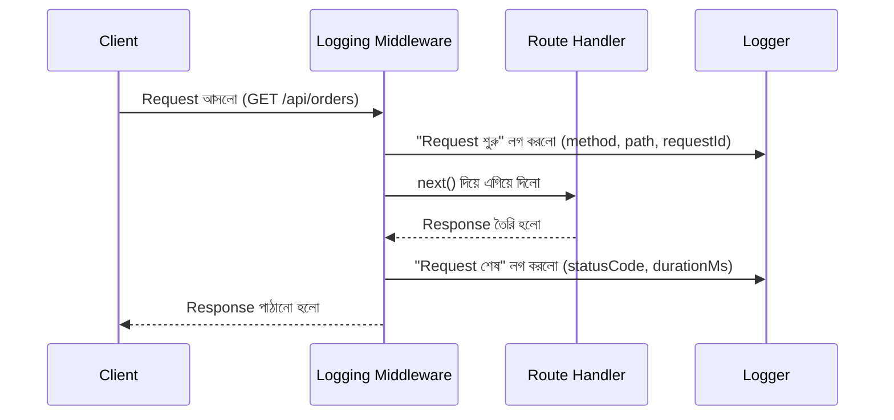

# ৩২.০৩. Request and Response Logging Middleware

আগের লেসনে আমরা একটা structured logger বানিয়েছিলাম, কিন্তু সেটা এখনো ম্যানুয়ালি প্রতিটা route-এ বসিয়ে ব্যবহার করতে হচ্ছে। Module 31-এর শেষ লেসনে আমরা একটা ছোট performance logging middleware-এর আভাসও পেয়েছিলাম। এই লেসনে আমরা সেই দুটো ধারণা একসাথে করে একটা সম্পূর্ণ, প্রফেশনাল request/response logging middleware বানাবো, যা প্রতিটা রিকোয়েস্টের জন্য স্বয়ংক্রিয়ভাবে চলে — আলাদা করে প্রতিটা route-এ কিছু লিখতে হয় না।

## কেন Middleware-এই এই কাজ করা উচিত

Module 7-এ আমরা শিখেছিলাম middleware হলো এমন কোড যা প্রতিটা রিকোয়েস্টের পথে বসে, route handler-এ পৌঁছানোর আগে বা response পাঠানোর সময়/পরে কিছু কাজ করে। Logging-এর জন্য এটা আদর্শ জায়গা, কারণ তুমি একবার middleware লিখলে সেটা তোমার অ্যাপ্লিকেশনের প্রতিটা endpoint-এর জন্য কাজ করবে — প্রতিটা route handler-এ আলাদা করে `logger.info(...)` লেখার দরকার নেই।



## সম্পূর্ণ Middleware কোড

চলো আগের লেসনের logger ব্যবহার করে একটা middleware বানাই, যাতে প্রতিটা রিকোয়েস্টের একটা ইউনিক আইডি (**requestId**) থাকে — এটা খুবই গুরুত্বপূর্ণ, কারণ একটা রিকোয়েস্ট যদি একাধিক লগ লাইন তৈরি করে (শুরু, মাঝে কিছু ঘটনা, শেষ), তাহলে requestId দিয়ে সেই লাইনগুলোকে একসাথে সাজানো যায়।

```js
const crypto = require('crypto'); // Module 3-এ পরিচিত হওয়া core module
const logger = require('./logger'); // আগের লেসনের Winston logger

function requestLogger(req, res, next) {
  req.requestId = crypto.randomUUID(); // প্রতিটা রিকোয়েস্টের জন্য ইউনিক আইডি
  const start = Date.now();

  logger.info('Request started', {
    requestId: req.requestId,
    method: req.method,
    path: req.originalUrl,
    ip: req.ip,
  });

  res.on('finish', () => {
    const durationMs = Date.now() - start;
    const logLevel = res.statusCode >= 500 ? 'error'
      : res.statusCode >= 400 ? 'warn'
      : 'info';

    logger[logLevel]('Request completed', {
      requestId: req.requestId,
      method: req.method,
      path: req.originalUrl,
      statusCode: res.statusCode,
      durationMs,
    });
  });

  next();
}

module.exports = requestLogger;
```

এখানে একটা গুরুত্বপূর্ণ প্যাটার্ন দেখো — আমরা `res.statusCode` অনুযায়ী log level বদলে দিচ্ছি। ৫০০-এর বেশি স্ট্যাটাস কোড (সার্ভার এরর) হলে `error` লেভেলে, ৪০০-এর বেশি (ক্লায়েন্ট এরর, যেমন 404 বা 401) হলে `warn` লেভেলে, আর বাকি সব স্বাভাবিক ক্ষেত্রে `info` লেভেলে লগ হচ্ছে। এভাবে পরে যখন আমরা শুধু error লগ ফিল্টার করে দেখতে চাইবো, শুধু আসল সমস্যাগুলোই দেখা যাবে।

## অ্যাপ্লিকেশনে বসানো

```js
const express = require('express');
const requestLogger = require('./middleware/requestLogger');

const app = express();
app.use(requestLogger); // সবার আগে বসাতে হবে, যাতে সব রিকোয়েস্ট এর ভেতর দিয়ে যায়

app.get('/api/orders', (req, res) => {
  // req.requestId এখানেও অ্যাক্সেস করা যায়, দরকার হলে বিজনেস লজিকের লগেও ব্যবহার করা যায়
  res.json({ data: [] });
});

app.listen(3000);
```

`app.use(requestLogger)` কে সবচেয়ে উপরে রাখাটা জরুরি — Module 7-এ আমরা শিখেছিলাম middleware ক্রম অনুযায়ী চলে, তাই logging middleware প্রথমে না রাখলে তার আগের কোনো middleware-এ ঘটা সমস্যা লগ হবে না।

## রেসপন্স বডি লগ করা নিয়ে সতর্কতা

একটা লোভনীয় কিন্তু বিপজ্জনক ব্যাপার হলো পুরো response body লগ করে ফেলা। এটা এড়িয়ে চলা উচিত দুটো কারণে — এক, বড় response (যেমন হাজার প্রোডাক্টের লিস্ট) লগ করলে লগ ফাইল দ্রুত বিশাল হয়ে যায়; দুই, response-এ প্রায়ই স্পর্শকাতর তথ্য (পাসওয়ার্ড, টোকেন, ব্যক্তিগত তথ্য) থাকতে পারে, যা লগে থেকে গেলে নিরাপত্তা ঝুঁকি তৈরি করে — Module 30-এ আমরা যে security সচেতনতা শিখেছিলাম, সেটা logging-এও প্রযোজ্য।

আমাদের এখন একটা কাজ করা middleware আছে যা প্রতিটা রিকোয়েস্ট-রেসপন্স লগ করে। কিন্তু এখনো একটা প্রশ্ন বাকি — যখন সত্যিই একটা এরর ঘটে (একটা exception থ্রো হয়), তখন সেটা কীভাবে সঠিকভাবে ধরে, লগ করে, ইউজারকে একটা ভদ্র জবাব দেয়া যায়? সেটাই পরের লেসনের বিষয়।
