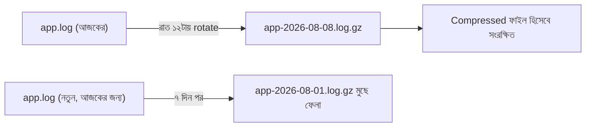
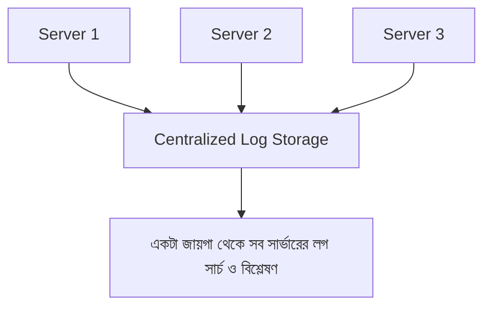

# ৩২.০৫. Log Rotation and Storage Strategies

আমরা এই মডিউল জুড়ে ধরে নিয়েছিলাম লগ একটা ফাইলে (`combined.log`) লেখা হচ্ছে। কিন্তু বাস্তবে একটা প্রোডাকশন সার্ভার প্রতিদিন হাজার হাজার, এমনকি লক্ষ লক্ষ লগ লাইন তৈরি করতে পারে। যদি সবকিছু একটা ফাইলে জমতে থাকে, সেই ফাইল কিছুদিনের মধ্যেই কয়েক গিগাবাইট হয়ে যাবে — ডিস্কের জায়গা ফুরিয়ে যাবে, আর সেই বিশাল ফাইল খোলাই কষ্টকর হয়ে দাঁড়াবে। এই সমস্যার সমাধান হলো **log rotation**।

## Log Rotation-এর ধারণা: একটা ডায়েরির উপমা

কল্পনা করো তুমি প্রতিদিন ডায়েরি লেখো, কিন্তু একটাই অসীম দৈর্ঘ্যের খাতায়। কয়েক বছর পর সেই খাতা বহন করাই অসম্ভব হয়ে যাবে। এর বদলে স্বাভাবিক নিয়ম হলো — প্রতিদিন বা প্রতি মাসে একটা নতুন খাতা শুরু করা, আর পুরনো খাতাগুলো তারিখ লিখে আলাদা তাকে রেখে দেয়া, আর অনেক পুরনো হয়ে গেলে (যেমন ৫ বছরের বেশি) সেগুলো ফেলে দেয়া। Log rotation ঠিক এই কাজটাই করে — নির্দিষ্ট সময় পরপর (বা নির্দিষ্ট সাইজ পার হলে) একটা নতুন লগ ফাইল শুরু করা, পুরনোগুলো সংকুচিত (compress) করে রাখা, আর অনেক পুরনো ফাইল স্বয়ংক্রিয়ভাবে মুছে ফেলা।



## Winston-এর সাথে Rotation যোগ করা

Winston নিজে থেকে rotation করে না, কিন্তু এর জন্য একটা অফিসিয়াল সহায়ক প্যাকেজ আছে, `winston-daily-rotate-file`। এটা আগের লেসনগুলোর logger-এর সাথে সহজেই যুক্ত করা যায়:

```bash
npm install winston-daily-rotate-file
```

```js
const winston = require('winston');
require('winston-daily-rotate-file');

const dailyRotateTransport = new winston.transports.DailyRotateFile({
  filename: 'logs/app-%DATE%.log', // %DATE% জায়গায় প্রকৃত তারিখ বসবে
  datePattern: 'YYYY-MM-DD',
  zippedArchive: true, // পুরনো ফাইল .gz করে সংকুচিত করা হবে
  maxSize: '20m', // একটা ফাইল ২০MB পার হলেও নতুন ফাইল শুরু হবে
  maxFiles: '14d', // ১৪ দিনের বেশি পুরনো ফাইল স্বয়ংক্রিয়ভাবে মুছে যাবে
});

const logger = winston.createLogger({
  level: 'info',
  format: winston.format.combine(
    winston.format.timestamp(),
    winston.format.json()
  ),
  transports: [
    new winston.transports.Console(),
    dailyRotateTransport,
  ],
});

module.exports = logger;
```

এখানে তিনটা সেটিং বিশেষভাবে গুরুত্বপূর্ণ। `datePattern` ঠিক করে কত ঘনঘন নতুন ফাইল শুরু হবে (এখানে প্রতিদিন)। `maxSize` একটা নিরাপত্তা-জাল (safety net) — যদি হঠাৎ কোনো bug-এর কারণে অস্বাভাবিক পরিমাণ লগ তৈরি হয়, তাও একটা ফাইল ২০MB-এর বেশি বড় হবে না। আর `maxFiles: '14d'` মানে ১৪ দিনের বেশি পুরনো লগ ফাইল প্রতিদিন স্বয়ংক্রিয়ভাবে চেক করে মুছে ফেলা হবে — এটা ডিস্ক স্পেস অসীমভাবে বাড়তে দেয় না।

## কতদিন লগ রাখা উচিত

এই "কত দিন" প্রশ্নের উত্তর নির্ভর করে তোমার প্রয়োজনের উপর। ডিবাগিং-এর জন্য সাধারণত ১-৪ সপ্তাহের লগ যথেষ্ট। কিন্তু কিছু ক্ষেত্রে (financial transaction, audit trail) আইনি বা compliance কারণে মাস বা বছরের হিসেবে লগ সংরক্ষণ করা লাগতে পারে — সেক্ষেত্রে লোকাল ডিস্কে না রেখে ক্লাউড স্টোরেজে (যেমন AWS S3) archive করাই ভালো অভ্যাস, কারণ সার্ভারের নিজের ডিস্ক সীমিত।

## Local ফাইলের বাইরেও ভাবা: Centralized Logging

আরেকটা বাস্তবতা হলো — আজকাল বেশিরভাগ প্রোডাকশন সিস্টেম একটা সার্ভারে চলে না, একাধিক সার্ভার/কন্টেইনারে চলে (Module 25-এ আমরা microservices নিয়ে সংক্ষেপে শুনেছিলাম)। যদি প্রতিটা সার্ভারের লগ তার নিজের ডিস্কে আলাদা থাকে, তাহলে কোনো একটা সমস্যা খুঁজতে গিয়ে ১০টা সার্ভারে আলাদা আলাদা লগইন করে ফাইল খুঁজতে হবে — অত্যন্ত অব্যবহারিক। তাই প্রোডাকশনে সাধারণত লগ একটা কেন্দ্রীয় জায়গায় (যেমন Elasticsearch, বা ক্লাউড সার্ভিসের logging system) পাঠানো হয়, যেখানে সব সার্ভারের লগ একসাথে সার্চ করা যায়।



এই মডিউলে আমরা লগিং সিস্টেম তৈরি করা শিখলাম — Winston/Pino দিয়ে শুরু করা, structured format মেনে চলা, প্রতিটা request/response আর error স্বয়ংক্রিয়ভাবে ধরা, আর সেই লগকে নিয়ন্ত্রিতভাবে সংরক্ষণ করা। কিন্তু লগ ফাইল থাকলেই চলবে না — কেউ না কেউ (বা কোনো সিস্টেম) সেটা সক্রিয়ভাবে নজরে রাখতে হবে, আর সমস্যা হলে তৎক্ষণাৎ জানাতে হবে। পরের মডিউলে আমরা ঠিক সেটাই শিখবো — PM2, New Relic, আর Datadog-এর মতো টুল দিয়ে সিস্টেম মনিটরিং আর অ্যালার্টিং।
