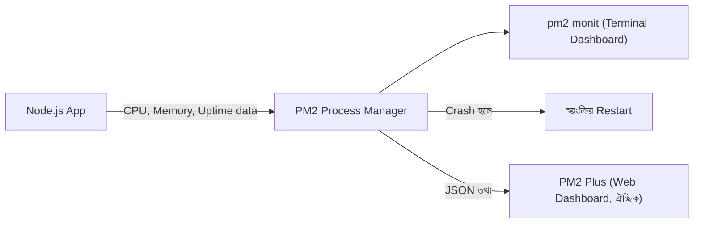

# ৩৩.০১. Real-time Monitoring with PM2

Module 32-তে আমরা Winston আর Pino দিয়ে structured logging শিখেছিলাম — মানে অ্যাপ্লিকেশনের ভেতরে কী ঘটছে সেটা ফাইলে লিখে রাখা। কিন্তু লগ ফাইল তো তখনই কাজে লাগে যখন তুমি সেটা খুলে পড়ো। প্রশ্ন হলো — সার্ভার যদি মাঝরাতে ক্র্যাশ করে, বা মেমরি হঠাৎ বেড়ে যায়, তুমি কি সেটা তখনই টের পাবে, নাকি সকালে ইউজারের অভিযোগ পেয়ে বুঝবে? এই ফাঁকটা পূরণ করে monitoring — লগ যেমন অতীতের রেকর্ড, monitoring তেমনি বর্তমানের স্পন্দন (pulse) দেখায়।

Module 21-এ (database performance) আমরা যেমন query-এর গতি মাপতে শিখেছিলাম, ঠিক তেমনি এখন আমরা পুরো Node.js প্রসেসের "স্বাস্থ্য" মাপা শিখবো — CPU ব্যবহার কতটুকু, মেমরি কতটুকু খাচ্ছে, প্রসেস বেঁচে আছে কিনা। আর এই কাজের সবচেয়ে সহজ প্রথম ধাপ হলো **PM2** — একটা process manager, যেটা দিয়ে আমরা আগে থেকেই (deployment মডিউলে) অ্যাপ চালু রাখতে শিখেছি। PM2-এর একটা বিল্ট-ইন monitoring dashboard আছে, যেটা টার্মিনালেই তোমাকে লাইভ ছবি দেখায়।

```bash
# PM2 দিয়ে অ্যাপ চালু করা (আগেই শেখা)
pm2 start server.js --name my-api

# রিয়েল-টাইম মনিটরিং ড্যাশবোর্ড
pm2 monit

# প্রতিটা প্রসেসের অবস্থা এক নজরে
pm2 list

# একটা নির্দিষ্ট প্রসেসের বিস্তারিত তথ্য
pm2 show my-api
```

`pm2 monit` চালালে তুমি দেখবে প্রতিটা প্রসেসের জন্য একটা লাইভ গ্রাফ — CPU % আর Memory ব্যবহার সেকেন্ডে সেকেন্ডে বদলাচ্ছে। এটা অনেকটা গাড়ির ড্যাশবোর্ডের স্পিডোমিটারের মতো — ইঞ্জিন ভেতরে কী করছে তুমি দেখতে পাচ্ছো না, কিন্তু গেজ দেখে বুঝতে পারছো গতি বেশি নাকি স্বাভাবিক।

PM2 আরেকটা গুরুত্বপূর্ণ কাজ করে — process crash হলে স্বয়ংক্রিয়ভাবে restart করে, আর কতবার restart হয়েছে সেটাও গুনে রাখে। এই সংখ্যাটা (`restart count`) আসলে একটা early warning sign — যদি দেখো একটা অ্যাপ ঘন ঘন restart হচ্ছে, বুঝতে হবে কোথাও memory leak বা unhandled exception লুকিয়ে আছে, যেটা আমরা এই মডিউলের পরের লেসনগুলোতে গভীরভাবে দেখবো।



তবে `pm2 monit` একটা সীমাবদ্ধতা আছে — তুমি টার্মিনাল বন্ধ করলেই ড্যাশবোর্ড হারিয়ে যায়, আর এটা শুধু একটা মেশিনের জন্য কাজ করে। প্রোডাকশনে যদি একাধিক সার্ভারে অ্যাপ চলে, তাহলে আলাদা মেশিনের PM2 ড্যাশবোর্ড আলাদাভাবে দেখতে হবে — কেন্দ্রীয় কোনো ভিউ নেই। এই সীমাবদ্ধতা পেরোতেই দরকার হয় পেশাদার Application Performance Monitoring (APM) টুল, যেটা নিয়ে আমরা পরের লেসনে কথা বলবো।
