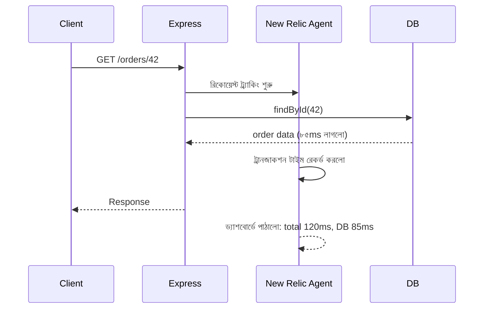

# ৩৩.০২. Application Performance Monitoring with New Relic

আগের লেসনে আমরা দেখলাম PM2 টার্মিনালে একটা লাইভ ড্যাশবোর্ড দেখায়, কিন্তু সেটা একমেশিন-কেন্দ্রিক আর সীমিত। এখন কল্পনা করো তোমার অ্যাপটা প্রতিদিন হাজার হাজার request সামলাচ্ছে, আর কোনো একটা নির্দিষ্ট API endpoint মাঝে মাঝে ধীরগতির হয়ে যাচ্ছে। PM2 তোমাকে বলবে "CPU বেশি ব্যবহার হচ্ছে", কিন্তু কোন endpoint, কোন query, কোন লাইন কোডে সমস্যা — সেটা বলবে না। এই গভীরতার প্রশ্নের উত্তর দেয় **Application Performance Monitoring (APM)** টুল, যার মধ্যে **New Relic** সবচেয়ে পরিচিত একটা।

APM-কে ভাবতে পারো হাসপাতালের ফুল বডি চেকআপের মতো। PM2 যেমন শুধু নাড়ির স্পন্দন (pulse) মাপে, APM পুরো শরীরের এক্স-রে করে দেখায় — কোন অঙ্গ (কোড path) কতটা চাপে আছে। New Relic তোমার Node.js কোডের ভেতরে ঢুকে প্রতিটা request-এর জার্নি ট্রেস করে — কোন middleware কতক্ষণ সময় নিলো, database query-তে কত মিলিসেকেন্ড গেলো, external API call-এ কত দেরি হলো — সব আলাদা করে দেখায়।

ব্যবহার করা শুরু করা বেশ সহজ। প্রথমে প্যাকেজ ইনস্টল করে অ্যাপের একদম শুরুতে require করতে হয়:

```bash
npm install newrelic
```

```js
// server.js এর একদম প্রথম লাইনে, অন্য কিছুর আগে
require('newrelic');

const express = require('express');
const app = express();

app.get('/orders/:id', async (req, res) => {
  const order = await Order.findById(req.params.id); // New Relic এটাও ট্রেস করবে
  res.json(order);
});

app.listen(3000);
```

`newrelic.js` নামে একটা কনফিগ ফাইলে তোমার লাইসেন্স কী আর অ্যাপের নাম বসাতে হয়। এরপর New Relic নিজে থেকেই Express-এর route handler, database driver (যেমন Mongoose বা pg) — এসবের ভেতরে "hook" বসিয়ে দেয়, তোমাকে ম্যানুয়ালি প্রতিটা জায়গায় কোড লিখতে হয় না। এই কৌশলটাকে বলে **auto-instrumentation**।



New Relic-এর ওয়েব ড্যাশবোর্ডে গেলে তুমি দেখবে "Transaction Trace" নামে একটা ভিউ, যেখানে প্রতিটা ধীরগতির request-এর সম্পূর্ণ breakdown পাওয়া যায় — ঠিক যেমন Module 32-এ আমরা structured log দিয়ে একটা request-এর গল্প ফলো করতে পারতাম, এখানে সেই গল্পটা সময়ের সাথে ভিজ্যুয়ালি দেখা যায়। এখানেই APM-এর আসল শক্তি — সমস্যাটা "কোথায়" আছে সেটা অনুমান না করে, সরাসরি নির্দিষ্ট করে দেখানো।

তবে New Relic একটা নির্দিষ্ট কোম্পানির পণ্য, তাদের নিজস্ব ফরম্যাট আর ড্যাশবোর্ডে আটকে থাকতে হয়। পরের লেসনে আমরা দেখবো Datadog দিয়ে কীভাবে metrics আরও নমনীয়ভাবে, নিজের পছন্দমতো সংগ্রহ ও বিশ্লেষণ করা যায়।
