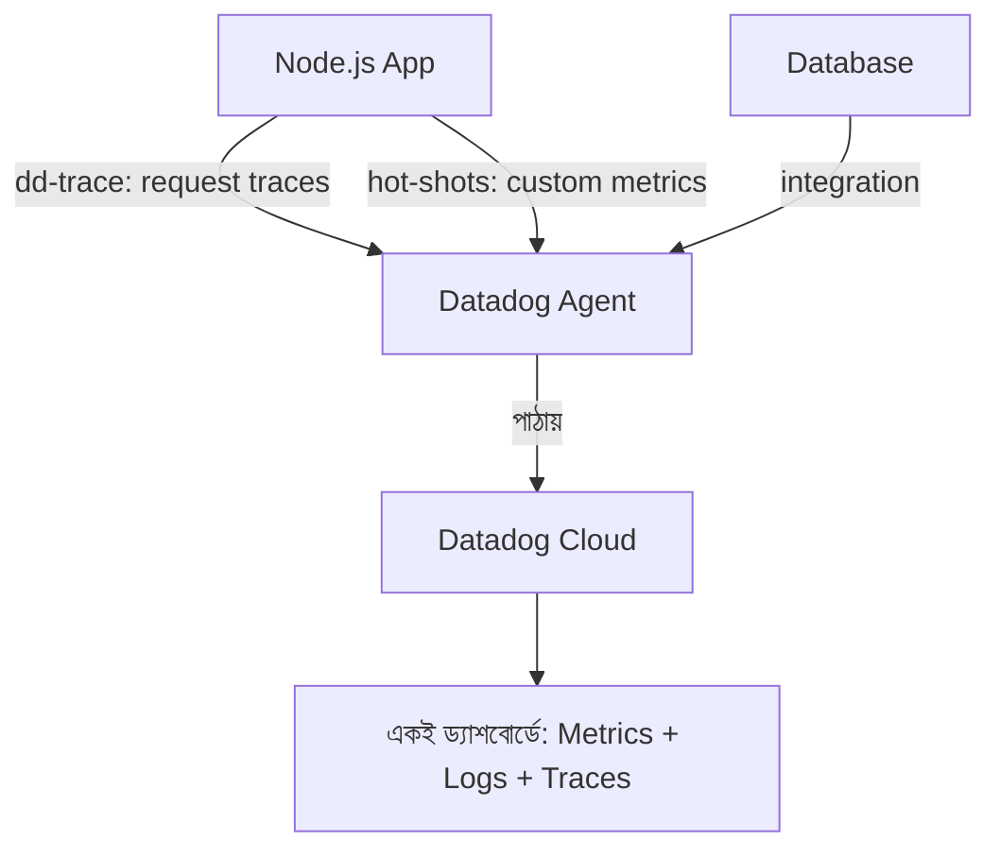

# ৩৩.০৩. Metrics Collection with Datadog

New Relic আমাদের শিখিয়েছে APM কীভাবে একটা request-এর ভেতরের যাত্রা দেখায়। কিন্তু কখনো কখনো তোমার দরকার হয় আরও বিস্তৃত ছবি — শুধু একটা অ্যাপ না, তোমার পুরো সিস্টেম (একাধিক সার্ভার, ডাটাবেজ, কিউ, cache — সব মিলিয়ে) একসাথে দেখা। এই কাজে **Datadog** সবচেয়ে জনপ্রিয় টুলগুলোর একটা, কারণ এটা শুধু APM না, বরং **metrics, logs, আর traces** — তিনটাকেই এক জায়গায় নিয়ে আসে।

এখানে একটা নতুন শব্দ বোঝা দরকার — **metric**। Metric মানে সময়ের সাথে বদলানো একটা সংখ্যা, যেটা তুমি নিজে বেছে নাও কী মাপবে। যেমন — "প্রতি মিনিটে কতগুলো অর্ডার তৈরি হলো", বা "লগইন ফেইল হওয়ার সংখ্যা"। Module 32-তে আমরা log লিখতাম টেক্সট আকারে ("User login failed for user123"), কিন্তু metric হলো সেই একই ঘটনার সংখ্যাগত রূপ, যেটা গ্রাফে আঁকা যায়, threshold বসানো যায়।

Datadog-এর Node.js লাইব্রেরি `dd-trace` দিয়ে auto-instrumentation পাওয়া যায়, তবে custom metric পাঠানোর জন্য আমরা `hot-shots` (StatsD ক্লায়েন্ট) ব্যবহার করি:

```bash
npm install hot-shots dd-trace
```

```js
// tracing.js - সবচেয়ে আগে require করতে হয়
const tracer = require('dd-trace').init();

// metrics.js
const StatsD = require('hot-shots');
const dogstatsd = new StatsD({ prefix: 'my_api.' });

// server.js
const express = require('express');
const app = express();

app.post('/orders', async (req, res) => {
  const order = await Order.create(req.body);

  // কাস্টম মেট্রিক পাঠানো — কতগুলো অর্ডার তৈরি হলো তার কাউন্টার
  dogstatsd.increment('orders.created');

  // response time নিজে থেকেই মাপা (gauge/histogram)
  dogstatsd.histogram('orders.create.duration_ms', Date.now() - req.startTime);

  res.status(201).json(order);
});
```

এখানে `increment` একটা **counter** metric — শুধু গুনতে থাকে। আর `histogram` মাপে একটা সংখ্যার বিতরণ (distribution) — যেমন response time-এর p50, p95, p99 (Module 31-এ আমরা response time নিয়ে কথা বলেছিলাম, এখানে সেই একই ধারণা metric হিসেবে সংরক্ষিত হচ্ছে)।



Datadog-এর আসল সুবিধা হলো **correlation** — তুমি একটা গ্রাফে দেখলে orders.created হঠাৎ কমে গেছে, এক ক্লিকে সেই একই সময়ের logs আর traces দেখতে পারো, বুঝতে পারো কারণটা কী ছিলো। এটা অনেকটা গোয়েন্দার কাজের মতো — একটা সূত্র (metric-এর অস্বাভাবিকতা) থেকে শুরু করে, সংশ্লিষ্ট সব প্রমাণ (logs, traces) এক জায়গায় জড়ো করে সমস্যাটা ধরা।

মেট্রিক সংগ্রহ করাই যথেষ্ট নয় অবশ্য — সেগুলো দেখে রাখারও দরকার নেই যদি কেউ সমস্যা হলে সাথে সাথে না জানে। পরের লেসনে আমরা দেখবো কীভাবে এই মেট্রিকগুলোর উপর ভিত্তি করে alert threshold বসিয়ে, সমস্যা হলে সাথে সাথে notification পাওয়া যায়।
