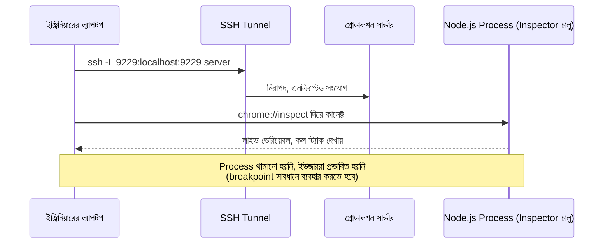

# ৩৪.০৩. Remote Debugging in Production

কখনো কখনো logs আর metrics মিলিয়েও বোঝা যায় না সমস্যাটা ঠিক কোথায়। এমন সময় মনে হয় — "যদি লোকাল মেশিনের মতো এই প্রসেসের ভেতরে গিয়ে সরাসরি দেখতে পারতাম!" ভালো খবর হলো, Node.js আসলে এটার একটা নিরাপদ উপায় দেয় — **remote debugging**, যেখানে তুমি প্রোডাকশন প্রসেসের ভেতরে (থামিয়ে না দিয়ে) উঁকি দিতে পারো, দূর থেকে।

Node.js-এর built-in **Inspector protocol** (Module 3-তে আমরা core module-এর ধারণা শিখেছিলাম — এটাও Node.js-এর নিজস্ব বিল্ট-ইন সুবিধারই একটা অংশ) দিয়ে যেকোনো চলমান Node প্রসেসকে একটা বিশেষ ফ্ল্যাগ দিয়ে "inspectable" বানানো যায়:

```bash
# একটা চলমান প্রসেসের PID ধরে, রানটাইমে inspector চালু করা (সিগন্যাল পাঠিয়ে)
kill -USR1 <PID>

# অথবা প্রসেস শুরু করার সময়েই inspector চালু রাখা (শুধু নির্দিষ্ট, সুরক্ষিত পোর্টে)
node --inspect=127.0.0.1:9229 server.js
```

লক্ষ্য করো, আমরা `127.0.0.1` ব্যবহার করেছি, `0.0.0.0` না — এটা অত্যন্ত গুরুত্বপূর্ণ নিরাপত্তা সিদ্ধান্ত। Inspector চালু থাকলে যে কেউ সেই পোর্টে কানেক্ট করে তোমার প্রসেসের ভেতরের যেকোনো ভেরিয়েবল দেখতে পারবে, এমনকি কোড execute করতেও পারবে। তাই প্রোডাকশনে inspector শুধু SSH tunnel-এর মাধ্যমে, শুধু নির্দিষ্ট সময়ের জন্য, শুধু বিশ্বস্ত ইঞ্জিনিয়ারের জন্য খোলা রাখা উচিত।



Chrome ব্রাউজারে `chrome://inspect` খুলে "Configure" দিয়ে `localhost:9229` যোগ করলে, তুমি সরাসরি Chrome DevTools দিয়ে প্রোডাকশন প্রসেসের memory heap snapshot নিতে পারো, বা এমনকি breakpoint বসাতে পারো। তবে এখানে সাবধানতা জরুরি — যদি তুমি breakpoint বসিয়ে প্রসেসটা থামিয়ে রাখো, তাহলে সেই মুহূর্তে আসা সব real request আটকে যাবে, ইউজাররা timeout পাবে। তাই breakpoint ব্যবহার শুধু কম-ট্রাফিকের সময়ে, খুব অল্প সময়ের জন্য করা উচিত, অথবা এড়িয়ে শুধু non-blocking পর্যবেক্ষণ (যেমন heap snapshot) ব্যবহার করা উচিত।

একটা নিরাপদ বিকল্প হলো `node --inspect` এর বদলে শুধু signal-ভিত্তিক ডায়াগনস্টিক নেওয়া, যেমন Node.js-এর built-in `process.report`:

```js
// একটা admin-only endpoint, প্রয়োজনে সিস্টেমের বিস্তারিত রিপোর্ট জেনারেট করে
app.post('/admin/diagnostic-report', requireAdmin, (req, res) => {
  const report = process.report.getReport();
  res.json({ cpu: report.resourceUsage, memory: report.javascriptHeap });
});
```

এই পদ্ধতিতে প্রসেস থামে না, শুধু সেই মুহূর্তের একটা স্ন্যাপশট নেওয়া হয় — লাইভ অস্ত্রোপচারের বদলে একটা এক্স-রে ছবি তোলার মতো। এই `javascriptHeap` ডেটাই আমাদের পরের লেসনের বিষয়ের সাথে সরাসরি যুক্ত — memory leak কীভাবে ধরা যায়, সেটা এবার দেখবো।
