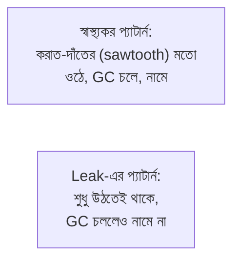

# ৩৪.০৪. Memory Leak Detection and Analysis

আগের লেসনের শেষে আমরা `process.report`-এর `javascriptHeap` তথ্য দেখেছিলাম। এই লেসনে আমরা বুঝবো কেন সেই heap-এর দিকে নজর রাখা এত জরুরি — কারণ Node.js অ্যাপ্লিকেশনের সবচেয়ে ছলনাময় (sneaky) সমস্যাগুলোর একটা হলো **memory leak**। Module 33-তে আমরা যখন PM2-তে বারবার crash আর restart দেখার কথা বলেছিলাম, তার একটা সবচেয়ে সাধারণ কারণ এই memory leak।

Memory leak বুঝতে হলে আগে বুঝতে হবে **garbage collection (GC)** কী। JavaScript-এ তোমাকে ম্যানুয়ালি মেমরি মুক্ত করতে হয় না (যেমন C ভাষায় করতে হয়) — Node.js-এর V8 ইঞ্জিন নিজে থেকেই বুঝে নেয় কোন অবজেক্ট আর কেউ ব্যবহার করছে না, আর সেটা মুছে ফেলে। কিন্তু সমস্যা হয় যখন তুমি এমনভাবে কোড লেখো যে একটা অবজেক্ট, আসলে অপ্রয়োজনীয় হয়ে যাওয়ার পরেও, কোথাও না কোথাও এখনো "রেফারেন্স করা" থেকে যায় — GC ভাবে এটা এখনো দরকার, তাই মোছে না। সময়ের সাথে সাথে এরকম হাজারো অব্যবহৃত অবজেক্ট জমতে থাকে, আর মেমরি ব্যবহার ক্রমাগত বাড়তেই থাকে, কখনো কমে না।

এটা অনেকটা একটা আলমারির মতো — তুমি জিনিস ব্যবহার শেষ করেও ফেলে দাও না, শুধু আলমারিতে ভরে রাখো "যদি লাগে" ভেবে। প্রতিদিন কিছু না কিছু জমতে থাকে, একসময় আলমারি উপচে পড়ে। সবচেয়ে সাধারণ কারণগুলো হলো ভুলভাবে ব্যবহৃত caches, ভুলে না-সরানো event listener, বা closure-এ আটকে থাকা রেফারেন্স:

```js
// ভুল উদাহরণ: একটা Map cache-এ কখনো এন্ট্রি মুছা হচ্ছে না
const cache = new Map();

app.get('/products/:id', async (req, res) => {
  if (!cache.has(req.params.id)) {
    cache.set(req.params.id, await Product.findById(req.params.id));
    // প্রতিটা নতুন product ID নিয়মিত যোগ হচ্ছে, কখনো মুছছে না
  }
  res.json(cache.get(req.params.id));
});
```

লক্ষ লক্ষ ভিন্ন product ID-এর জন্য এই cache অসীমভাবে বাড়তে থাকবে — এটাই leak। সমাধান হলো একটা সীমাবদ্ধ, expiry-যুক্ত cache ব্যবহার করা (যেমন `lru-cache` প্যাকেজ, যেটা পুরনো এন্ট্রি নিজে থেকে সরিয়ে দেয়)।

leak শনাক্ত করার প্রথম ধাপ হলো মেমরি ব্যবহারের গ্রাফ দেখা — যদি গ্রাফটা সময়ের সাথে ধারাবাহিকভাবে উপরের দিকে উঠতেই থাকে, কখনো নিচে না নামে (GC চললেও), সেটাই leak-এর লক্ষণ:



সন্দেহ হলে দুইটা **heap snapshot** নেওয়া যায় — একটা এখন, একটা কিছুক্ষণ পরে — আর `heapdump` প্যাকেজ বা Chrome DevTools দিয়ে দুটো তুলনা করে দেখা যায় কোন ধরনের অবজেক্ট সবচেয়ে বেশি বেড়েছে:

```js
const heapdump = require('heapdump');

app.post('/admin/heap-snapshot', requireAdmin, (req, res) => {
  const filename = `/tmp/heap-${Date.now()}.heapsnapshot`;
  heapdump.writeSnapshot(filename);
  res.json({ message: `Snapshot saved: ${filename}` });
});
```

এই দুইটা `.heapsnapshot` ফাইল Chrome DevTools-এর Memory ট্যাবে লোড করে "Comparison" ভিউতে দেখলে, ঠিক বোঝা যায় কোন object type-এর সংখ্যা অস্বাভাবিকভাবে বেড়েছে — যেমন যদি দেখো হাজার হাজার `Product` অবজেক্ট জমে আছে, তখনই বুঝবে উপরের cache-এর মতো কোনো জায়গায় সমস্যা।

মেমরি leak ধরাটা যেমন গোয়েন্দাগিরি, ঠিক তেমনি অ্যাপের গতি কমে যাওয়ার কারণ খোঁজাও আরেক ধরনের অনুসন্ধান — যেখানে সমস্যা মেমরিতে না হয়ে CPU-তে হতে পারে। পরের, এই মডিউলের শেষ লেসনে আমরা দেখবো performance profiling দিয়ে কীভাবে সেই ধরনের সমস্যা ধরা যায়।
