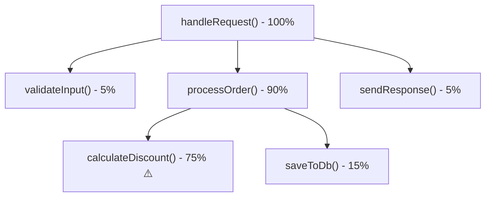

# ৩৪.০৫. Performance Profiling in Production

আমরা এই মডিউলে দেখেছি অনেক ধরনের প্রোডাকশন সমস্যা — crash, memory leak, ধীরগতির response। কিন্তু কখনো কখনো মেমরি ঠিকই আছে, লগেও অস্বাভাবিক কিছু নেই, তবু একটা নির্দিষ্ট endpoint অস্বাভাবিক ধীর। এই ধরনের সমস্যার উৎস প্রায়ই হয় CPU — কোনো একটা ফাংশন অতিরিক্ত সময় ধরে গণনা করছে, আর যেহেতু Node.js **single-threaded** (Module 5-এ আমরা async ও event loop নিয়ে কথা বলেছিলাম), একটা ভারী synchronous কাজ পুরো event loop-কে আটকে রাখতে পারে, বাকি সব request-কে অপেক্ষায় রেখে।

এই সমস্যা ধরার হাতিয়ার হলো **CPU profiling**। প্রোফাইলার একটা নির্দিষ্ট সময়ের জন্য প্রতি মিলিসেকেন্ডে বারবার দেখে কোন ফাংশন তখন চলছিলো, আর শেষে একটা রিপোর্ট বানায় — কোন ফাংশন মোট সময়ের কত শতাংশ দখল করেছে। Node.js-এর built-in `--prof` ফ্ল্যাগ দিয়ে এটা করা যায়:

```bash
# প্রোডাকশনে সাময়িকভাবে profiling সহ প্রসেস চালানো
node --prof server.js

# কিছুক্ষণ ট্রাফিক চলার পর, প্রসেস বন্ধ করে লগ প্রসেস করা
node --prof-process isolate-0xnnnnnnnnnnnn-v8.log > processed.txt
```

এই `processed.txt` ফাইলে একটা তালিকা পাওয়া যায় — কোন ফাংশন কত শতাংশ CPU সময় নিয়েছে। কিন্তু এটা টেক্সট আকারে পড়া কষ্টকর, তাই বাস্তবে বেশিরভাগ ইঞ্জিনিয়ার Chrome DevTools-এর **Flame Graph** ব্যবহার করে, যেটা visual আকারে দেখায়:



এখানে `calculateDiscount()` স্পষ্টভাবে দোষী — মোট সময়ের ৭৫% এখানেই যাচ্ছে। এটা flame graph-এর আসল শক্তি — চোখে দেখেই বোঝা যায় কোথায় "আগুন" সবচেয়ে চওড়া (সবচেয়ে বেশি সময় খাচ্ছে), ম্যানুয়ালি প্রতিটা লাইন গণনা করতে হয় না।

প্রোডাকশনে সরাসরি `--prof` চালানো কিছুটা ঝুঁকিপূর্ণ, কারণ এটা নিজেই কিছুটা ওভারহেড যোগ করে। তাই বাস্তবে প্রায়ই একটা নির্দিষ্ট, কম-ট্রাফিকের replica সার্ভারে এটা চালানো হয়, অথবা New Relic/Datadog-এর (Module 33) বিল্ট-ইন CPU profiling ফিচার ব্যবহার করা হয়, যেগুলো কম overhead-এ চলে এবং সরাসরি ওয়েব ড্যাশবোর্ডে flame graph দেখায়:

```js
// Datadog-এর continuous profiler চালু করা - dd-trace এর মধ্যেই আছে
const tracer = require('dd-trace').init({
  profiling: true, // CPU ও memory profiling স্বয়ংক্রিয়ভাবে চালু
});
```

`profiling: true` দিলে Datadog নিজে থেকেই কম overhead-এ প্রোফাইল ডেটা সংগ্রহ করতে থাকে, আর তুমি চাইলে যেকোনো সময় গিয়ে দেখতে পারো গত এক ঘণ্টায় কোন ফাংশন সবচেয়ে বেশি CPU খেয়েছে — কোনো ম্যানুয়াল `--prof` চালানো ছাড়াই।

এই লেসন দিয়ে আমরা production debugging-এর টুলবক্স সম্পূর্ণ করলাম — logs দিয়ে গল্প পড়া, remote inspector দিয়ে সরাসরি উঁকি দেওয়া, heap snapshot দিয়ে memory leak ধরা, আর CPU profiling দিয়ে ধীরগতির কারণ খুঁজে বের করা। এই চারটা হাতিয়ার একসাথে মিলিয়েই একজন ব্যাকএন্ড ইঞ্জিনিয়ার প্রোডাকশনের যেকোনো রহস্য সমাধান করতে পারে। পরের মডিউলে আমরা এগিয়ে যাবো আরও কিছু উন্নত বিষয়ে — Advanced Topics।
