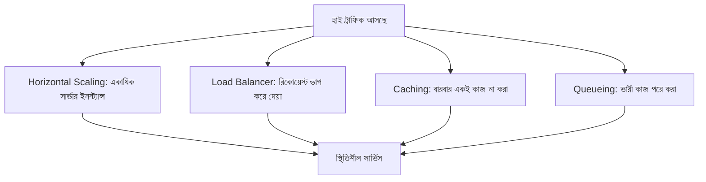

# ৩৫.১ High Traffic Management in a Backend Application

Module ৩২ আর ৩৩-এ আমরা logging আর monitoring শিখেছি — মানে এখন আমাদের হাতে সার্ভারের "স্বাস্থ্য পরীক্ষার রিপোর্ট" আছে। Module ৩৪-এ আমরা শিখেছি সেই রিপোর্ট দেখে সমস্যা কীভাবে খুঁজে বের করতে হয়। কিন্তু একটা প্রশ্ন এখনো বাকি — যদি হঠাৎ হাজার হাজার মানুষ একসাথে তোমার API-তে রিকোয়েস্ট পাঠায়, তাহলে কী হবে? এই লেসন থেকে আমরা "Advanced Topics" মডিউলে ঢুকছি, আর প্রথম আলোচনা — high traffic সামলানো।

কল্পনা করো একটা ছোট চায়ের দোকান, যেখানে একজন মাত্র কর্মচারী আছে। সাধারণ দিনে সে সবাইকে ভালোভাবে সামলাতে পারে। কিন্তু হঠাৎ একদিন এলাকায় মেলা বসলো, আর এক ঘণ্টায় ৫০০ জন কাস্টমার এলো। একজন কর্মচারী দিয়ে এটা সামলানো অসম্ভব — লাইন দীর্ঘ হবে, কাস্টমাররা বিরক্ত হয়ে চলে যাবে, কেউ কেউ ভুল অর্ডার পাবে। তোমার Express সার্ভারও ঠিক এই দোকানের মতো — একটা নির্দিষ্ট ক্যাপাসিটির পর সে আর নতুন request নিতে পারে না ঠিকঠাকভাবে।

Node.js সিঙ্গেল-থ্রেডেড হলেও (Module ৫-এ Event Loop নিয়ে আলোচনা মনে করো), high traffic সামলানোর জন্য কয়েকটা মূল কৌশল আছে:



প্রথম কৌশল — **horizontal scaling**। একটা সার্ভার ইনস্ট্যান্সের বদলে PM2 (Module ৩৩-এ শেখা) দিয়ে একাধিক instance চালানো:

```bash
pm2 start server.js -i max   # CPU core সংখ্যা অনুযায়ী instance চালায়
```

দ্বিতীয় কৌশল — **load balancer**, যেটা এই একাধিক instance-এর মধ্যে request ভাগ করে দেয়, ঠিক যেমন মেলার দিনে চায়ের দোকানে যদি চারজন কর্মচারী থাকতো আর একজন ম্যানেজার লাইন ভাগ করে দিতো। তৃতীয় কৌশল — **caching**, যেটা নিয়ে আমরা Module ৩১-এ বিস্তারিত দেখেছি: একই ডেটা বারবার ডেটাবেজ থেকে না এনে Redis-এ রেখে দেয়া। চতুর্থ কৌশল — **queueing**, যেখানে ভারী কাজ (যেমন ইমেইল পাঠানো, রিপোর্ট বানানো) সাথে সাথে না করে একটা লাইনে রেখে ব্যাকগ্রাউন্ডে পরে করা হয়, যাতে মূল request-response দ্রুত শেষ হয়।

```javascript
// একটা সহজ rate-aware middleware, ভারী রুটে ব্যবহার করার জন্য
const heavyQueue = [];
app.post('/generate-report', (req, res) => {
  heavyQueue.push({ userId: req.user.id, requestedAt: Date.now() });
  res.status(202).json({ message: 'রিপোর্ট তৈরি হচ্ছে, তোমাকে notify করা হবে' });
});
```

লক্ষ্য করো, উপরের কোডে সার্ভার সাথে সাথে "হ্যাঁ, কাজ শুরু হয়েছে" বলে দিচ্ছে (status ২০২ — Accepted), পুরো কাজ শেষ হওয়া পর্যন্ত অপেক্ষা করাচ্ছে না। এটাই high-traffic ডিজাইনের একটা মূল নীতি: প্রতিটা request-কে যতটা সম্ভব হালকা রাখা।

কিন্তু শুধু সার্ভার-সাইড কৌশল যথেষ্ট না — যদি কেউ ইচ্ছাকৃতভাবে বা ভুলবশত অস্বাভাবিক হারে request পাঠাতে থাকে, সেটাকে থামানোর ব্যবস্থাও দরকার। পরের লেসনে আমরা দেখবো কীভাবে middleware দিয়ে নিজের API-কে এই ধরনের অপব্যবহার থেকে রক্ষা করা যায়।
