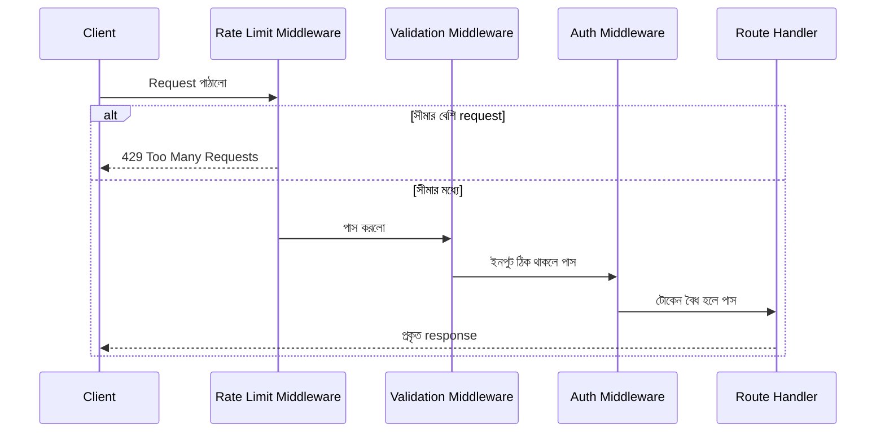

# ৩৫.২ Guard Your API Using Middlewares

আগের লেসনে আমরা দেখলাম হাই ট্রাফিক সামলানোর সার্ভার-সাইড কৌশল — scaling, caching, queueing। কিন্তু একটা জিনিস বাকি রয়ে গেলো: যদি ট্রাফিকের একটা অংশ আসলে বৈধ ব্যবহারকারীই না হয়, বরং কেউ ইচ্ছাকৃতভাবে তোমার সার্ভারকে আক্রমণ করার চেষ্টা করছে (যাকে বলে DoS বা bot abuse)? এই লেসনে আমরা দেখবো কীভাবে middleware ব্যবহার করে API-কে একটা "প্রহরী" (guard) দিয়ে ঘিরে রাখা যায়।

Module ৭-এ আমরা middleware-এর ধারণা শিখেছিলাম — একটা function যেটা request আর response-এর মাঝখানে বসে, request-টাকে আটকাতে বা পরিবর্তন করতে পারে। এখন আমরা সেই একই ধারণাকে নিরাপত্তার কাজে লাগাবো। ভাবো একটা অফিস ভবনের প্রধান ফটকের দারোয়ানকে — সে প্রত্যেক ভিজিটরকে চেক করে: পরিচয়পত্র আছে কিনা, কতবার আজ ঢুকেছে, নিষিদ্ধ তালিকায় নাম আছে কিনা। middleware ঠিক এই কাজটাই করে প্রতিটা incoming request-এর জন্য।



সবচেয়ে সাধারণ প্রহরী হলো **rate limiting** — একজন ব্যবহারকারী বা একটা IP address থেকে নির্দিষ্ট সময়ে কতগুলো request আসতে পারবে, সেটার সীমা বেঁধে দেয়া:

```javascript
const rateLimit = require('express-rate-limit');

const limiter = rateLimit({
  windowMs: 15 * 60 * 1000, // ১৫ মিনিট
  max: 100,                  // প্রতি IP থেকে ১৫ মিনিটে সর্বোচ্চ ১০০ request
  message: 'অনেক বেশি request পাঠানো হয়েছে, একটু পরে চেষ্টা করো।',
});

app.use('/api/', limiter);
```

দ্বিতীয় প্রহরী — **input validation middleware**, যেটা নিশ্চিত করে খারাপ বা malformed ডেটা route handler পর্যন্ত পৌঁছানোর আগেই আটকা পড়ে:

```javascript
const { body, validationResult } = require('express-validator');

app.post(
  '/api/habits',
  body('title').isString().isLength({ min: 1, max: 100 }),
  body('frequency').isIn(['daily', 'weekly']),
  (req, res, next) => {
    const errors = validationResult(req);
    if (!errors.isEmpty()) {
      return res.status(400).json({ errors: errors.array() });
    }
    next();
  }
);
```

তৃতীয় প্রহরী — **authentication/authorization guard**, যেটা নিশ্চিত করে শুধু বৈধ টোকেনধারীরাই সংবেদনশীল রুটে ঢুকতে পারে। Module ১২-তে আমরা JWT দিয়ে এই ধরনের middleware বানিয়েছিলাম, এখানে সেই একই প্যাটার্ন কিন্তু broader নিরাপত্তা কৌশলের একটা অংশ হিসেবে দেখছি।

গুরুত্বপূর্ণ বিষয় হলো এই middleware-গুলোর **ক্রম** — rate limiter সবার আগে থাকা উচিত, কারণ সেটা সবচেয়ে সস্তা চেক (শুধু একটা কাউন্টার দেখা), আর ভারী কাজ (ডেটাবেজ কুয়েরি, ব্যবসায়িক লজিক) সবার শেষে। এভাবে সাজালে অবৈধ request যত দ্রুত সম্ভব বাতিল হয়ে যায়, সার্ভারের রিসোর্স বাঁচে।

এখন প্রশ্ন হলো — এই সীমাগুলো (যেমন ১০০ request/১৫ মিনিট) কীভাবে ঠিক করবে? এলোমেলোভাবে সংখ্যা বসিয়ে দিলে চলবে না — তার জন্য দরকার প্রকৃত লোড টেস্টিং, যেটা আমরা পরের লেসনে দেখবো।
