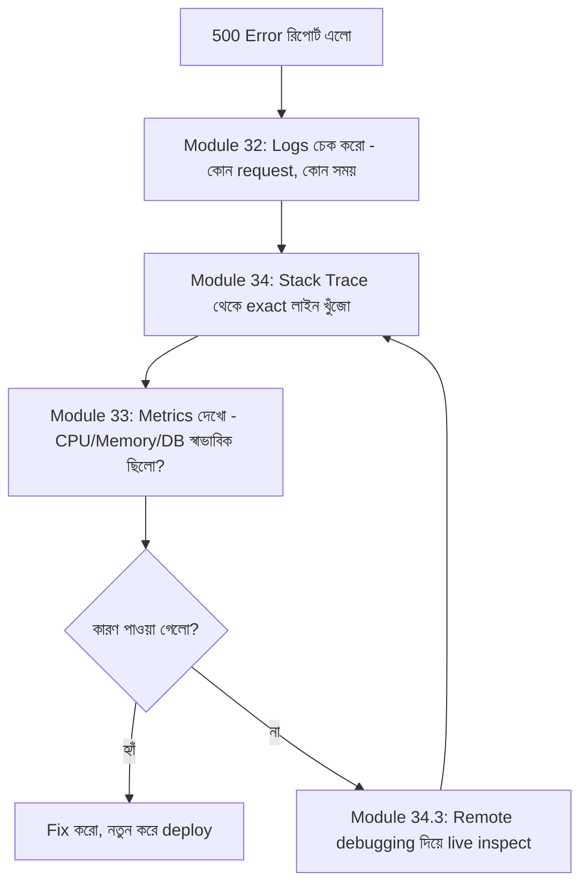

# ৩৫.৫ Trouble Shooting Backend Application

আগের লেসনে আমরা DevTools দিয়ে বুঝলাম কীভাবে বোঝা যায় সমস্যাটা frontend-এ, নাকি backend-এ। ধরো তদন্ত করে দেখা গেলো — না, request ঠিকমতো গিয়েছে, কিন্তু backend থেকে 500 error ফেরত এসেছে। এখন পালা backend ট্রাবলশুটিং-এর, যেখানে Module ৩২ (logging), Module ৩৩ (monitoring), আর Module ৩৪ (production debugging)-এ শেখা সব হাতিয়ার একসাথে কাজে লাগবে।

Backend ট্রাবলশুটিংকে একটা গোয়েন্দা তদন্তের মতো ভাবা যায় — একটা অপরাধ (error) ঘটেছে, আর তোমার কাছে আছে প্রমাণ জোগাড় করার তিনটা প্রধান উৎস: logs (সাক্ষীর জবানবন্দি), metrics (সিসিটিভি ফুটেজ), আর stack trace (অপরাধের দৃশ্যের ছবি)।



প্রথম ধাপ, structured logs (Module ৩২.২) থেকে সেই নির্দিষ্ট request-এর trace খুঁজে বের করা — কোন user, কোন endpoint, কোন সময়, আর তার সাথে যুক্ত error message:

```javascript
// Module 32-এ শেখা structured logging কাজে লাগছে এখানে
logger.error('Failed to save habit', {
  requestId: req.id,
  userId: req.user?.id,
  route: req.originalUrl,
  error: err.message,
  stack: err.stack,
});
```

এই লগ থেকেই আমরা জানতে পারি ঠিক কোথায় error হয়েছে। দ্বিতীয় ধাপ, stack trace বিশ্লেষণ — Module ৩৪.৪-এ আমরা যেভাবে memory leak trace করেছিলাম, ঠিক একইভাবে stack trace-এর প্রতিটা লাইন পড়ে বুঝতে হয় কল-চেইন কোথা থেকে শুরু হয়ে কোথায় ভেঙেছে। একটা সাধারণ ভুল — নতুন developer-রা stack trace-এর একদম উপরের লাইনটাই শুধু পড়ে, কিন্তু আসল কারণ প্রায়ই দুই-তিন লাইন নিচে, নিজের কোডের ভেতরে (npm package-এর ভেতরে না) লুকিয়ে থাকে।

তৃতীয় ধাপ, metrics দেখে বোঝা এটা কি একটা বিচ্ছিন্ন ঘটনা, নাকি প্যাটার্ন। ধরো Datadog-এ (Module ৩৩.৩) দেখা গেলো ঠিক সেই সময় ডেটাবেজ কানেকশন পুল পুরো ভরে গিয়েছিলো:

```javascript
pool.on('error', (err) => {
  logger.error('Database pool error', { error: err.message });
});

// কানেকশন পুলের আকার সীমিত রাখা, যাতে বোঝা যায় সীমা কোথায়
const pool = new Pool({ max: 20, idleTimeoutMillis: 30000 });
```

এখন কারণ স্পষ্ট — একসাথে অনেক request আসায় কানেকশন পুল ফুরিয়ে গিয়েছিলো, নতুন request কানেকশন না পেয়ে টাইমআউট হয়ে 500 error দিয়েছে। এটা সরাসরি Module ৩৫.১-এ শেখা high-traffic সমস্যার সাথে যুক্ত — সমাধান হতে পারে pool size বাড়ানো, অথবা query optimize করা, অথবা caching বসানো (Module ৩১.৫)।

লক্ষ্য করার মতো বিষয় — একটা ভালো backend troubleshooting সবসময় logs, stack trace, আর metrics — এই তিনটাকে একসাথে ব্যবহার করে, কোনো একটা একা যথেষ্ট না। এখন সমস্যা খুঁজে বের করা আর ঠিক করা শিখেছি, কিন্তু সেই ফিক্সটা production-এ পৌঁছাবে কীভাবে? পরের লেসনে আমরা দেখবো বিভিন্ন deployment strategy, যেগুলো নিশ্চিত করে ফিক্স যাওয়ার সময় ব্যবহারকারীরা কোনো বিঘ্ন টের না পায়।
