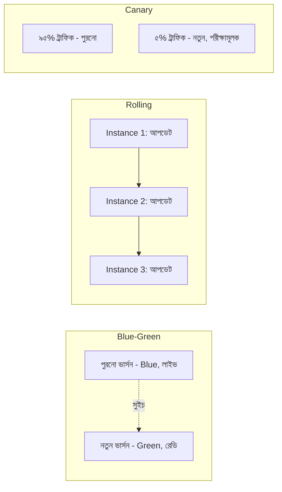

# ৩৫.৬ Deployment Strategies

আগের লেসনে আমরা একটা backend সমস্যা খুঁজে বের করে ফিক্স করলাম। কিন্তু সেই ফিক্স production সার্ভারে পৌঁছাতে হবে, আর সেটা যদি ভুলভাবে করা হয়, তাহলে ফিক্স করতে গিয়ে নতুন সমস্যা তৈরি হতে পারে — সার্ভার কিছুক্ষণের জন্য বন্ধ থাকা, বা অর্ধেক ব্যবহারকারী পুরনো কোড আর অর্ধেক নতুন কোড পাওয়া। এই লেসনে আমরা দেখবো কীভাবে পরিকল্পিতভাবে নতুন কোড production-এ ছাড়া যায়, ঝুঁকি কমিয়ে।

সবচেয়ে সহজ (কিন্তু ঝুঁকিপূর্ণ) পদ্ধতি হলো পুরনো সার্ভার বন্ধ করে নতুন কোড বসিয়ে আবার চালু করা — একে বলে **recreate deployment**। এটা অনেকটা একটা দোকান পুরোপুরি বন্ধ করে ভেতরে সংস্কার করে আবার খোলার মতো — যতক্ষণ সংস্কার চলে, ততক্ষণ কোনো কাস্টমার ঢুকতে পারে না। ছোট প্রজেক্টে এটা চলতে পারে, কিন্তু Personal Growth Tracker-এর মতো অ্যাপ যদি সবসময় চালু থাকতে হয়, এই পদ্ধতি গ্রহণযোগ্য না।



**Blue-Green deployment**-এ দুইটা সম্পূর্ণ পরিবেশ থাকে — "Blue" (বর্তমানে লাইভ) আর "Green" (নতুন ভার্সন, প্রস্তুত কিন্তু ট্রাফিক পাচ্ছে না)। নতুন ভার্সন ভালোভাবে টেস্ট হওয়ার পর, load balancer-কে একবারে Green-এর দিকে সুইচ করে দেয়া হয়। সমস্যা হলে সাথে সাথে আবার Blue-এ ফিরে যাওয়া যায় — এটাই এই কৌশলের সবচেয়ে বড় সুবিধা, তাৎক্ষণিক rollback।

**Rolling deployment**-এ, যদি তোমার একাধিক instance চলে (Module ৩৫.১-এ শেখা PM2 cluster mode-এর মতো), তাহলে একটা একটা করে instance আপডেট করা হয়, বাকিগুলো তখনও পুরনো কোড দিয়ে ট্রাফিক সামলায়। কোনো মুহূর্তেই পুরো সিস্টেম বন্ধ থাকে না, তবে সাময়িকভাবে কিছু ব্যবহারকারী পুরনো আর কিছু নতুন ভার্সন পেতে পারে।

**Canary deployment** সবচেয়ে সতর্ক পদ্ধতি — নতুন কোড প্রথমে মাত্র ৫% ট্রাফিকে ছাড়া হয় (যেমন একটা কয়লাখনির "canary" পাখি, যেটা বিষাক্ত গ্যাসের আগাম সংকেত দিতো)। Module ৩৩-এ শেখা monitoring দিয়ে সেই ৫% ট্রাফিকে error rate আর latency পর্যবেক্ষণ করা হয়; সব ঠিক থাকলে ধীরে ধীরে ১০%, ৫০%, তারপর ১০০%-এ নেয়া হয়।

```javascript
// একটা সহজ canary রাউটিং-এর উদাহরণ, header বা percentage ভিত্তিক
app.use((req, res, next) => {
  const isCanary = Math.random() < 0.05; // ৫% ট্রাফিক
  req.headers['x-deployment-version'] = isCanary ? 'v2-canary' : 'v1-stable';
  next();
});
```

কোন কৌশল বেছে নেবে সেটা নির্ভর করে ঝুঁকি সহনশীলতা আর অবকাঠামোর উপর — ছোট প্রজেক্টে rolling deployment যথেষ্ট, বড় প্রোডাকশন সিস্টেমে canary বেশি নিরাপদ। কিন্তু এই সবগুলো কৌশল যদি হাতে করে, ম্যানুয়ালি করতে হয়, তাহলে মানুষের ভুলের ঝুঁকি থেকেই যায়। পরের লেসনে আমরা দেখবো কীভাবে এই পুরো প্রক্রিয়াটা স্বয়ংক্রিয় করে একটা "frictionless" পাইপলাইন বানানো যায়।
