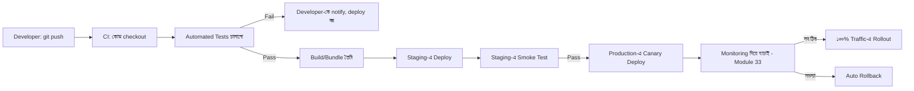

# ৩৫.৭ Frictionless Deployment Pipeline

আগের লেসনে আমরা শিখেছি কোন strategy দিয়ে (blue-green, rolling, canary) নতুন কোড ছাড়া উচিত। কিন্তু যদি প্রতিবার এই ধাপগুলো — টেস্ট চালানো, বিল্ড করা, সার্ভারে কপি করা, সুইচ করা — হাতে করে করতে হয়, তাহলে সেটা ধীর, ক্লান্তিকর, আর ভুলপ্রবণ। এই মডিউলের শেষ লেসনে আমরা দেখবো কীভাবে এই পুরো যাত্রাটা একটা "frictionless" (ঘর্ষণহীন) স্বয়ংক্রিয় পাইপলাইনে রূপান্তর করা যায় — যেটাকে বলা হয় CI/CD (Continuous Integration / Continuous Deployment)।

ভাবো একটা কারখানার অ্যাসেম্বলি লাইন। কাঁচামাল একদিকে ঢোকে, আর অন্যদিক থেকে সম্পূর্ণ প্রস্তুত পণ্য বের হয় — মাঝখানে প্রতিটা ধাপ (কাটা, জোড়া লাগানো, পরীক্ষা করা, প্যাকেজিং) স্বয়ংক্রিয়ভাবে ঘটে, কোনো মানুষ প্রতিটা ধাপে হাত না লাগিয়ে। একটা frictionless deployment pipeline ঠিক এভাবেই কাজ করে — একজন ডেভেলপার কোড push করে, আর বাকিটা পাইপলাইন নিজে সামলায়।



একটা সাধারণ GitHub Actions পাইপলাইন কেমন দেখতে হয় দেখি:

```yaml
name: Deploy Personal Growth Tracker
on:
  push:
    branches: [main]

jobs:
  test-and-deploy:
    runs-on: ubuntu-latest
    steps:
      - uses: actions/checkout@v4
      - uses: actions/setup-node@v4
        with:
          node-version: 20
      - run: npm ci
      - run: npm test               # Module 36-এ শেখা automated testing
      - run: npm run build
      - name: Deploy to production
        if: success()
        run: ./deploy.sh
```

লক্ষ্য করো — `npm test` fail করলে পরের ধাপগুলো (deploy) আর চলে না। এটাই frictionless pipeline-এর মূল নিরাপত্তা: খারাপ কোড কখনো production পর্যন্ত পৌঁছাতে পারে না, কারণ পথে বাধা (automated gate) বসানো আছে।

একটা সত্যিকারের frictionless পাইপলাইনে এই ধাপগুলো একসাথে কাজ করে:

- **Continuous Integration (CI)** — প্রতিটা push-এ স্বয়ংক্রিয়ভাবে টেস্ট চলা, যাতে সমস্যা দ্রুত ধরা পড়ে।
- **Automated deployment** — টেস্ট পাস করলে নিজে থেকেই staging আর production-এ কোড যাওয়া, আগের লেসনের কোনো একটা strategy (canary বা rolling) ব্যবহার করে।
- **Monitoring-linked rollback** — Module ৩৩-এ শেখা alert threshold-গুলো যদি deploy-এর পরে trigger হয় (error rate বেড়ে গেছে), পাইপলাইন নিজে থেকেই আগের ভার্সনে ফিরে যায়, মানুষকে ঘুম থেকে না জাগিয়েই।

এখানেই "Advanced Topics" মডিউল শেষ হচ্ছে — এই সাতটা লেসনে আমরা ট্রাফিক সামলানো থেকে শুরু করে নিরাপত্তা, লোড টেস্টিং, ট্রাবলশুটিং, আর শেষে স্বয়ংক্রিয় ডেপ্লয়মেন্ট পর্যন্ত পুরো একটা প্রোডাকশন-রেডি সিস্টেমের ছবি সম্পূর্ণ করলাম। এখন সময় এসেছে এই সব জ্ঞান একটা বাস্তব প্রজেক্টে প্রয়োগ করার — পরের মডিউলে আমরা শুরু থেকে শেষ পর্যন্ত একটা সম্পূর্ণ অ্যাপ্লিকেশন, "Personal Growth Tracker" পরিকল্পনা আর তৈরি করবো।
