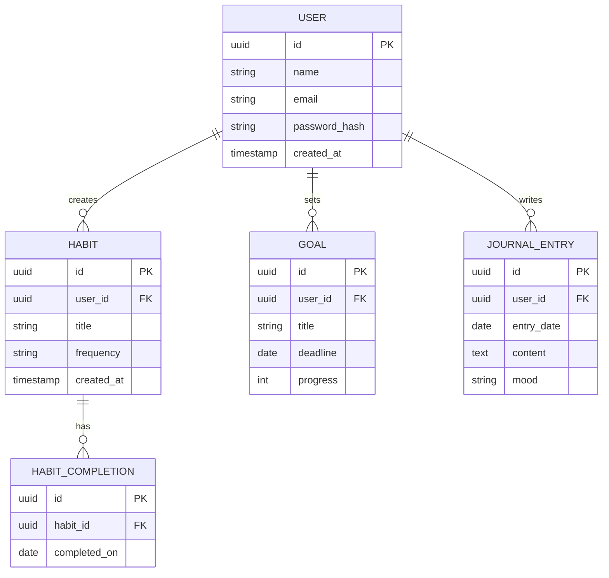

# ৩৬.২ Database Plan for Project

আগের লেসনে আমরা Personal Growth Tracker-এর চারটা মূল অবজেক্ট ঠিক করেছি — User, Habit, Goal, JournalEntry — আর তাদের মধ্যে সম্পর্ক একটা classDiagram-এ দেখেছি। এখন সেই কাগজে আঁকা নকশাকে একটা বাস্তব ডেটাবেজ স্কিমায় রূপান্তর করার পালা।

এটাকে ভাবতে পারো একটা বাড়ির স্থাপত্য নকশা থেকে আসল ইট-সিমেন্টের কাঠামোতে যাওয়ার মতো। classDiagram আমাদের বলেছে কী কী "ঘর" (entity) দরকার আর তাদের মধ্যে দরজা (relationship) কোথায় থাকবে; এখন আমরা ঠিক করবো প্রতিটা ঘরের ইট বসানোর সঠিক মাপ — কোন কলামে কী টাইপের ডেটা থাকবে।

যেহেতু ডেটার মধ্যে স্পষ্ট সম্পর্ক আছে (এক User-এর অনেক Habit, এক Habit-এর অনেক completion), আমরা এখানে একটা relational database (PostgreSQL) বেছে নিচ্ছি — এই ধরনের structured, সম্পর্কযুক্ত ডেটার জন্য relational ডেটাবেজ স্বাভাবিক পছন্দ।



লক্ষ্য করো `Habit`-এর `completions` array-টা classDiagram-এ একটা সাধারণ list হিসেবে দেখানো হয়েছিলো, কিন্তু এখানে একটা আলাদা `HABIT_COMPLETION` টেবিলে পরিণত হয়েছে। এটা একটা গুরুত্বপূর্ণ শিক্ষা — object মডেলে যেটা একটা প্রপার্টির ভেতরের array মনে হয়, ডেটাবেজে সেটা প্রায়ই একটা আলাদা টেবিল হয়ে যায়, কারণ আমরা প্রতিটা completion-এর তারিখ ধরে query করতে চাইবো (যেমন "গত ৩০ দিনে কয়বার সম্পন্ন হয়েছে")।

Sequelize বা Prisma-এর মতো ORM দিয়ে এই স্কিমা কোডে এভাবে প্রকাশ করা যায়:

```javascript
// Prisma schema-র একটা অংশ
model Habit {
  id          String   @id @default(uuid())
  userId      String
  title       String
  frequency   String
  completions HabitCompletion[]
  user        User     @relation(fields: [userId], references: [id])
}
```

ফরেন কী (`userId`) দিয়ে আমরা নিশ্চিত করছি প্রতিটা Habit ঠিক একজন User-এর সাথে যুক্ত থাকে — যেটা আগের লেসনের classDiagram-এ `User "1" --> "many" Habit` সম্পর্কটার হুবহু ডেটাবেজ প্রতিফলন।

এখন আমাদের কাছে অবজেক্ট মডেল আর ডেটাবেজ স্কিমা দুটোই আছে। কিন্তু এগুলো কীভাবে একটা পূর্ণাঙ্গ সিস্টেমের মধ্যে বসবে — API, ফ্রন্টএন্ড, ক্যাশ, সব মিলিয়ে? পরের লেসনে আমরা পুরো সিস্টেমের একটা high-level architecture diagram আঁকবো।
