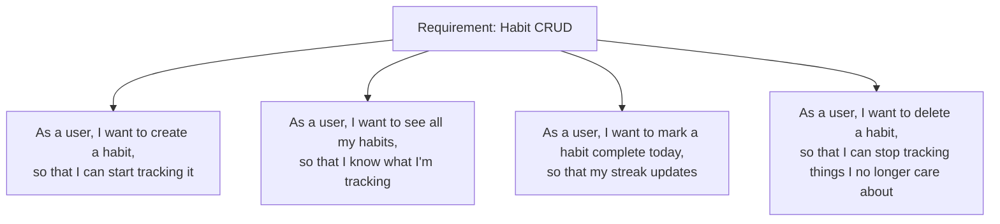

# ৩৬.৫ Handling Project Requirements for a Project

আগের লেসনে আমরা Personal Growth Tracker-এর functional আর non-functional requirement-গুলো তালিকাভুক্ত করেছি। কিন্তু "Habit CRUD" লেখাটা এখনো অনেক বড় আর অস্পষ্ট একটা কাজ — এটা দিয়ে সরাসরি কোড লেখা শুরু করা কঠিন। এই লেসনে আমরা দেখবো কীভাবে বড় requirement-কে ছোট, কাজ-করার-মতো টুকরায় ভাঙা যায়।

এই কাজটাকে ভাবা যায় একটা রেসিপি বই লেখার মতো। "রান্না করো" বললে কেউ কিছু বুঝবে না, কিন্তু "পেঁয়াজ কুচি করো, তেলে ভাজো, তারপর মসলা দাও" — এই ধাপগুলো কেউ অনুসরণ করতে পারে। Requirement handling মানে বড় লক্ষ্যকে এমন ধাপে ভাঙা, যেটা একজন ডেভেলপার একদিনে বা দুইদিনে শেষ করতে পারে।

এর জন্য সবচেয়ে জনপ্রিয় পদ্ধতি হলো **user story** লেখা — "As a [ব্যবহারকারীর ধরন], I want to [কাজ], so that [উদ্দেশ্য]" ফরম্যাটে। "Habit CRUD" requirement থেকে user story বের করলে দেখা যায়:



প্রতিটা user story এখন যথেষ্ট ছোট যে সরাসরি একটা API endpoint-এ রূপান্তর করা যায়:

```javascript
// Story: "As a user, I want to create a habit"
app.post('/api/habits', authMiddleware, async (req, res) => {
  const { title, frequency } = req.body;
  const habit = await Habit.create({ userId: req.user.id, title, frequency });
  res.status(201).json(habit);
});

// Story: "As a user, I want to mark a habit complete today"
app.post('/api/habits/:id/complete', authMiddleware, async (req, res) => {
  const completion = await HabitCompletion.create({
    habitId: req.params.id,
    completedOn: new Date(),
  });
  res.status(201).json(completion);
});
```

লক্ষ্য করো, প্রতিটা story-র একটা স্পষ্ট "acceptance criteria" থাকা উচিত — কীভাবে বোঝা যাবে কাজটা "সম্পন্ন"। যেমন "habit তৈরি করা" story-র জন্য: "title খালি হলে 400 error আসবে", "সফল হলে 201 status আর habit object ফেরত আসবে"। এই criteria-গুলোই পরে automated test-এ পরিণত হয় (Module ৩৬.১১-এ আমরা AI দিয়ে এই টেস্ট বানানো শিখবো)।

একটা গুরুত্বপূর্ণ অভ্যাস — প্রতিটা story-কে independent রাখা, যাতে একটা শেষ না হলে আরেকটা আটকে না থাকে। এখন requirement-গুলো ছোট ছোট কাজের টুকরায় ভাঙা হয়ে গেছে, কিন্তু সবগুলো টুকরা কি একসাথে প্রথম ভার্সনেই বানাতে হবে? পরের লেসনে আমরা দেখবো কীভাবে "scope" ঠিক করে বোঝা যায় কোনটা এখন দরকার, কোনটা পরে।
