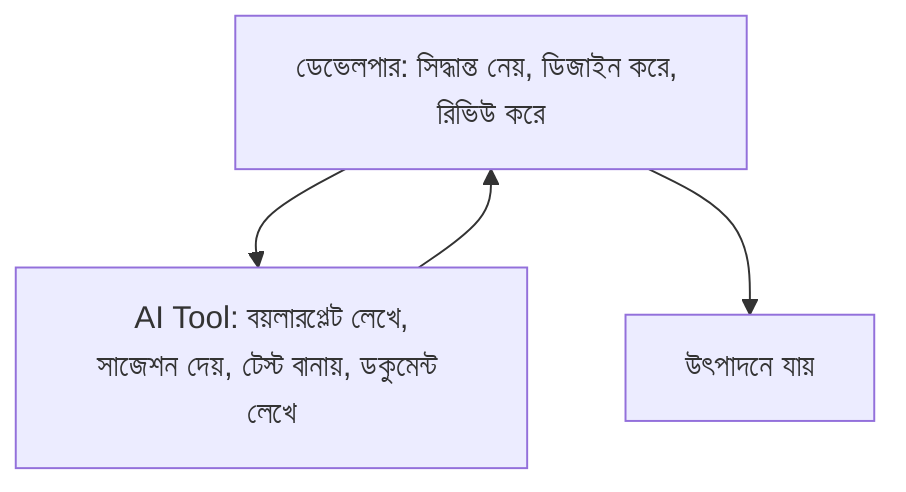

# ৩৬.৮ Introduction to AI-Assisted Development

সাতটা লেসন জুড়ে আমরা Personal Growth Tracker-এর পরিকল্পনা করেছি — অবজেক্ট, ডেটাবেজ, আর্কিটেকচার, requirement, scope, timeline। এখন কোড লেখা শুরু করার আগে একটা গুরুত্বপূর্ণ বিরতি নেয়া দরকার — আজকের যুগে কোড লেখার প্রক্রিয়াটাই বদলে গেছে, কারণ AI টুলস এখন একজন ডেভেলপারের নিত্যদিনের সঙ্গী।

ভাবো তুমি একজন স্থপতি, যে আগে হাতে প্রতিটা মাপ হিসাব করতো, এখন CAD সফটওয়্যার ব্যবহার করে। CAD স্থপতির কাজ কেড়ে নেয়নি — বরং তাকে দ্রুত, ভুল কম করে কাজ করতে সাহায্য করে, আর সৃজনশীল সিদ্ধান্তগুলোর জন্য বেশি সময় দেয়। AI-assisted development ঠিক এই ভূমিকা পালন করে — এটা ডেভেলপারের চিন্তাভাবনার বিকল্প না, বরং তার হাতিয়ার।



এই মডিউলের বাকি লেসনগুলোতে (৩৬.৯ থেকে ৩৬.১৫) আমরা একে একে দেখবো AI কীভাবে development-এর বিভিন্ন ধাপে সাহায্য করে — কোড লেখা (Copilot, Cursor), কোড রিভিউ, টেস্টিং, ডকুমেন্টেশন, আর নিজেদের ছোট AI টুল বানানো। কিন্তু তার আগে একটা গুরুত্বপূর্ণ নীতিগত কথা বলা দরকার — AI যা লেখে সেটা সবসময় সঠিক না, আর দায়িত্ব সবসময় ডেভেলপারেরই থাকে।

একটা উদাহরণ দেখি। ধরো আমরা AI-কে জিজ্ঞেস করলাম Habit model-এর জন্য একটা validation function লিখতে, আর সে দিলো:

```javascript
function validateHabit(habit) {
  if (!habit.title) throw new Error('Title required');
  return true;
}
```

এই কোড কাজ করে, কিন্তু Module ৩৬.৪-এ আমরা যে non-functional requirement ঠিক করেছিলাম (যেমন title-এর length সীমা), সেটা AI জানে না, কারণ সেটা আমাদের প্রজেক্ট-নির্দিষ্ট প্রেক্ষাপট। AI-কে ভালো ফলাফল দিতে হলে তাকে সঠিক প্রেক্ষাপট (context) দিতে হয় — এটাই "prompt engineering"-এর মূল কথা, শুধু ভালো প্রশ্ন করা না, বরং প্রাসঙ্গিক তথ্য দিয়ে প্রশ্ন করা।

AI-assisted development মানে এই না যে আমরা চিন্তা করা বন্ধ করে দেবো — বরং এই যে আমরা কম সময়ে বেশি যাচাই করার সুযোগ পাবো। পরের লেসনে আমরা দেখবো বাস্তবে কোন কোন টুল (GitHub Copilot, Cursor, IntelliJ, VS Code) কীভাবে আমাদের প্রজেক্টের ওয়ার্কফ্লোতে যুক্ত করতে হয়।
