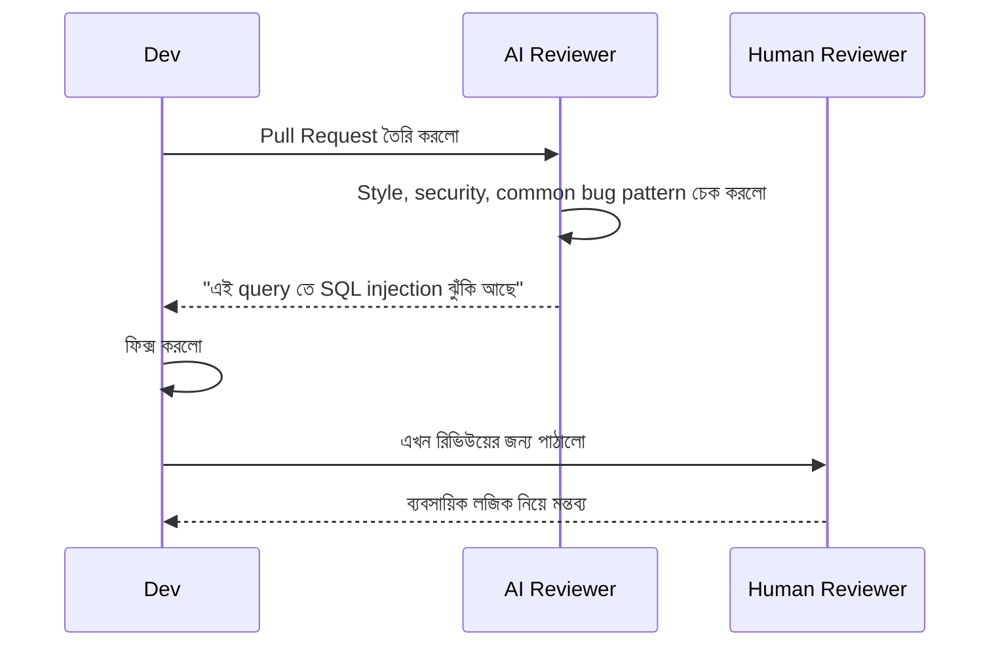

# ৩৬.১০ AI Code Review & Quality Analysis

আগের লেসনে আমরা AI টুল সেটআপ করলাম কোড লেখার জন্য। কিন্তু কোড লেখার পর আরেকটা গুরুত্বপূর্ণ ধাপ থাকে — কেউ একজন সেই কোড রিভিউ করে দেখে, ভুল আছে কিনা, ভালো প্র্যাকটিস মানা হয়েছে কিনা। ছোট টিমে বা একা কাজ করার সময় এই দ্বিতীয় জোড়া চোখের অভাব বোধ করা স্বাভাবিক — আর এখানেই AI code review কাজে লাগে।

একটা প্রুফরিডারের কথা ভাবো, যে বই ছাপার আগে বানান আর ব্যাকরণ ভুল ধরে। AI code reviewer অনেকটা এরকম — এটা মানুষ রিভিউয়ারকে প্রতিস্থাপন করে না, কিন্তু সহজ, যান্ত্রিক ভুলগুলো (unused variable, missing error handling, inconsistent naming) ধরে ফেলে, যাতে মানুষ রিভিউয়ার গুরুত্বপূর্ণ ব্যবসায়িক-লজিক প্রশ্নে মনোযোগ দিতে পারে।



ধরো আমাদের Habit route-এ AI review করালো, আর এরকম একটা কোড পেলো:

```javascript
app.get('/api/habits/:id', async (req, res) => {
  const habit = await db.query(`SELECT * FROM habits WHERE id = '${req.params.id}'`);
  res.json(habit);
});
```

একটা ভালো AI reviewer সাথে সাথে চিহ্নিত করবে — এখানে raw string দিয়ে SQL query বানানো হচ্ছে, যেটা SQL injection-এর দরজা খুলে দেয়। সঠিক ফিক্স:

```javascript
app.get('/api/habits/:id', async (req, res) => {
  const habit = await db.query('SELECT * FROM habits WHERE id = $1', [req.params.id]);
  res.json(habit);
});
```

এই ধরনের সমস্যা AI দ্রুত ধরতে পারে কারণ এগুলো প্যাটার্ন-ভিত্তিক — হাজার হাজার কোডবেসে একই ভুল দেখে শেখা হয়েছে। কিন্তু AI যা বুঝতে পারে না, তা হলো "আমাদের প্রজেক্টের জন্য এই ফিচারটা আদৌ সঠিক সিদ্ধান্ত কিনা" — সেই judgment মানুষ রিভিউয়ারের কাজ।

ব্যবহারিকভাবে, GitHub-এ Copilot-এর review ফিচার বা CodeRabbit-এর মতো টুল pull request-এর সাথে যুক্ত করা যায়, যাতে প্রতিটা PR-এ স্বয়ংক্রিয়ভাবে প্রাথমিক রিভিউ হয়ে যায় — Module ৩৭-এ আমরা যখন pull request workflow নিয়ে বিস্তারিত শিখবো, তখন এই ধারণা আবার কাজে লাগবে।

কোড রিভিউ হয়ে গেলে পরের স্বাভাবিক প্রশ্ন — এই কোড আসলে সঠিকভাবে কাজ করে কিনা, সেটা কীভাবে যাচাই করবো? পরের লেসনে আমরা দেখবো AI দিয়ে কীভাবে টেস্ট লেখার কাজ দ্রুত করা যায়।
