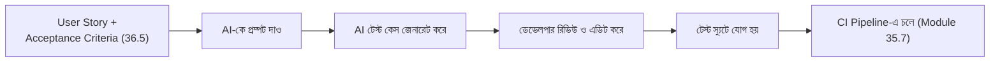

# ৩৬.১১ Automated Testing with AI

আগের লেসনে AI আমাদের কোডের নিরাপত্তা সমস্যা ধরিয়ে দিলো। রিভিউ পাস করা কোড মানেই কিন্তু কাজ করার গ্যারান্টি না — তার জন্য দরকার automated test। আর টেস্ট লেখা প্রায়ই ডেভেলপারদের সবচেয়ে ফাঁকি দেয়া কাজ, কারণ এটা "আসল ফিচার" মনে হয় না। এই লেসনে আমরা দেখবো AI কীভাবে এই বাধা দূর করতে সাহায্য করে।

ভাবো একজন কারিগর একটা চেয়ার বানালো। টেস্ট করা মানে চেয়ারে বসে দেখা এটা ভেঙে পড়ে কিনা, বিভিন্ন ওজনে, বিভিন্ন কোণে। Module ৩৬.৫-এ আমরা প্রতিটা user story-র জন্য acceptance criteria লিখেছিলাম — এখন সেগুলোই টেস্ট কেসের ভিত্তি হবে।



ধরো আমরা Cursor বা Copilot Chat-কে বললাম: "আমাদের `POST /api/habits` endpoint-এর জন্য Jest দিয়ে টেস্ট লেখো, যেটা যাচাই করবে: খালি title দিলে 400 আসে, সঠিক ডেটা দিলে 201 আসে।" AI নিচের মতো কিছু দিতে পারে:

```javascript
describe('POST /api/habits', () => {
  it('খালি title দিলে 400 রিটার্ন করবে', async () => {
    const res = await request(app)
      .post('/api/habits')
      .set('Authorization', `Bearer ${token}`)
      .send({ title: '', frequency: 'daily' });
    expect(res.status).toBe(400);
  });

  it('সঠিক ডেটা দিলে 201 রিটার্ন করবে', async () => {
    const res = await request(app)
      .post('/api/habits')
      .set('Authorization', `Bearer ${token}`)
      .send({ title: 'প্রতিদিন পড়া', frequency: 'daily' });
    expect(res.status).toBe(201);
    expect(res.body.title).toBe('প্রতিদিন পড়া');
  });
});
```

এই টেস্টগুলো একটা ভালো শুরু, কিন্তু AI সাধারণত সবচেয়ে সাধারণ (happy path আর একটা edge case) দৃশ্যপট কভার করে — কম দেখা যায় এমন কোণা (যেমন খুব দীর্ঘ title, একই সাথে দুইজন ব্যবহারকারী একই habit তৈরি করার race condition) নিজে থেকে ভাবতে হয়। এখানেও AI reviewer-এর মতো একই নীতি — AI প্রথম খসড়া দেয়, ডেভেলপার সেটাকে সম্পূর্ণ করে।

এই টেস্টগুলো Module ৩৫.৭-এ শেখা CI/CD পাইপলাইনের সাথে সরাসরি যুক্ত হবে — প্রতিটা push-এ এই টেস্টগুলো চলবে, ফেল করলে deploy বন্ধ হয়ে যাবে। এভাবে AI-এর সাহায্যে দ্রুত লেখা টেস্ট, প্রজেক্টের দীর্ঘমেয়াদী নিরাপত্তার একটা স্তম্ভ হয়ে ওঠে।

কোড লেখা হলো, টেস্ট হলো — এখন প্রজেক্টের আরেকটা প্রায়ই অবহেলিত অংশ: ডকুমেন্টেশন। পরের লেসনে আমরা দেখবো AI কীভাবে এই কাজেও সাহায্য করে।
