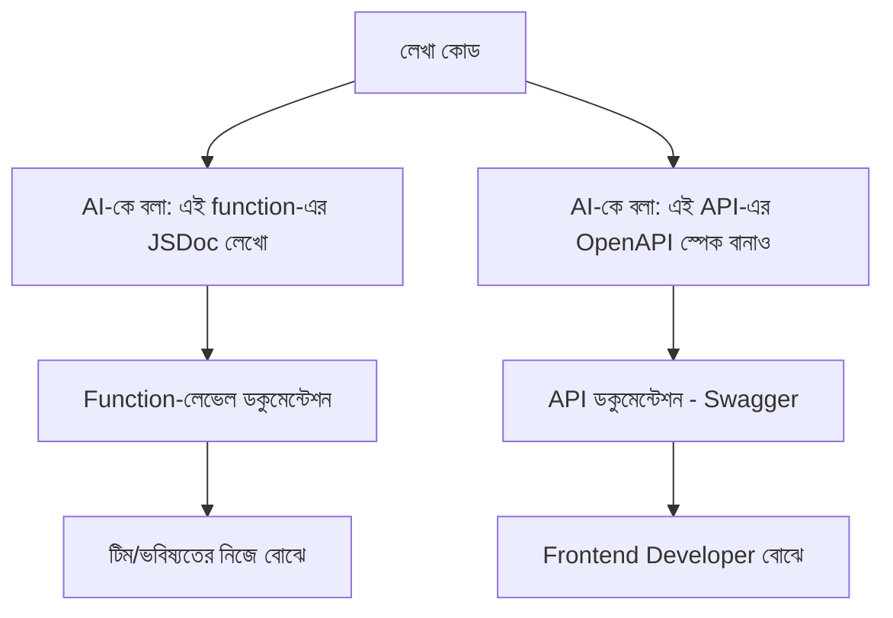

# ৩৬.১২ AI-Powered Code Documentation

আগের লেসনে আমরা AI দিয়ে টেস্ট লিখলাম Habit API-এর জন্য। এখন আমাদের কাছে কাজ করা কোড আছে, টেস্ট আছে — কিন্তু যদি তিন মাস পর অন্য কোনো ডেভেলপার (বা তুমি নিজেই) এই কোড খুলে দেখো, `getStreak()` ফাংশনটা ঠিক কী হিসাব করে বুঝতে সময় লাগবে। এই লেসনে আমরা দেখবো AI কীভাবে ডকুমেন্টেশন লেখার কাজ সহজ করে।

Module ৩৫.৪-এ আমরা দেখেছিলাম frontend সমস্যার একটা বড় কারণ হলো API contract নিয়ে ভুল ধারণা। ভালো ডকুমেন্টেশন এই ভুল বোঝাবুঝি প্রতিরোধ করে — এটা একটা রেস্তোরাঁর মেনু কার্ডের মতো, যেটা কাস্টমারকে বলে দেয় ঠিক কী অর্ডার করলে কী পাবে, রান্নাঘরে ঢুকে দেখতে হয় না।



ধরো আমাদের streak calculation function-টা এরকম:

```javascript
function getStreak(completions) {
  const sorted = completions.sort((a, b) => b - a);
  let streak = 0;
  let expected = new Date();
  for (const date of sorted) {
    if (isSameDay(date, expected)) {
      streak++;
      expected.setDate(expected.getDate() - 1);
    } else break;
  }
  return streak;
}
```

AI-কে বলা যায় "এই function-এর জন্য JSDoc কমেন্ট লেখো", আর ফলাফল হবে:

```javascript
/**
 * ব্যবহারকারীর একটা habit-এর বর্তমান streak (পরপর কতদিন সম্পন্ন হয়েছে) হিসাব করে।
 * @param {Date[]} completions - সেই habit-এর সব completion তারিখ
 * @returns {number} আজ থেকে পিছিয়ে গিয়ে পরপর সম্পন্ন দিনের সংখ্যা
 */
```

শুধু ফাংশন-লেভেল কমেন্ট না, পুরো API-এর জন্যও AI দিয়ে OpenAPI/Swagger স্পেসিফিকেশন বানানো যায় — কোড থেকে route আর validation rule পড়ে, একটা সম্পূর্ণ interactive ডকুমেন্টেশন পেজ তৈরি করে দেয়, যেটা Postman collection-এও (Module ৩১.২ থেকে মনে করো) import করা যায়।

একটা গুরুত্বপূর্ণ সতর্কতা — AI-এর লেখা ডকুমেন্টেশন সবসময় কোডের সাথে সিঙ্ক আছে কিনা যাচাই করা দরকার। কোড বদলালে ডকুমেন্টেশন-ও বদলাতে হয়, নাহলে ভুল ডকুমেন্টেশন কোনো ডকুমেন্টেশন না থাকার চেয়েও খারাপ — এটা মিথ্যা আত্মবিশ্বাস তৈরি করে।

কোড, টেস্ট, ডকুমেন্টেশন — সব AI-সহায়তায় এগিয়েছে। এখন একটু গভীরে গিয়ে দেখা যাক — এই AI টুলগুলো আসলে কীভাবে কাজ করে ভেতরে ভেতরে, development workflow-এর মধ্যে LLM ঠিক কীভাবে বসে। পরের লেসনে সেই আলোচনা।
