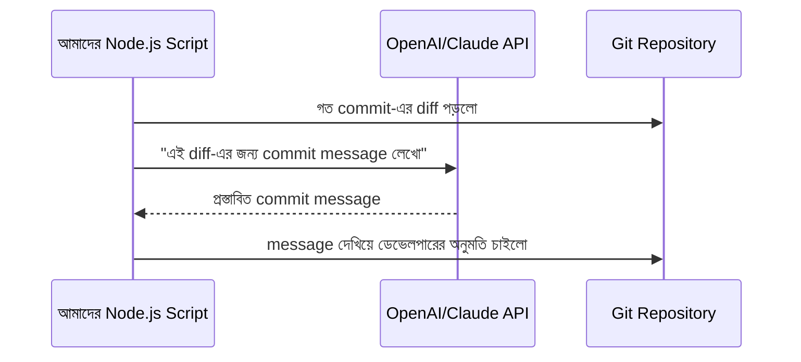

# ৩৬.১৩ LLM Integration in Development Workflow

আগের চারটা লেসনে আমরা AI টুল ব্যবহার করেছি কোড লেখা, রিভিউ, টেস্টিং, আর ডকুমেন্টেশনে। কিন্তু এখন পর্দার আড়ালে উঁকি দেয়ার সময় — এই টুলগুলো আসলে কীভাবে কাজ করে, আর কীভাবে আমরা নিজেরাই LLM-কে আমাদের development workflow-এর ভেতরে বসাতে পারি, শুধু editor plugin হিসেবে না।

মনে করো Copilot বা Cursor একটা রেস্তোরাঁর ওয়েটার, যে তোমার অর্ডার (prompt) রান্নাঘরে (LLM API) পাঠায়, আর রান্না হয়ে এলে (response) তোমাকে পরিবেশন করে। এখন পর্যন্ত আমরা শুধু "ওয়েটার"-এর মাধ্যমে অর্ডার করেছি — এই লেসনে আমরা শিখবো কীভাবে সরাসরি রান্নাঘরের (API) সাথে কথা বলতে হয়, নিজের workflow script বানানোর জন্য।



একটা বাস্তব উদাহরণ — নিজের একটা ছোট script বানানো, যেটা LLM API সরাসরি কল করে:

```javascript
const Anthropic = require('@anthropic-ai/sdk');
const client = new Anthropic({ apiKey: process.env.ANTHROPIC_API_KEY });

async function explainError(errorMessage, stackTrace) {
  const response = await client.messages.create({
    model: 'claude-sonnet-4-5',
    max_tokens: 300,
    messages: [{
      role: 'user',
      content: `এই error-টা বাংলায় সহজ করে ব্যাখ্যা করো, সম্ভাব্য কারণসহ:\n${errorMessage}\n${stackTrace}`,
    }],
  });
  return response.content[0].text;
}
```

লক্ষ্য করো, এই script-টা Module ৩৪-এ শেখা error handling-এর সাথে যুক্ত করা যায় — যখন production-এ কোনো error লগ হয়, স্বয়ংক্রিয়ভাবে এই function কল করে একটা সহজ-ভাষার ব্যাখ্যা তৈরি করা যায়, যেটা on-call ডেভেলপারকে দ্রুত বুঝতে সাহায্য করবে।

এই ধরনের সরাসরি API integration-এর একটা গুরুত্বপূর্ণ বিবেচনা হলো **cost আর latency** — প্রতিটা API কল টাকা খরচ করে আর কিছুটা সময় নেয়, তাই এটা এমন জায়গায় বসানো উচিত যেখানে মূল্য যোগ করে, প্রতিটা request-এ না (Module ৩৫.১-এ শেখা "প্রতিটা request হালকা রাখা" নীতির সাথে সাংঘর্ষিক না হয়ে)।

এতক্ষণ আমরা AI-কে ব্যবহার করেছি টুল হিসেবে ডেকে। কিন্তু দৈনন্দিন কোডিং-এ সবচেয়ে ঘনঘন ব্যবহৃত রূপটা হলো ইনলাইন কোড কমপ্লিশন — পরের লেসনে আমরা সেই অভ্যাসটা আরও গভীরভাবে দেখবো।
