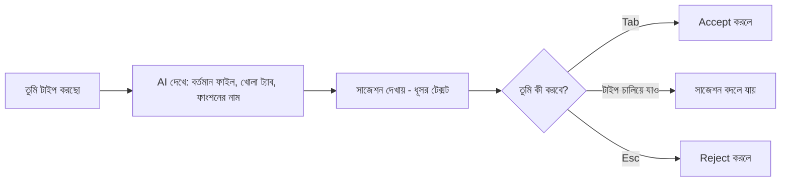

# ৩৬.১৪ AI Code Completion & Suggestions

আগের লেসনে আমরা LLM API সরাসরি কল করে নিজের script বানালাম। কিন্তু দিনের পর দিন কোডিং করার সময়, সবচেয়ে বেশি ব্যবহৃত AI ফিচারটা হলো সাধারণ কোড কমপ্লিশন — যেটা প্রতিটা লাইনে, প্রতিটা মুহূর্তে ঘটে। এই লেসনে আমরা এই অভ্যাসটাকে দক্ষতার সাথে ব্যবহার করার কৌশল দেখবো।

এটা টাইপ করার সময় ফোনের keyboard suggestion-এর সাথে তুলনা করা যায়, কিন্তু অনেক বেশি স্মার্ট ভার্সনে — এটা শুধু পরের শব্দ না, পুরো লজিক অনুমান করার চেষ্টা করে, তোমার আগের কোড, ফাইলের নাম, আর প্রজেক্টের প্যাটার্ন দেখে।



ধরো আমরা Goal model-এর জন্য একটা progress-আপডেট ফাংশন লিখছি, আর ইতিমধ্যে Habit-এর `markComplete` ফাংশন কোডবেসে আছে (Module ৩৬.১ থেকে):

```javascript
class Goal {
  constructor(id, title, deadline) {
    this.id = id;
    this.title = title;
    this.deadline = deadline;
    this.progress = 0;
  }

  updateProgress(value) {
    // এখানে টাইপ করা শুরু করলেই, AI প্যাটার্ন চিনে সাজেস্ট করবে:
    this.progress = Math.min(100, Math.max(0, this.progress + value));
  }
}
```

লক্ষ্য করো, AI `Math.min`/`Math.max` দিয়ে bounds check করার সাজেশন দিতে পারে কারণ এই প্যাটার্নটা লক্ষ লক্ষ কোডবেসে দেখা গেছে "progress bar" জাতীয় জিনিসের জন্য। কিন্তু AI জানে না যে আমাদের ব্যবসায়িক নিয়ম কী — progress কি নেগেটিভ হতে পারবে? এটা ডেভেলপারের সিদ্ধান্ত, AI-এর সাজেশন শুধু একটা শুরুর বিন্দু।

দক্ষতার সাথে কোড কমপ্লিশন ব্যবহারের কিছু অভ্যাস:

- **অর্থবহ নাম রাখা** — ফাংশন আর ভেরিয়েবলের নাম স্পষ্ট রাখলে (যেমন `updateProgress` বনাম `up`), AI-এর সাজেশন অনেক বেশি প্রাসঙ্গিক হয়।
- **ছোট ফাংশনে কাজ করা** — Module ৩৮-এ আমরা clean code নীতি শিখবো, যেখানে ছোট, একক-দায়িত্বের ফাংশন AI-এর জন্যও বুঝতে সহজ।
- **সাজেশন যাচাই না করে accept না করা** — বিশেষ করে নিরাপত্তা বা টাকা-সংক্রান্ত লজিকে।

এই দৈনন্দিন সহায়তার বাইরে, একটা প্রশ্ন থেকেই যায় — যদি আমাদের প্রয়োজন এমন কিছু হয় যা কোনো তৈরি টুল দেয় না? পরের লেসনে আমরা দেখবো কীভাবে নিজেদের প্রয়োজন অনুযায়ী একটা কাস্টম AI development টুল বানানো যায়।
