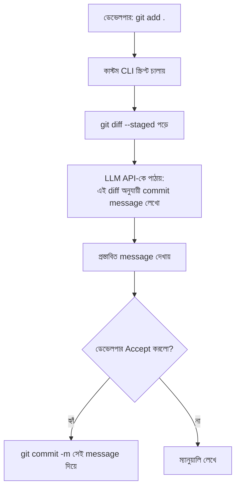

# ৩৬.১৫ Building Custom AI Development Tools

আগের ছয়টা লেসনে আমরা তৈরি AI টুল (Copilot, Cursor) ব্যবহার করেছি। কিন্তু কখনো কখনো আমাদের প্রজেক্টের প্রয়োজন এতটাই নির্দিষ্ট যে কোনো তৈরি টুল সেটা সরাসরি সমাধান করে না। এই লেসনে, AI-assisted development অংশের শেষ ধাপে, আমরা নিজেদের জন্য একটা ছোট কাস্টম AI টুল বানাবো — Module ৩৬.১৩-এ শেখা সরাসরি API কল করার কৌশল ব্যবহার করে।

ভাবো তুমি একজন দর্জি, যে বাজারের রেডিমেড জামার পাশাপাশি মাঝে মাঝে নিজের মাপ অনুযায়ী কাস্টম জামাও বানাও, কারণ সেটা তোমার শরীরে (তোমার প্রজেক্টের নির্দিষ্ট প্রয়োজনে) নিখুঁতভাবে ফিট করে।

Personal Growth Tracker প্রজেক্টের জন্য একটা কাজে লাগার মতো কাস্টম টুল — একটা **commit message generator**, যেটা `git diff` পড়ে একটা স্পষ্ট, প্রজেক্টের কনভেনশন মেনে commit message লিখে দেয়:



```javascript
#!/usr/bin/env node
const { execSync } = require('child_process');
const Anthropic = require('@anthropic-ai/sdk');
const client = new Anthropic({ apiKey: process.env.ANTHROPIC_API_KEY });

async function generateCommitMessage() {
  const diff = execSync('git diff --staged').toString();
  if (!diff) {
    console.log('কোনো staged পরিবর্তন নেই।');
    return;
  }

  const response = await client.messages.create({
    model: 'claude-sonnet-4-5',
    max_tokens: 100,
    messages: [{
      role: 'user',
      content: `নিচের git diff-এর জন্য একটা সংক্ষিপ্ত, conventional commit style message লেখো (feat:/fix:/refactor: দিয়ে শুরু):\n\n${diff}`,
    }],
  });

  console.log('প্রস্তাবিত commit message:\n', response.content[0].text);
}

generateCommitMessage();
```

এই ধরনের ছোট টুল বানানোর সময় কয়েকটা নীতি মাথায় রাখা দরকার — টুলটা যেন কখনোই স্বয়ংক্রিয়ভাবে সিদ্ধান্ত না নেয় (এখানে commit message শুধু "প্রস্তাব", ডেভেলপারের চূড়ান্ত অনুমোদন ছাড়া কমিট হয় না), আর secrets (API key) `.env`-এ রাখা, কোডে হার্ডকোড না করা — Module ৩৬.৯-এ শেখা নিরাপত্তা নীতির পুনরাবৃত্তি এখানে।

এই ধরনের কাস্টম টুল যেকোনো repetitive কাজে বানানো যায় — changelog লেখা, PR description তৈরি করা, এমনকি Module ৩৬.১১-এর মতো টেস্ট জেনারেট করা একটা নিজস্ব CLI দিয়ে অটোমেট করা। এখানেই AI-assisted development-এর তত্ত্বীয় অংশ শেষ হচ্ছে — এখন সময় হয়েছে সব পরিকল্পনা আর টুল একসাথে নিয়ে, সত্যিকারের Personal Growth Tracker অ্যাপ্লিকেশন বানানো শুরু করার।
