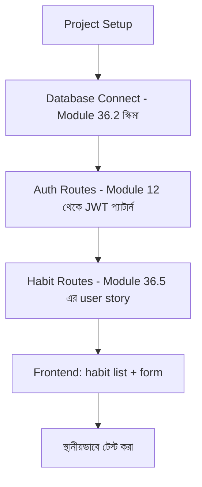

# ৩৬.১৬ Personal Growth Tracker: API + Frontend

পনেরোটা লেসন জুড়ে আমরা পরিকল্পনা করেছি (৩৬.১-৩৬.৭) আর টুল প্রস্তুত করেছি (৩৬.৮-৩৬.১৫)। এখন সময় এসেছে — আজকের লেসনে আমরা Personal Growth Tracker-এর MVP আসলে বানাবো। যা কিছু আঁকা হয়েছিলো কাগজে (classDiagram, ERD, architecture diagram), সেগুলো এখন কোডে রূপান্তরিত হবে।

Module ৩৬.৬-এ ঠিক করা MVP স্কোপ মনে করি: user auth, habit তৈরি করা, complete মার্ক করা, আর list দেখা। আমরা Express দিয়ে backend আর একটা সাধারণ frontend বানাবো।



প্রথমে backend-এর কঙ্কাল:

```javascript
// server.js
const express = require('express');
const app = express();
app.use(express.json());

const authRoutes = require('./routes/auth');
const habitRoutes = require('./routes/habits');

app.use('/api/auth', authRoutes);
app.use('/api/habits', habitRoutes);

app.listen(3000, () => console.log('Personal Growth Tracker চলছে পোর্ট 3000-এ'));
```

Habit routes, ৩৬.৫-এ পরিকল্পিত user story অনুযায়ী:

```javascript
// routes/habits.js
const router = require('express').Router();
const { authMiddleware } = require('../middleware/auth');
const Habit = require('../models/Habit');

router.use(authMiddleware);

router.post('/', async (req, res) => {
  const { title, frequency } = req.body;
  if (!title) return res.status(400).json({ error: 'title আবশ্যক' });
  const habit = await Habit.create({ userId: req.user.id, title, frequency });
  res.status(201).json(habit);
});

router.get('/', async (req, res) => {
  const habits = await Habit.findAll({ where: { userId: req.user.id } });
  res.json({ habits });
});

router.post('/:id/complete', async (req, res) => {
  const completion = await HabitCompletion.create({ habitId: req.params.id, completedOn: new Date() });
  res.status(201).json(completion);
});

module.exports = router;
```

Frontend-এর দিকে, একটা সাধারণ React কম্পোনেন্ট:

```jsx
function HabitList() {
  const [habits, setHabits] = useState([]);

  useEffect(() => {
    fetch('/api/habits', { headers: { Authorization: `Bearer ${token}` } })
      .then(res => res.json())
      .then(data => setHabits(data.habits)); // Module 35.4-এ শেখা শুদ্ধ response-হ্যান্ডলিং
  }, []);

  return (
    <ul>
      {habits.map(h => <li key={h.id}>{h.title} <button onClick={() => markComplete(h.id)}>✓ আজ সম্পন্ন</button></li>)}
    </ul>
  );
}
```

লক্ষ্য করো, frontend-এ `data.habits` ব্যবহার করা হচ্ছে, `data` সরাসরি না — এটা ৩৫.৪ লেসনে শেখা ভুলটা আগে থেকেই এড়িয়ে যাওয়া। এভাবেই MVP-র প্রথম কার্যকরী ভার্সন তৈরি হলো, যদিও এখনো এটা শুধু নিজের কম্পিউটারে (localhost) চলছে। পরের লেসনে আমরা এটাকে প্রকৃত ব্যবহারকারীদের হাতে পৌঁছানোর জন্য প্রোডাকশনে deploy করবো।
