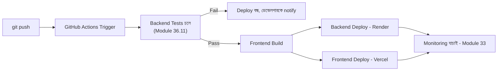

# ৩৬.১৮ CI/CD Pipeline for Fullstack Application

আগের লেসনে আমরা Personal Growth Tracker হাতে করে deploy করলাম। কিন্তু ভবিষ্যতে প্রতিটা ছোট পরিবর্তনের জন্য যদি এই একই প্রক্রিয়া ম্যানুয়ালি করতে হয়, ভুল হওয়ার আর সময় নষ্ট হওয়ার ঝুঁকি থেকেই যায়। এই লেসনে আমরা Module ৩৫.৭-এ শেখা frictionless deployment pipeline-এর ধারণাকে এই নির্দিষ্ট প্রজেক্টে বাস্তবায়ন করবো।

Module ৩৬.১১-এ আমরা AI দিয়ে টেস্ট লিখেছিলাম — এখন সেই টেস্টগুলো একটা automated pipeline-এর "দারোয়ান" হিসেবে কাজ করবে, যে নিশ্চিত করে ভাঙা কোড কখনো production-এ পৌঁছায় না।



GitHub Actions দিয়ে এই পাইপলাইন এরকম দেখাবে:

```yaml
name: Deploy Personal Growth Tracker
on:
  push:
    branches: [main]

jobs:
  test:
    runs-on: ubuntu-latest
    steps:
      - uses: actions/checkout@v4
      - uses: actions/setup-node@v4
        with: { node-version: 20 }
      - run: npm ci
      - run: npm test

  deploy-backend:
    needs: test
    runs-on: ubuntu-latest
    steps:
      - name: Trigger Render Deploy
        run: curl -X POST ${{ secrets.RENDER_DEPLOY_HOOK }}

  deploy-frontend:
    needs: test
    runs-on: ubuntu-latest
    steps:
      - uses: actions/checkout@v4
      - run: cd frontend && npm ci && npm run build
      - name: Deploy to Vercel
        run: npx vercel deploy --prod --token ${{ secrets.VERCEL_TOKEN }}
```

লক্ষ্য করো `needs: test` লাইনটা — এটা নিশ্চিত করে `deploy-backend` আর `deploy-frontend` জব দুটো তখনই চলবে যখন `test` জব সফল হয়েছে। এটাই Module ৩৫.৭-এ দেখা "gate" ধারণার হুবহু বাস্তবায়ন।

`RENDER_DEPLOY_HOOK` আর `VERCEL_TOKEN`-এর মতো সংবেদনশীল তথ্য কোডে না লিখে GitHub repository-র "Secrets" সেটিংসে রাখা হয় — এটা Module ৩৬.৯-এ শেখা "secrets কখনো কোডে হার্ডকোড না করা" নীতির CI/CD-স্তরের প্রয়োগ।

এখন প্রতিটা `git push` স্বয়ংক্রিয়ভাবে টেস্ট চালায়, আর পাস করলেই deploy করে। কিন্তু deploy হয়ে যাওয়ার পর সার্ভার আসলে কেমন চলছে, সেটা কে দেখবে? পরের লেসনে আমরা এই লাইভ সার্ভার ব্যবস্থাপনার দিকে ফিরে তাকাবো।
