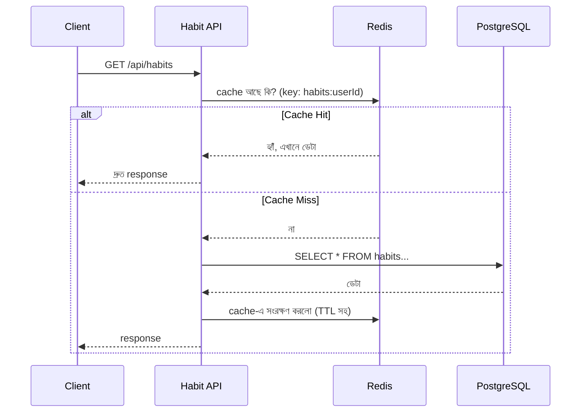

# ৩৬.২০ API Performance Optimization

আগের লেসনে আমরা সার্ভার পর্যবেক্ষণ করতে শুরু করলাম, আর ধরে নিলাম — Datadog-এ দেখা যাচ্ছে `/api/habits` endpoint-টা ব্যবহারকারী বাড়ার সাথে সাথে ধীর হয়ে যাচ্ছে। এই লেসনে আমরা Module ৩১-এ শেখা caching কৌশল এই বাস্তব সমস্যায় প্রয়োগ করবো।

মনে করো একটা লাইব্রেরি, যেখানে প্রতিবার একটা বই চাইলে লাইব্রেরিয়ানকে পুরো গুদামঘর খুঁজে বের করতে হয়। যদি জনপ্রিয় কিছু বই ডেস্কের পাশেই রাখা থাকে, বারবার গুদামঘরে যেতে হয় না। Redis cache ঠিক এই "ডেস্কের পাশে রাখা" জিনিসটা করে আমাদের ডেটার জন্য।



কোডে বাস্তবায়ন:

```javascript
const redis = require('redis').createClient();

router.get('/', async (req, res) => {
  const cacheKey = `habits:${req.user.id}`;
  const cached = await redis.get(cacheKey);
  if (cached) {
    return res.json(JSON.parse(cached));
  }

  const habits = await Habit.findAll({ where: { userId: req.user.id } });
  const result = { habits };
  await redis.setEx(cacheKey, 60, JSON.stringify(result)); // ৬০ সেকেন্ড cache
  res.json(result);
});

// habit তৈরি/আপডেট হলে cache invalidate করা জরুরি, নাহলে পুরনো ডেটা দেখাবে
router.post('/', async (req, res) => {
  const habit = await Habit.create({ userId: req.user.id, ...req.body });
  await redis.del(`habits:${req.user.id}`); // cache পরিষ্কার
  res.status(201).json(habit);
});
```

লক্ষ্য করো cache invalidation-এর অংশটা — cache বসানো সহজ, কিন্তু ডেটা বদলালে পুরনো cache মুছে ফেলাটা ভুলে গেলে ব্যবহারকারী পুরনো তথ্য দেখতে থাকবে। এটাই ক্যাশিং-এর সবচেয়ে সাধারণ ভুল।

আরেকটা optimization — ডেটাবেজ query নিজেই দ্রুত করা, index যোগ করে:

```sql
CREATE INDEX idx_habits_user_id ON habits(user_id);
CREATE INDEX idx_completions_habit_id ON habit_completions(habit_id);
```

Module ৩১.৪-এ শেখা response time মাপার পদ্ধতি দিয়ে, optimize করার আগে আর পরে তুলনা করে দেখা উচিত আসলে উন্নতি হয়েছে কিনা — অনুমানের ভিত্তিতে না, মাপের ভিত্তিতে সিদ্ধান্ত নেয়া।

Performance ঠিক হলো, কিন্তু একটা প্রজেক্ট যত বড় হয়, ততই ভুল আর error-এর সম্ভাবনা বাড়ে। পরের লেসনে আমরা দেখবো কীভাবে fullstack অ্যাপ্লিকেশনে শক্তপোক্ত error handling বসানো যায়।
